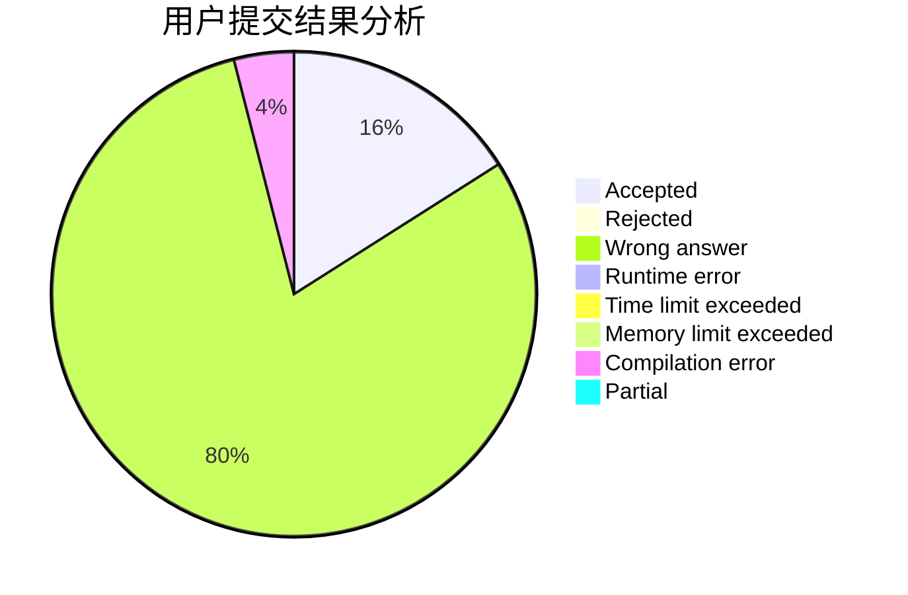
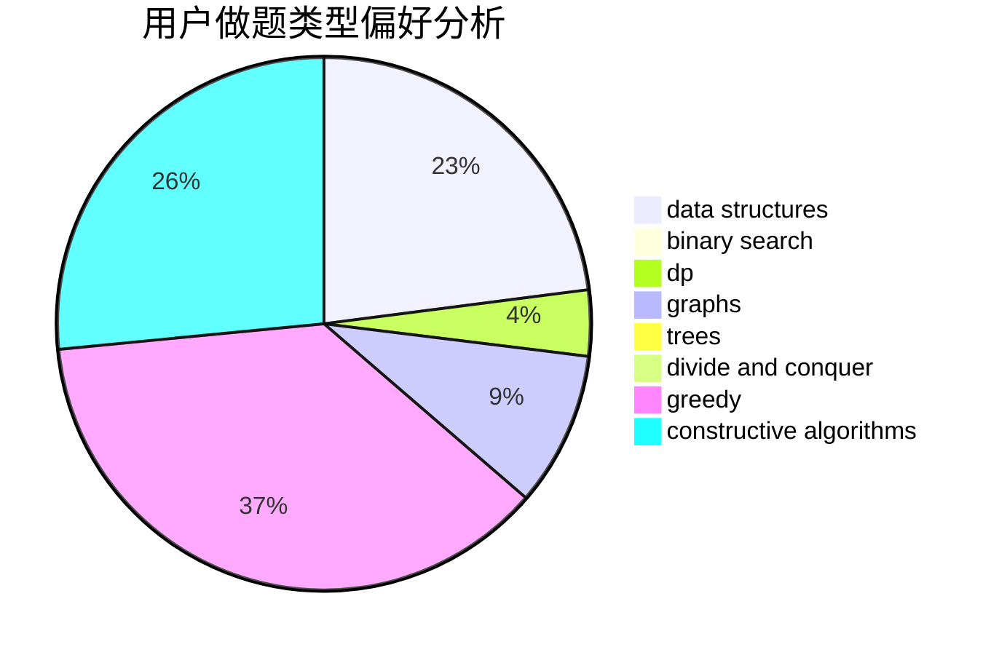
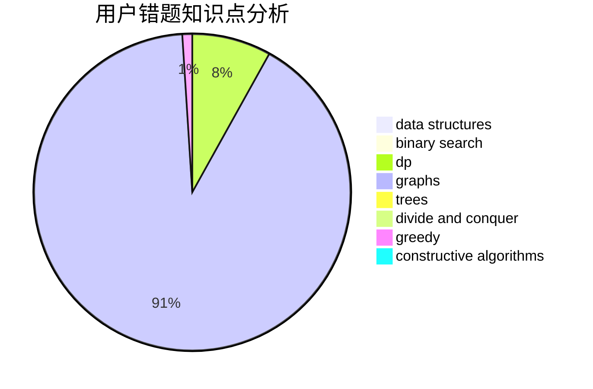

# tc-imba

<!-- tabs:start -->

#### **用户提交结果分析**

#### **用户做题类型偏好分析**

#### **用户错题知识点分析**

<!-- tabs:end -->
# 推荐题目
[283C](https://codeforces.com/contest/283/problem/C)		dp		  
[1485A](https://codeforces.com/contest/1485/problem/A)		brute force,
                        greedy,
                        math,
                        number theory		  
[845C](https://codeforces.com/contest/845/problem/C)		data structures,
                        greedy,
                        sortings		  
[11892](https://codeforces.com/contest/1189/problem/2)		dsu,graphs,sortings,trees		  
[1406E](https://codeforces.com/contest/1406/problem/E)		interactive,
                        math,
                        number theory		  
[567E](https://codeforces.com/contest/567/problem/E)		dfs and similar,
                        graphs,
                        hashing,
                        shortest paths		  
[45G](https://codeforces.com/contest/45/problem/G)		number theory		  
[1466H](https://codeforces.com/contest/1466/problem/H)		combinatorics,
                        dp,
                        graphs,
                        greedy,
                        math		  
[415A](https://codeforces.com/contest/415/problem/A)		implementation		  
[199B](https://codeforces.com/contest/199/problem/B)		geometry		  
