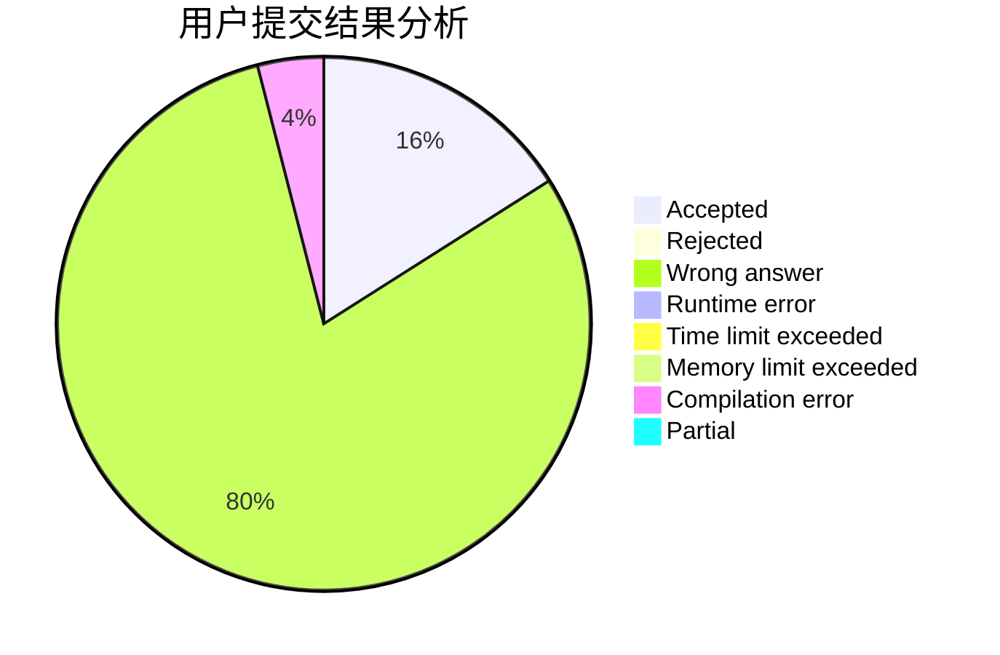
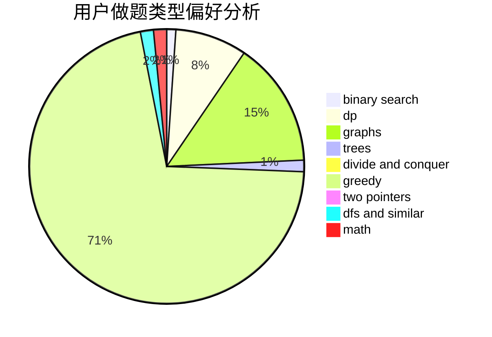

# tc-imba

<!-- tabs:start -->

#### **用户提交结果分析**

#### **用户做题类型偏好分析**

<!-- tabs:end -->
# 推荐题目
[283C](https://codeforces.com/contest/283/problem/C)
[1485A](https://codeforces.com/contest/1485/problem/A)
[845C](https://codeforces.com/contest/845/problem/C)
[11892](https://codeforces.com/contest/1189/problem/2)
[1406E](https://codeforces.com/contest/1406/problem/E)
[567E](https://codeforces.com/contest/567/problem/E)
[45G](https://codeforces.com/contest/45/problem/G)
[1466H](https://codeforces.com/contest/1466/problem/H)
[415A](https://codeforces.com/contest/415/problem/A)
[199B](https://codeforces.com/contest/199/problem/B)
