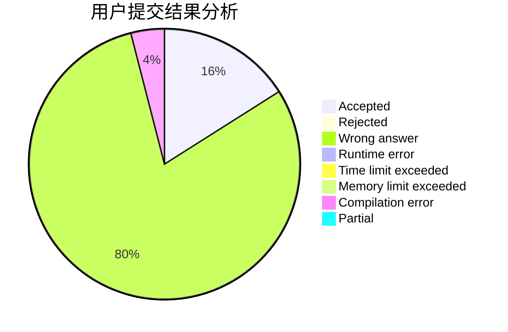
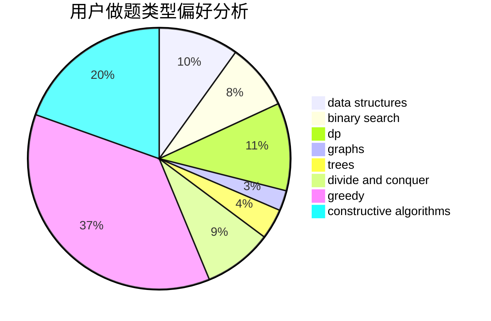
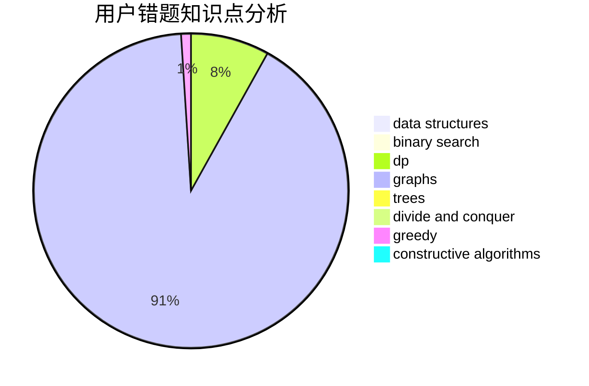

# tc-imba

<!-- tabs:start -->

#### **用户提交结果分析**

#### **用户做题类型偏好分析**

#### **用户错题知识点分析**

<!-- tabs:end -->
# 推荐题目
[268B](https://codeforces.com/contest/268/problem/B)		implementation,
                        math		  
[1476C](https://codeforces.com/contest/1476/problem/C)		dp,
                        graphs,
                        greedy		  
[825G](https://codeforces.com/contest/825/problem/G)		dfs and similar,
                        graphs,
                        trees		  
[1185B](https://codeforces.com/contest/1185/problem/B)		implementation,
                        strings		  
[1398A](https://codeforces.com/contest/1398/problem/A)		geometry,
                        math		  
[543C](https://codeforces.com/contest/543/problem/C)		bitmasks,
                        dp		  
[438B](https://codeforces.com/contest/438/problem/B)		dsu,graphs,sortings,trees		  
[1457E](https://codeforces.com/contest/1457/problem/E)		dsu,graphs,sortings,trees		  
[385E](https://codeforces.com/contest/385/problem/E)		math,
                        matrices		  
[171E](https://codeforces.com/contest/171/problem/E)		*special problem		  
