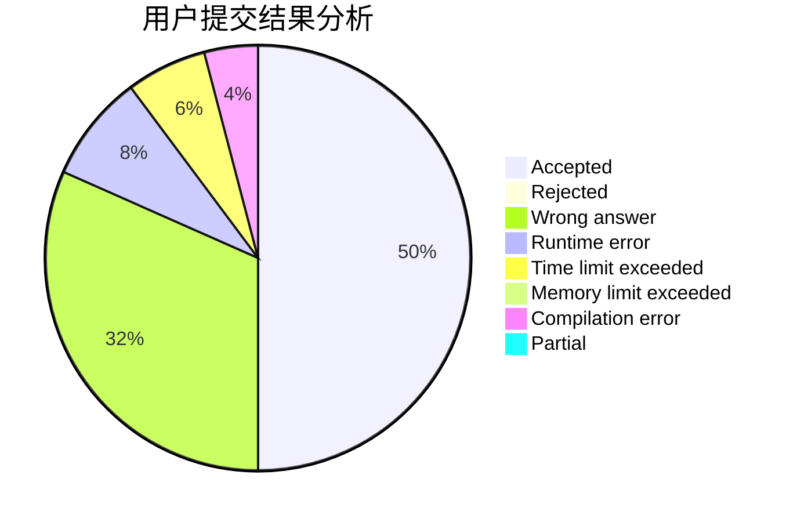
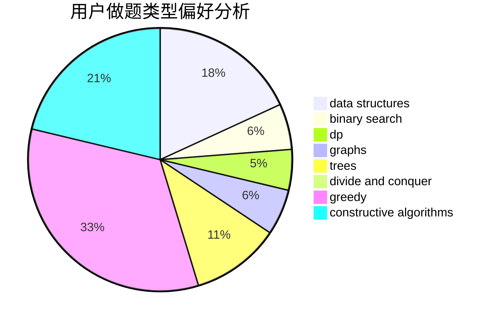

# te5555

<!-- tabs:start -->

#### **用户提交结果分析**

#### **用户做题类型偏好分析**

#### **用户错题知识点分析**

<!-- tabs:end -->
# 推荐题目
[1421A](https://codeforces.com/contest/1421/problem/A)		bitmasks,
                        greedy,
                        math		  
[738D](https://codeforces.com/contest/738/problem/D)		dsu,graphs,sortings,trees		  
[1300E](https://codeforces.com/contest/1300/problem/E)		dsu,graphs,sortings,trees		  
[238D](https://codeforces.com/contest/238/problem/D)		data structures,
                        implementation		  
[796B](https://codeforces.com/contest/796/problem/B)		implementation		  
[1330D](https://codeforces.com/contest/1330/problem/D)		dsu,graphs,sortings,trees		  
[634F](https://codeforces.com/contest/634/problem/F)		dsu,graphs,sortings,trees		  
[1313E](https://codeforces.com/contest/1313/problem/E)		data structures,
                        hashing,
                        strings,
                        two pointers		  
[160D](https://codeforces.com/contest/160/problem/D)		dfs and similar,
                        dsu,
                        graphs,
                        sortings		  
[1076C](https://codeforces.com/contest/1076/problem/C)		binary search,
                        math		  
