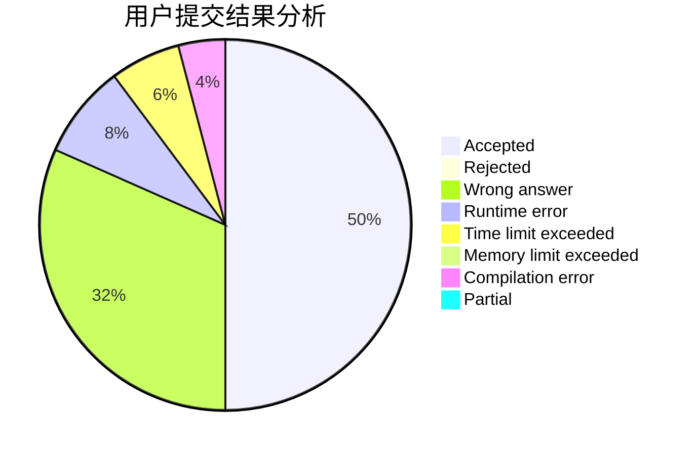
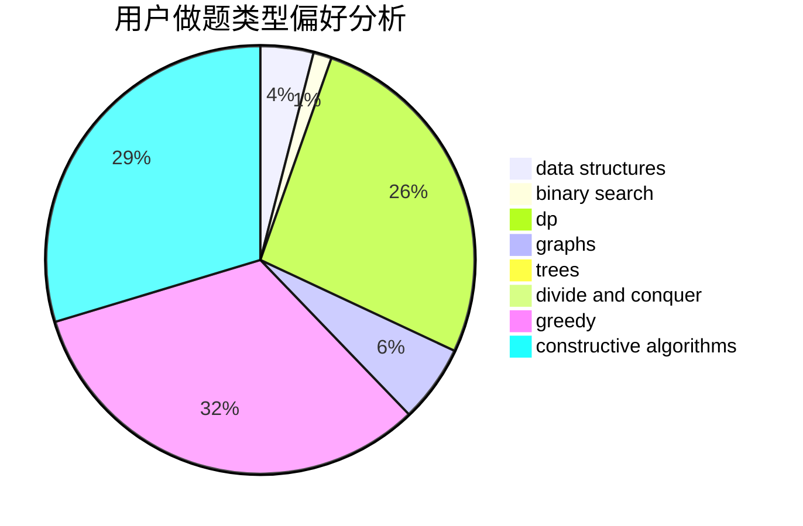

# te5555

<!-- tabs:start -->

#### **用户提交结果分析**

#### **用户做题类型偏好分析**

#### **用户错题知识点分析**

<!-- tabs:end -->
# 推荐题目
[1428D](https://codeforces.com/contest/1428/problem/D)		constructive algorithms,
                        greedy,
                        implementation		  
[759D](https://codeforces.com/contest/759/problem/D)		dsu,graphs,sortings,trees		  
[1310C](https://codeforces.com/contest/1310/problem/C)		binary search,
                        dp,
                        strings		  
[260A](https://codeforces.com/contest/260/problem/A)		implementation,
                        math		  
[810C](https://codeforces.com/contest/810/problem/C)		dsu,graphs,sortings,trees		  
[1336D](https://codeforces.com/contest/1336/problem/D)		constructive algorithms,
                        interactive		  
[667B](https://codeforces.com/contest/667/problem/B)		constructive algorithms,
                        geometry		  
[1323C](https://codeforces.com/contest/1323/problem/C)		dsu,graphs,sortings,trees		  
[186C](https://codeforces.com/contest/186/problem/C)		dsu,graphs,sortings,trees		  
[1076F](https://codeforces.com/contest/1076/problem/F)		dp,
                        greedy		  
