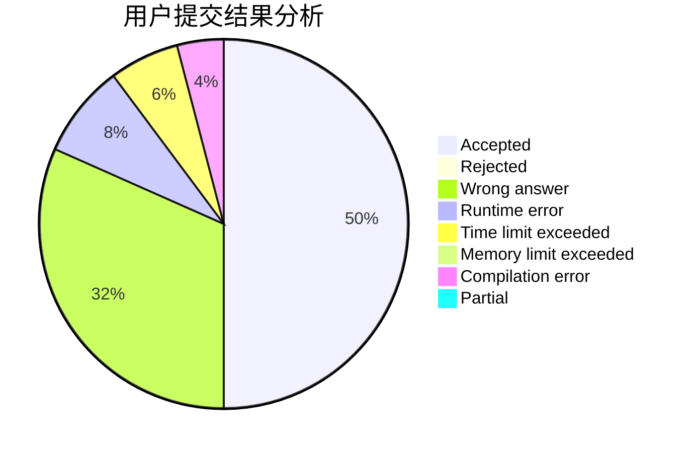
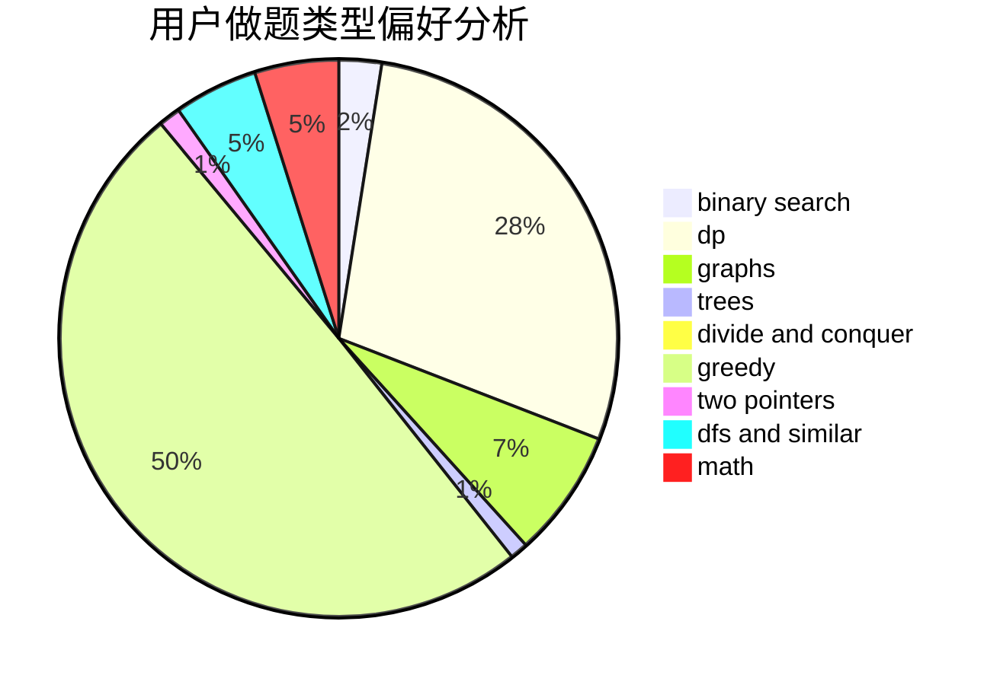

# te5555

<!-- tabs:start -->

#### **用户提交结果分析**

#### **用户做题类型偏好分析**

<!-- tabs:end -->
# 推荐题目
[1428D](https://codeforces.com/contest/1428/problem/D)
[759D](https://codeforces.com/contest/759/problem/D)
[1310C](https://codeforces.com/contest/1310/problem/C)
[260A](https://codeforces.com/contest/260/problem/A)
[810C](https://codeforces.com/contest/810/problem/C)
[1336D](https://codeforces.com/contest/1336/problem/D)
[667B](https://codeforces.com/contest/667/problem/B)
[1323C](https://codeforces.com/contest/1323/problem/C)
[186C](https://codeforces.com/contest/186/problem/C)
[1076F](https://codeforces.com/contest/1076/problem/F)
