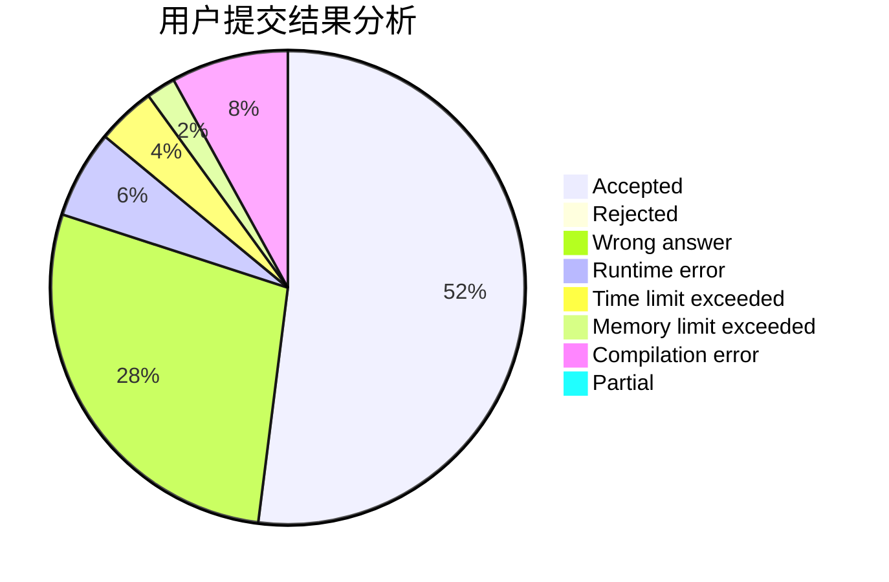
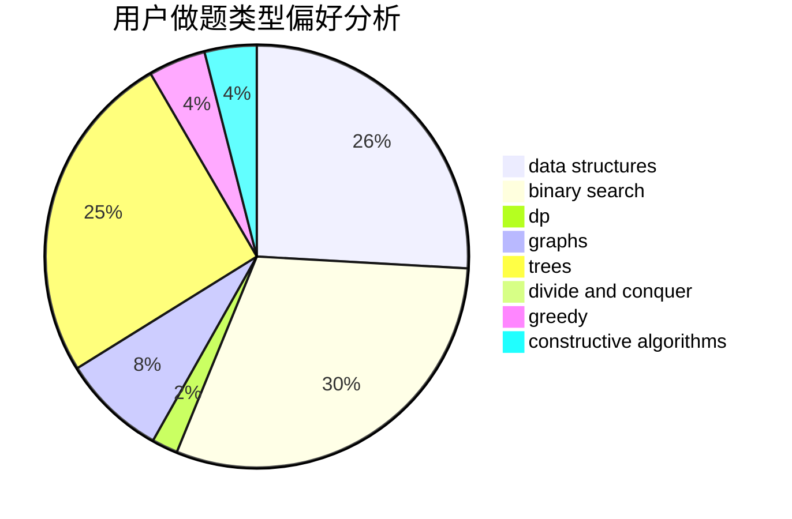

# th1rteen

<!-- tabs:start -->

#### **用户提交结果分析**

#### **用户做题类型偏好分析**

#### **用户错题知识点分析**

<!-- tabs:end -->
# 推荐题目
[1099A](https://codeforces.com/contest/1099/problem/A)		implementation		  
[1042D](https://codeforces.com/contest/1042/problem/D)		data structures,
                        divide and conquer,
                        two pointers		  
[711B](https://codeforces.com/contest/711/problem/B)		constructive algorithms,
                        implementation		  
[1341F](https://codeforces.com/contest/1341/problem/F)		dsu,graphs,sortings,trees		  
[1264A](https://codeforces.com/contest/1264/problem/A)		greedy,
                        implementation		  
[1324E](https://codeforces.com/contest/1324/problem/E)		dp,
                        implementation		  
[1458C](https://codeforces.com/contest/1458/problem/C)		math,
                        matrices		  
[1482E](https://codeforces.com/contest/1482/problem/E)		data structures,
                        divide and conquer,
                        dp		  
[1489D](https://codeforces.com/contest/1489/problem/D)		dsu,graphs,sortings,trees		  
[1483E](https://codeforces.com/contest/1483/problem/E)		dsu,graphs,sortings,trees		  
