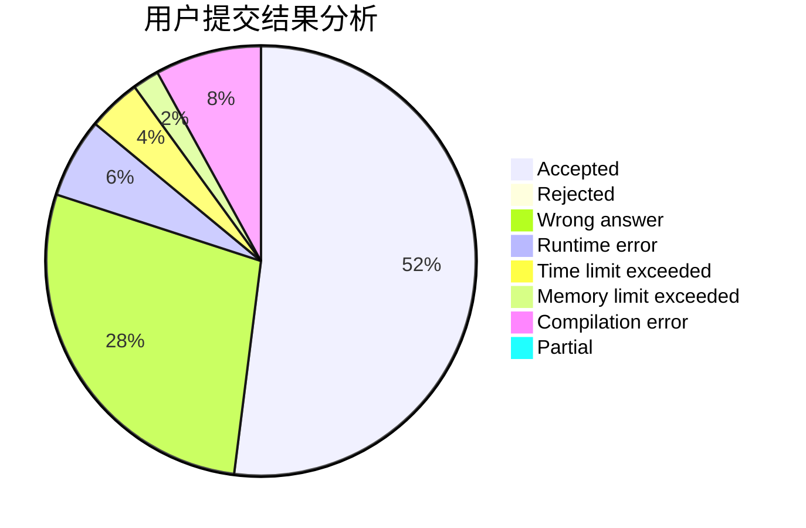
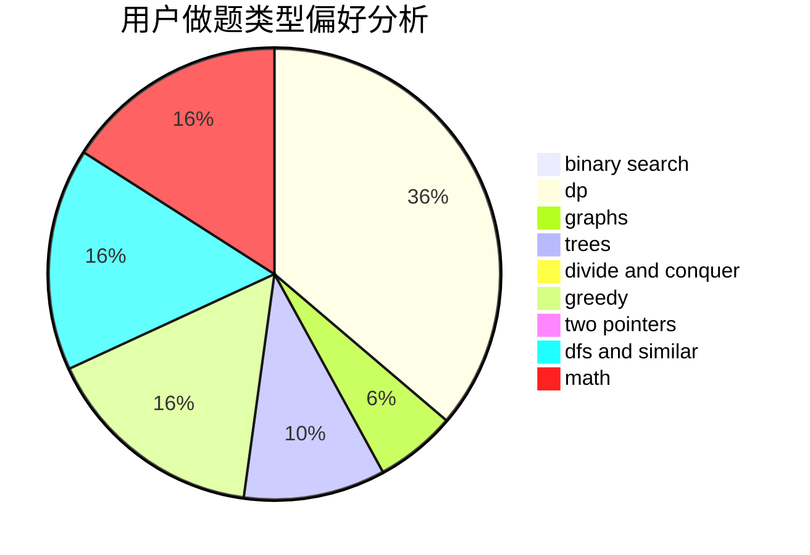

# th1rteen

<!-- tabs:start -->

#### **用户提交结果分析**

#### **用户做题类型偏好分析**

<!-- tabs:end -->
# 推荐题目
[1099D](https://codeforces.com/contest/1099/problem/D)
[1043A](https://codeforces.com/contest/1043/problem/A)
[731B](https://codeforces.com/contest/731/problem/B)
[1348F](https://codeforces.com/contest/1348/problem/F)
[1269E](https://codeforces.com/contest/1269/problem/E)
[1331C](https://codeforces.com/contest/1331/problem/C)
[1467B](https://codeforces.com/contest/1467/problem/B)
[1490C](https://codeforces.com/contest/1490/problem/C)
[1497B](https://codeforces.com/contest/1497/problem/B)
[1491C](https://codeforces.com/contest/1491/problem/C)
