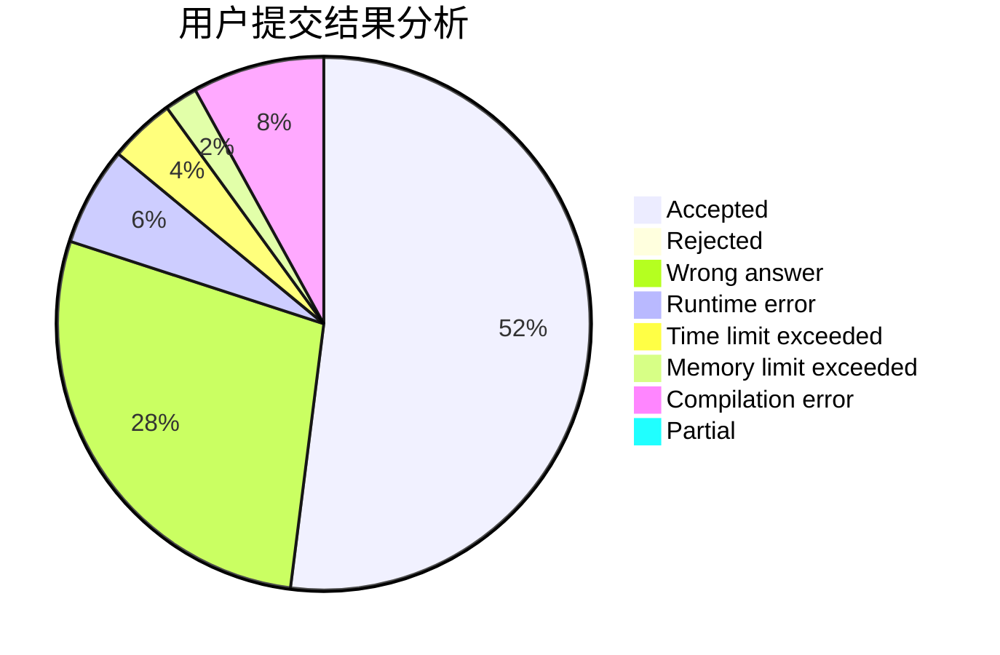
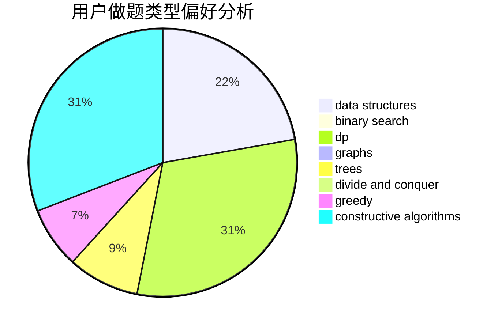

# th1rteen

<!-- tabs:start -->

#### **用户提交结果分析**

#### **用户做题类型偏好分析**

#### **用户错题知识点分析**

<!-- tabs:end -->
# 推荐题目
[1099D](https://codeforces.com/contest/1099/problem/D)		dsu,graphs,sortings,trees		  
[1043A](https://codeforces.com/contest/1043/problem/A)		implementation,
                        math		  
[731B](https://codeforces.com/contest/731/problem/B)		constructive algorithms,
                        greedy		  
[1348F](https://codeforces.com/contest/1348/problem/F)		data structures,
                        dfs and similar,
                        graphs,
                        greedy		  
[1269E](https://codeforces.com/contest/1269/problem/E)		dsu,graphs,sortings,trees		  
[1331C](https://codeforces.com/contest/1331/problem/C)		bitmasks		  
[1467B](https://codeforces.com/contest/1467/problem/B)		brute force,
                        implementation		  
[1490C](https://codeforces.com/contest/1490/problem/C)		binary search,
                        brute force,
                        brute force,
                        math		  
[1497B](https://codeforces.com/contest/1497/problem/B)		constructive algorithms,
                        greedy,
                        math		  
[1491C](https://codeforces.com/contest/1491/problem/C)		brute force,
                        data structures,
                        dp,
                        greedy,
                        implementation		  
