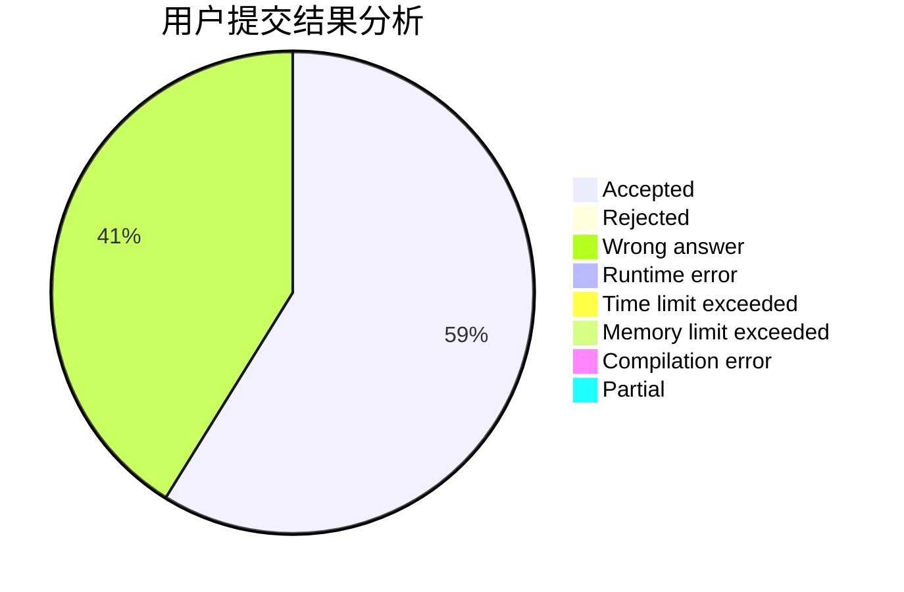
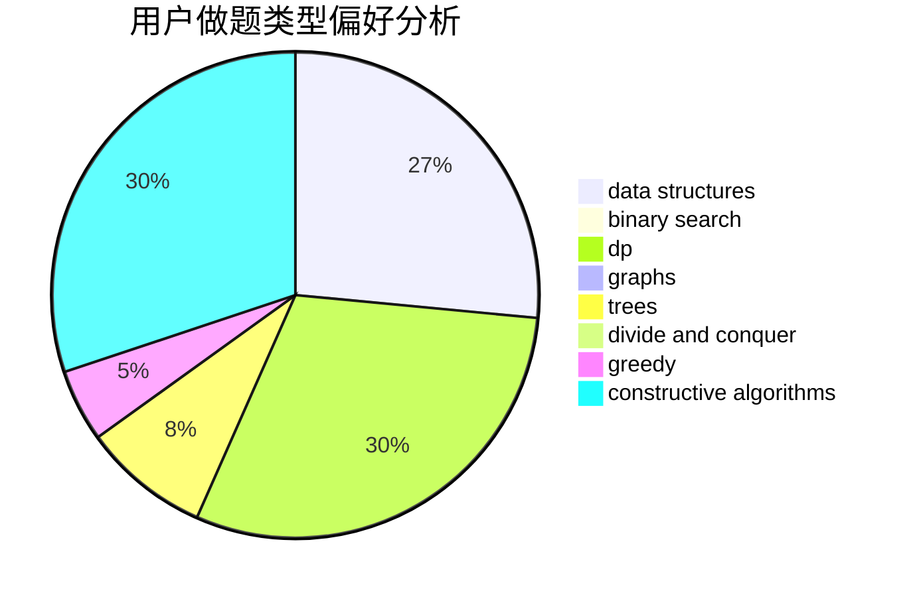
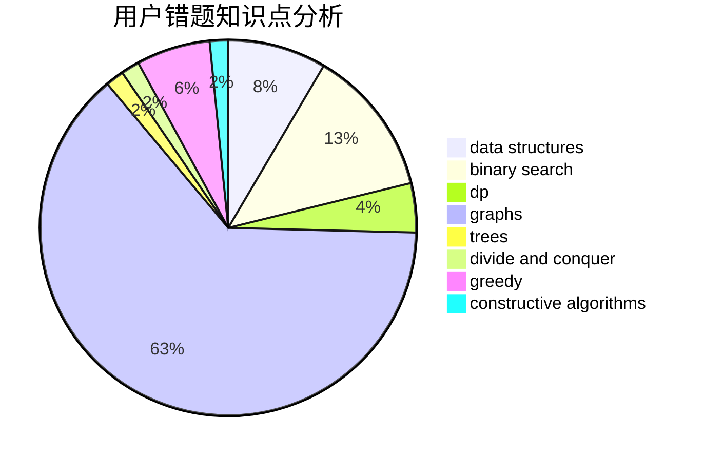

# th__turns

<!-- tabs:start -->

#### **用户提交结果分析**

#### **用户做题类型偏好分析**

#### **用户错题知识点分析**

<!-- tabs:end -->
# 推荐题目
[19A](https://codeforces.com/contest/19/problem/A)		implementation		  
[1154D](https://codeforces.com/contest/1154/problem/D)		greedy		  
[896D](https://codeforces.com/contest/896/problem/D)		chinese remainder theorem,
                        combinatorics,
                        math,
                        number theory		  
[990A](https://codeforces.com/contest/990/problem/A)		implementation,
                        math		  
[1407E](https://codeforces.com/contest/1407/problem/E)		constructive algorithms,
                        dfs and similar,
                        dp,
                        graphs,
                        greedy,
                        shortest paths		  
[1156G](https://codeforces.com/contest/1156/problem/G)		graphs,
                        greedy,
                        hashing,
                        implementation		  
[93E](https://codeforces.com/contest/93/problem/E)		dp,
                        math,
                        number theory		  
[1491C](https://codeforces.com/contest/1491/problem/C)		brute force,
                        data structures,
                        dp,
                        greedy,
                        implementation		  
[1322B](https://codeforces.com/contest/1322/problem/B)		binary search,
                        bitmasks,
                        constructive algorithms,
                        data structures,
                        math,
                        sortings		  
[512E](https://codeforces.com/contest/512/problem/E)		constructive algorithms,
                        divide and conquer		  
