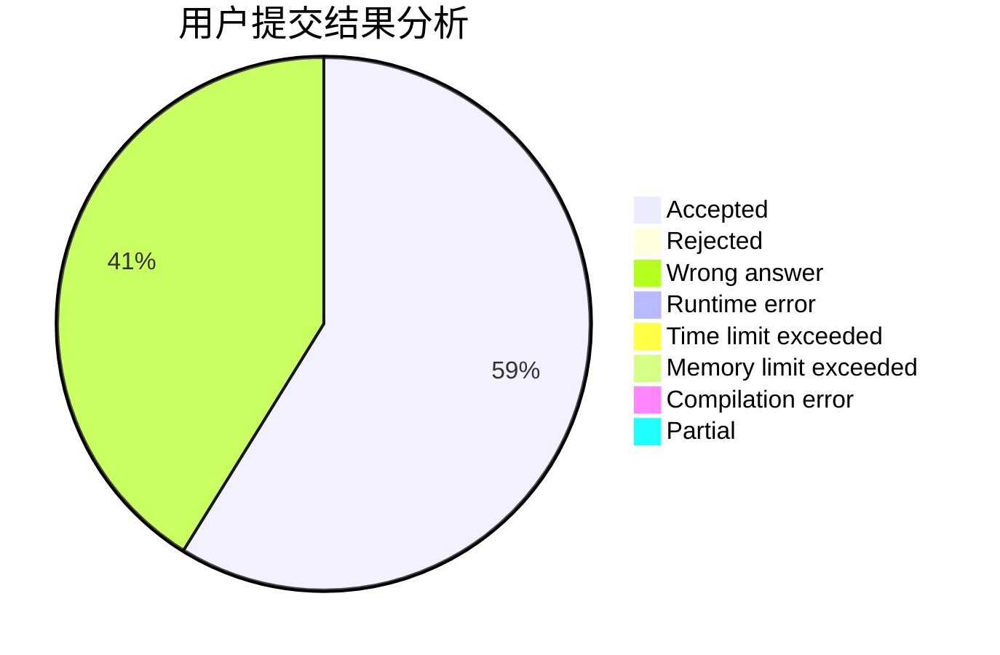
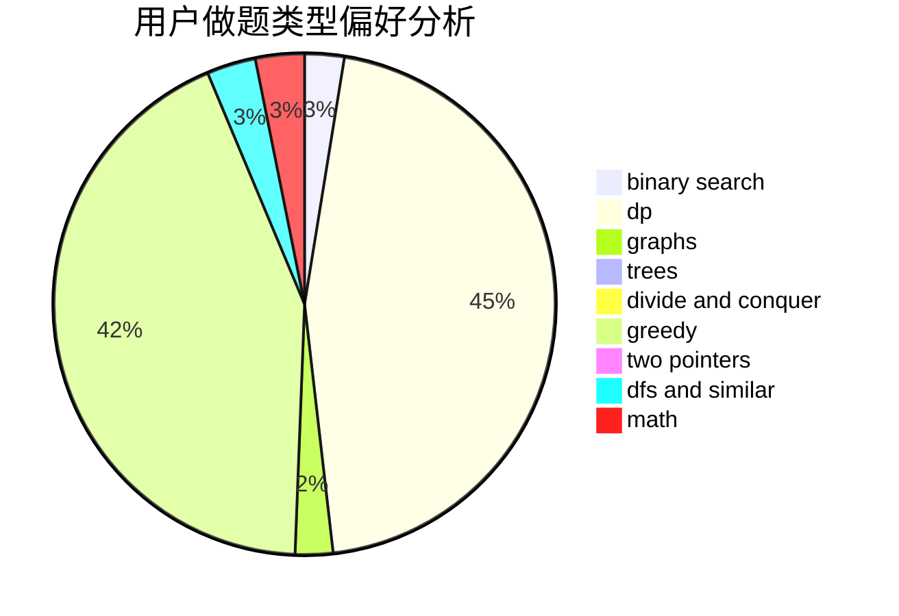

# th__turns

<!-- tabs:start -->

#### **用户提交结果分析**

#### **用户做题类型偏好分析**

<!-- tabs:end -->
# 推荐题目
[19A](https://codeforces.com/contest/19/problem/A)
[1154D](https://codeforces.com/contest/1154/problem/D)
[896D](https://codeforces.com/contest/896/problem/D)
[990A](https://codeforces.com/contest/990/problem/A)
[1407E](https://codeforces.com/contest/1407/problem/E)
[1156G](https://codeforces.com/contest/1156/problem/G)
[93E](https://codeforces.com/contest/93/problem/E)
[1491C](https://codeforces.com/contest/1491/problem/C)
[1322B](https://codeforces.com/contest/1322/problem/B)
[512E](https://codeforces.com/contest/512/problem/E)
