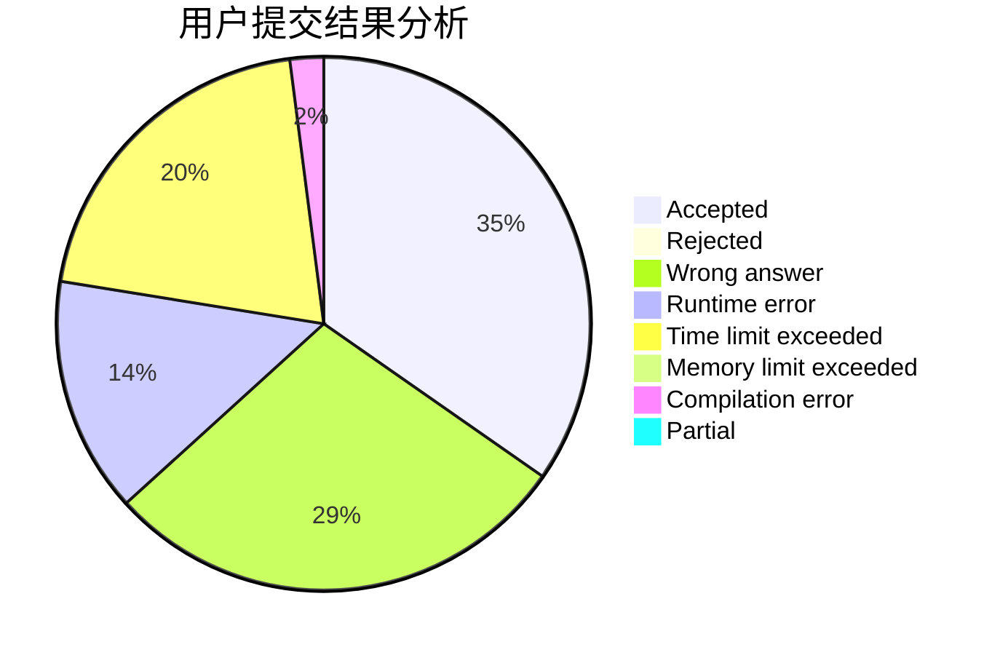
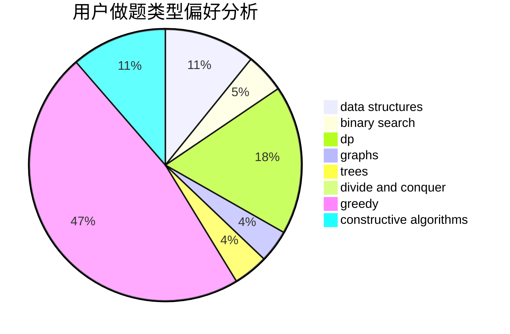

# CSP

<!-- tabs:start -->

#### **用户提交结果分析**

#### **用户做题类型偏好分析**

#### **用户错题知识点分析**

<!-- tabs:end -->
# 推荐题目
[1419B](https://codeforces.com/contest/1419/problem/B)		brute force,
                        constructive algorithms,
                        greedy,
                        implementation,
                        math		  
[1299C](https://codeforces.com/contest/1299/problem/C)		data structures,
                        geometry,
                        greedy		  
[1236A](https://codeforces.com/contest/1236/problem/A)		brute force,
                        greedy,
                        math		  
[1236D](https://codeforces.com/contest/1236/problem/D)		brute force,
                        data structures,
                        greedy,
                        implementation		  
[1236B](https://codeforces.com/contest/1236/problem/B)		combinatorics,
                        math		  
[300B](https://codeforces.com/contest/300/problem/B)		brute force,
                        dfs and similar,
                        graphs		  
[29A](https://codeforces.com/contest/29/problem/A)		brute force		  
[1228E](https://codeforces.com/contest/1228/problem/E)		combinatorics,
                        dp,
                        math		  
[1230F](https://codeforces.com/contest/1230/problem/F)		dsu,graphs,sortings,trees		  
[29E](https://codeforces.com/contest/29/problem/E)		graphs,
                        shortest paths		  
