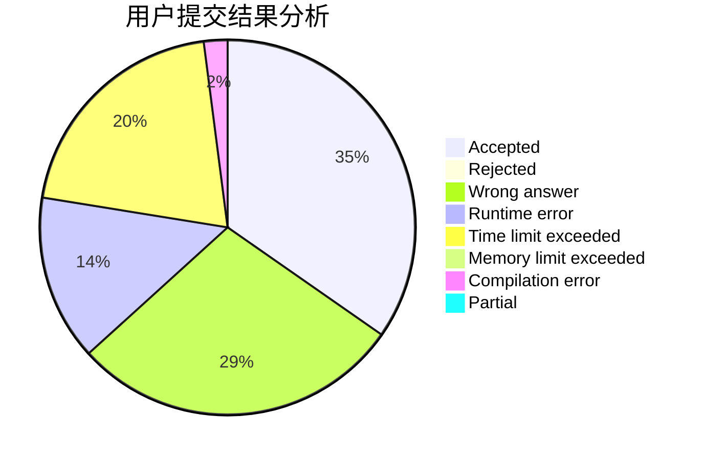
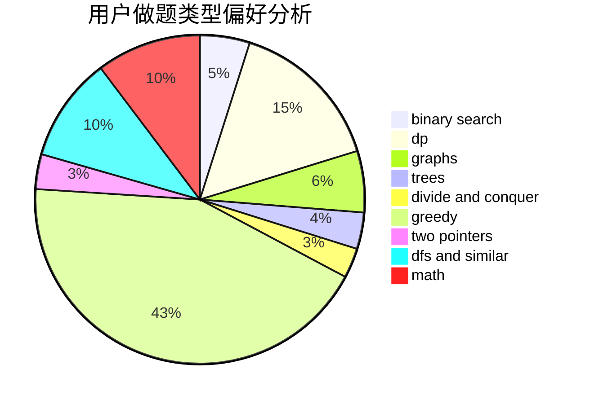

# CSP

<!-- tabs:start -->

#### **用户提交结果分析**

#### **用户做题类型偏好分析**

<!-- tabs:end -->
# 推荐题目
[1419B](https://codeforces.com/contest/1419/problem/B)
[1299C](https://codeforces.com/contest/1299/problem/C)
[1236A](https://codeforces.com/contest/1236/problem/A)
[1236D](https://codeforces.com/contest/1236/problem/D)
[1236B](https://codeforces.com/contest/1236/problem/B)
[300B](https://codeforces.com/contest/300/problem/B)
[29A](https://codeforces.com/contest/29/problem/A)
[1228E](https://codeforces.com/contest/1228/problem/E)
[1230F](https://codeforces.com/contest/1230/problem/F)
[29E](https://codeforces.com/contest/29/problem/E)
