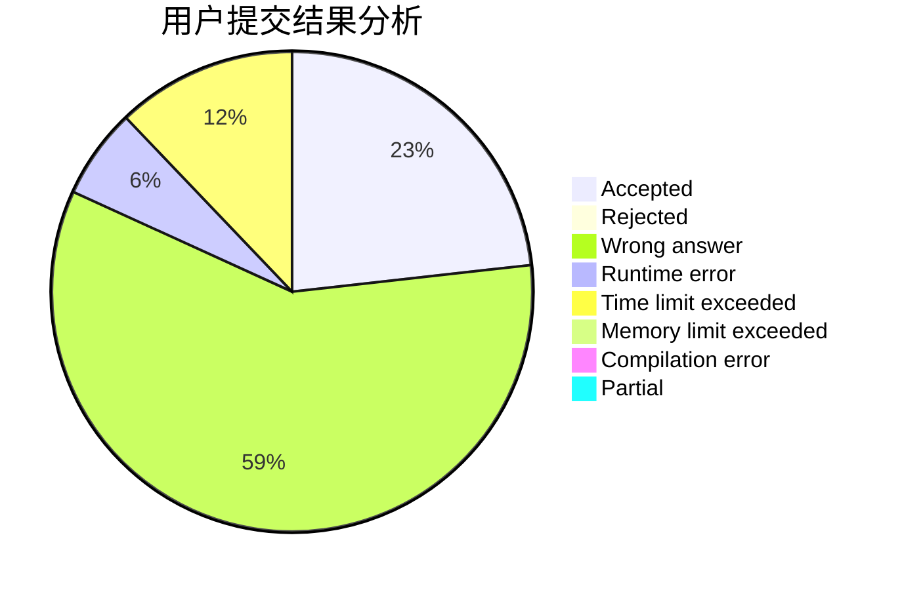
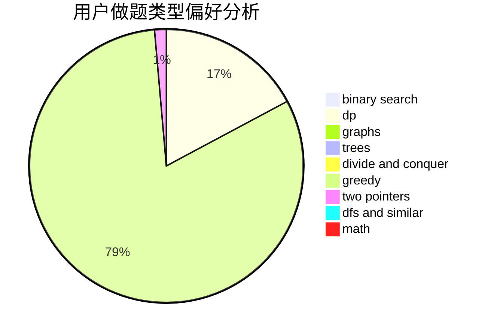

# the_xin

<!-- tabs:start -->

#### **用户提交结果分析**

#### **用户做题类型偏好分析**

<!-- tabs:end -->
# 推荐题目
[652A](https://codeforces.com/contest/652/problem/A)
[750C](https://codeforces.com/contest/750/problem/C)
[22B](https://codeforces.com/contest/22/problem/B)
[1368C](https://codeforces.com/contest/1368/problem/C)
[58E](https://codeforces.com/contest/58/problem/E)
[604B](https://codeforces.com/contest/604/problem/B)
[291A](https://codeforces.com/contest/291/problem/A)
[300A](https://codeforces.com/contest/300/problem/A)
[821D](https://codeforces.com/contest/821/problem/D)
[666D](https://codeforces.com/contest/666/problem/D)
