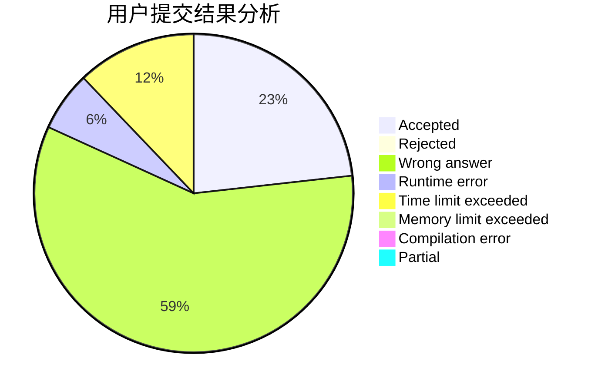
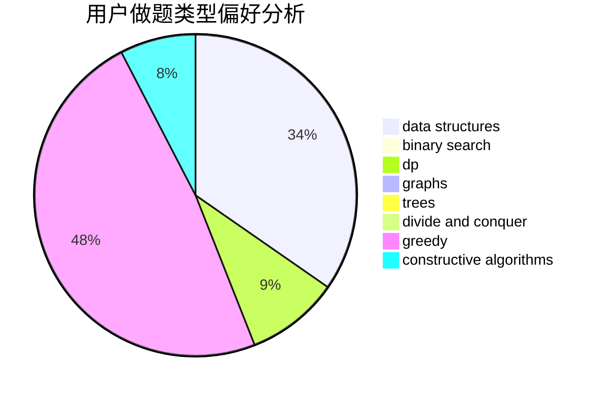
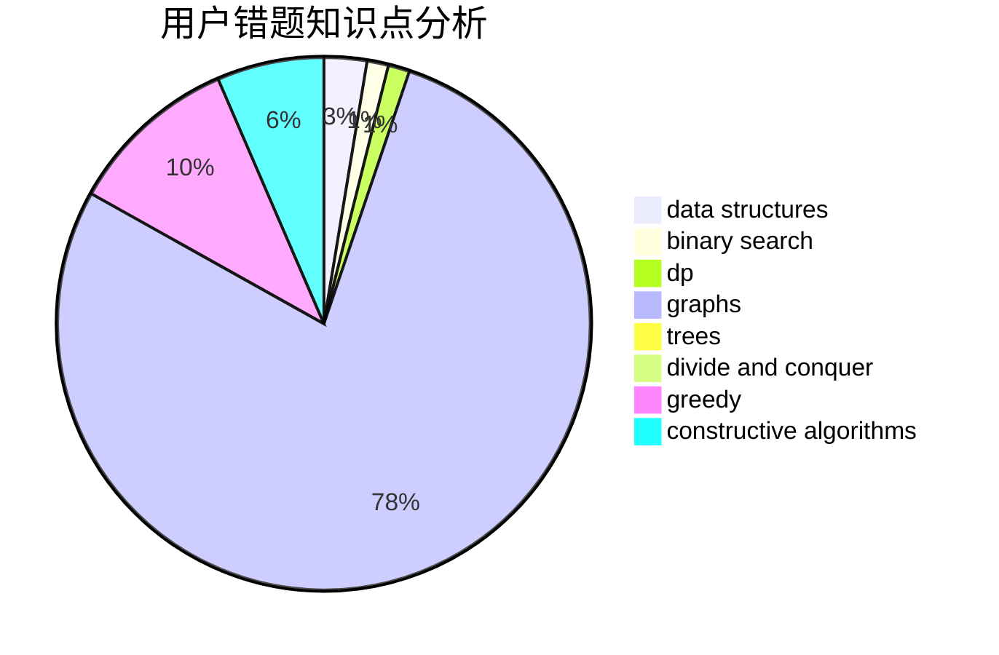

# the_xin

<!-- tabs:start -->

#### **用户提交结果分析**

#### **用户做题类型偏好分析**

#### **用户错题知识点分析**

<!-- tabs:end -->
# 推荐题目
[652A](https://codeforces.com/contest/652/problem/A)		implementation,
                        math		  
[750C](https://codeforces.com/contest/750/problem/C)		binary search,
                        greedy,
                        math		  
[22B](https://codeforces.com/contest/22/problem/B)		brute force,
                        dp		  
[1368C](https://codeforces.com/contest/1368/problem/C)		constructive algorithms		  
[58E](https://codeforces.com/contest/58/problem/E)		dp		  
[604B](https://codeforces.com/contest/604/problem/B)		binary search,
                        greedy		  
[291A](https://codeforces.com/contest/291/problem/A)		*special problem,
                        implementation,
                        sortings		  
[300A](https://codeforces.com/contest/300/problem/A)		brute force,
                        constructive algorithms,
                        implementation		  
[821D](https://codeforces.com/contest/821/problem/D)		dfs and similar,
                        graphs,
                        shortest paths		  
[666D](https://codeforces.com/contest/666/problem/D)		brute force,
                        geometry		  
