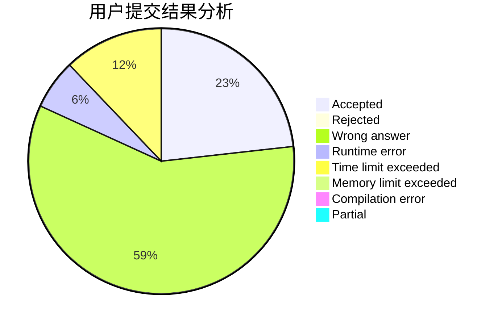
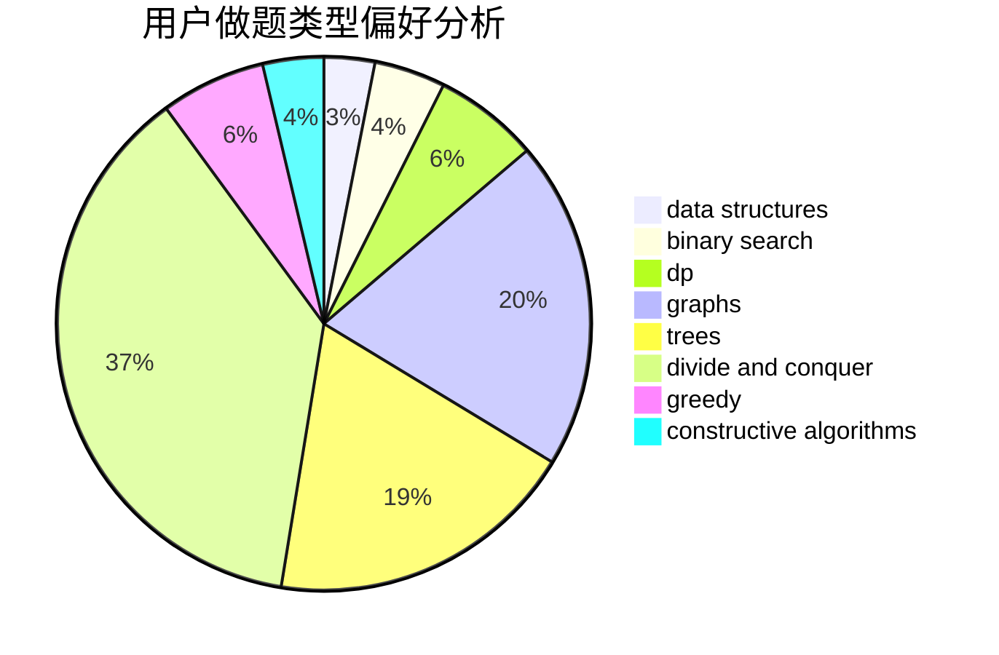
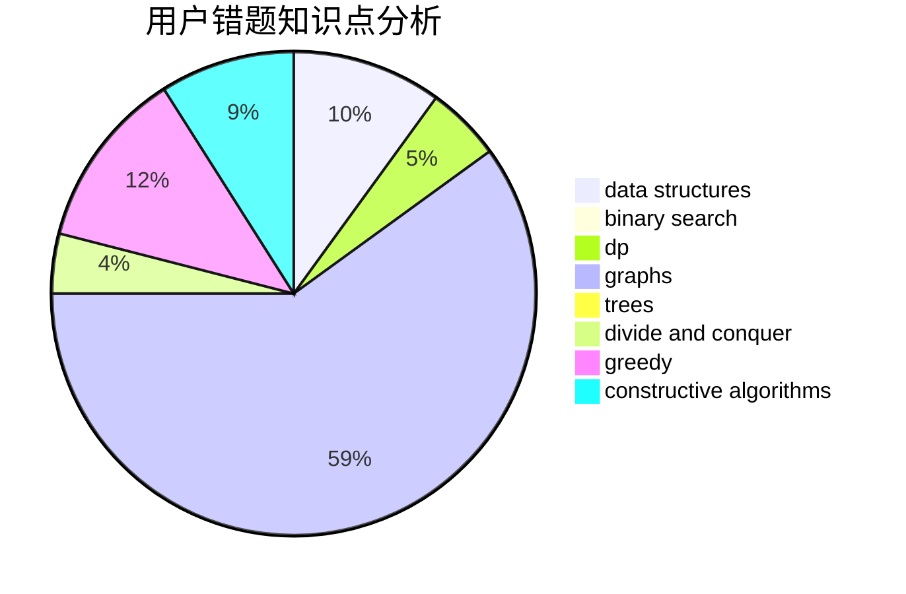

# the_xin

<!-- tabs:start -->

#### **用户提交结果分析**

#### **用户做题类型偏好分析**

#### **用户错题知识点分析**

<!-- tabs:end -->
# 推荐题目
[623E](https://codeforces.com/contest/623/problem/E)		combinatorics,
                        dp,
                        fft,
                        math		  
[732D](https://codeforces.com/contest/732/problem/D)		binary search,
                        greedy,
                        sortings		  
[208A](https://codeforces.com/contest/208/problem/A)		strings		  
[1360D](https://codeforces.com/contest/1360/problem/D)		math,
                        number theory		  
[56B](https://codeforces.com/contest/56/problem/B)		implementation		  
[584B](https://codeforces.com/contest/584/problem/B)		combinatorics		  
[276D](https://codeforces.com/contest/276/problem/D)		bitmasks,
                        dp,
                        greedy,
                        implementation,
                        math		  
[285E](https://codeforces.com/contest/285/problem/E)		combinatorics,
                        dp,
                        math		  
[805C](https://codeforces.com/contest/805/problem/C)		dsu,graphs,sortings,trees		  
[634A](https://codeforces.com/contest/634/problem/A)		constructive algorithms,
                        implementation		  
