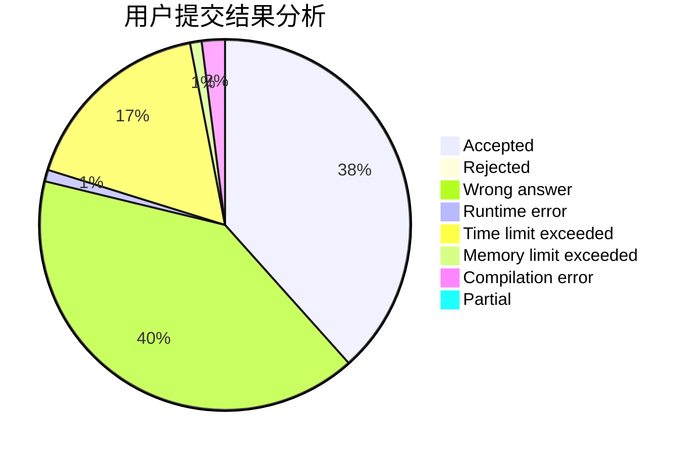
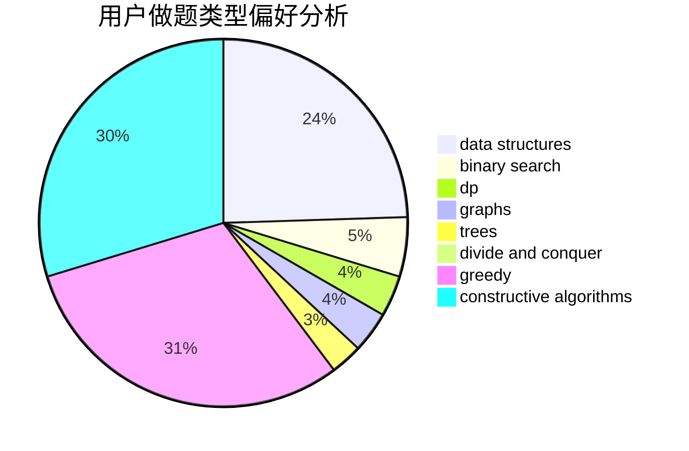
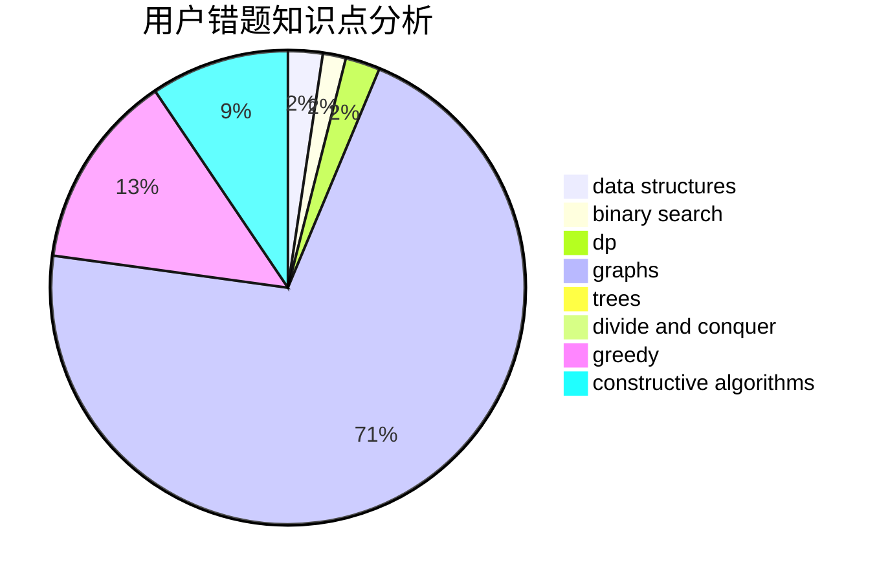

# thebighead

<!-- tabs:start -->

#### **用户提交结果分析**

#### **用户做题类型偏好分析**

#### **用户错题知识点分析**

<!-- tabs:end -->
# 推荐题目
[1469E](https://codeforces.com/contest/1469/problem/E)		bitmasks,
                        brute force,
                        hashing,
                        string suffix structures,
                        strings,
                        two pointers		  
[176B](https://codeforces.com/contest/176/problem/B)		dp		  
[898C](https://codeforces.com/contest/898/problem/C)		implementation,
                        strings		  
[988A](https://codeforces.com/contest/988/problem/A)		brute force,
                        implementation		  
[897B](https://codeforces.com/contest/897/problem/B)		brute force		  
[1117G](https://codeforces.com/contest/1117/problem/G)		data structures		  
[290B](https://codeforces.com/contest/290/problem/B)		*special problem,
                        implementation		  
[650C](https://codeforces.com/contest/650/problem/C)		dfs and similar,
                        dp,
                        dsu,
                        graphs,
                        greedy		  
[6C](https://codeforces.com/contest/6/problem/C)		greedy,
                        two pointers		  
[1133B](https://codeforces.com/contest/1133/problem/B)		math,
                        number theory		  
