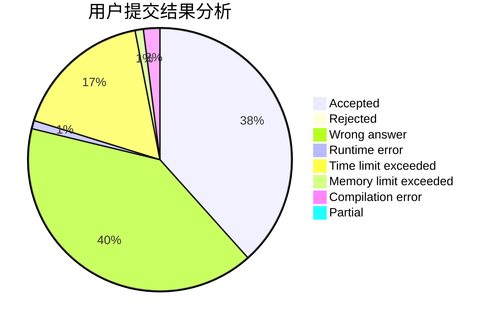
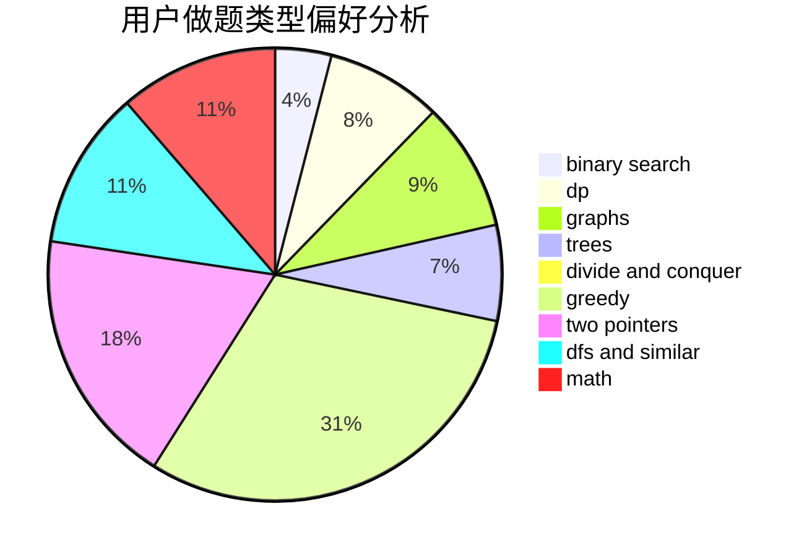

# thebighead

<!-- tabs:start -->

#### **用户提交结果分析**

#### **用户做题类型偏好分析**

<!-- tabs:end -->
# 推荐题目
[1469E](https://codeforces.com/contest/1469/problem/E)
[176B](https://codeforces.com/contest/176/problem/B)
[898C](https://codeforces.com/contest/898/problem/C)
[988A](https://codeforces.com/contest/988/problem/A)
[897B](https://codeforces.com/contest/897/problem/B)
[1117G](https://codeforces.com/contest/1117/problem/G)
[290B](https://codeforces.com/contest/290/problem/B)
[650C](https://codeforces.com/contest/650/problem/C)
[6C](https://codeforces.com/contest/6/problem/C)
[1133B](https://codeforces.com/contest/1133/problem/B)
