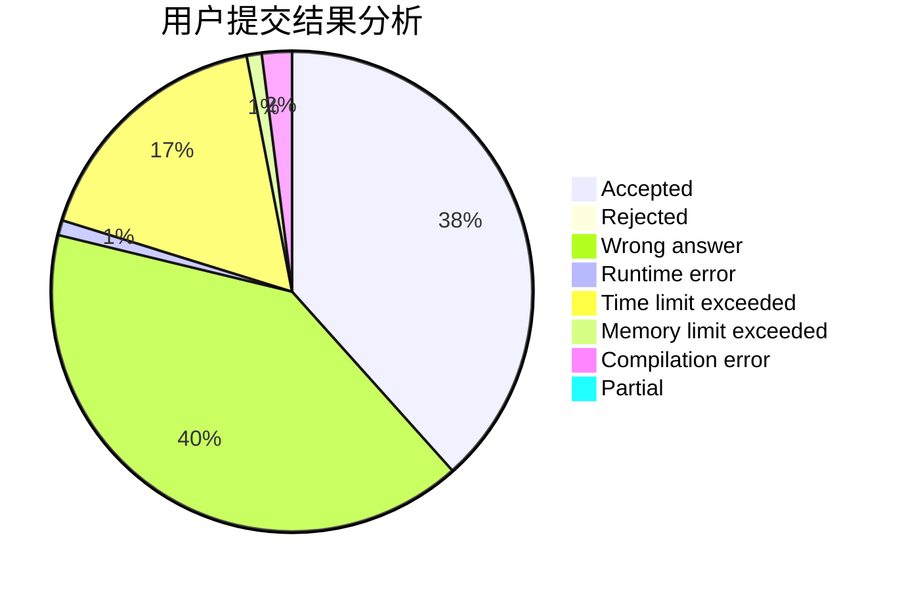
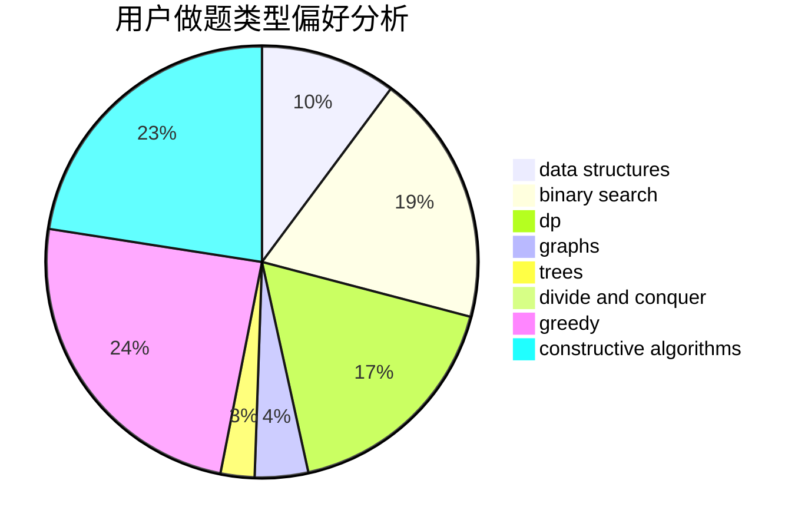
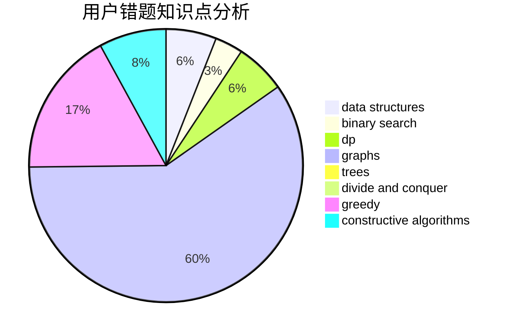

# thebighead

<!-- tabs:start -->

#### **用户提交结果分析**

#### **用户做题类型偏好分析**

#### **用户错题知识点分析**

<!-- tabs:end -->
# 推荐题目
[1462C](https://codeforces.com/contest/1462/problem/C)		brute force,
                        greedy,
                        math		  
[154C](https://codeforces.com/contest/154/problem/C)		graphs,
                        hashing,
                        sortings		  
[877D](https://codeforces.com/contest/877/problem/D)		data structures,
                        dfs and similar,
                        graphs,
                        shortest paths		  
[966B](https://codeforces.com/contest/966/problem/B)		dsu,graphs,sortings,trees		  
[876F](https://codeforces.com/contest/876/problem/F)		dsu,graphs,sortings,trees		  
[1116C1](https://codeforces.com/contest/1116C/problem/1)		nan		  
[275B](https://codeforces.com/contest/275/problem/B)		constructive algorithms,
                        implementation		  
[622C](https://codeforces.com/contest/622/problem/C)		data structures,
                        implementation		  
[675D](https://codeforces.com/contest/675/problem/D)		data structures,
                        trees		  
[1131E](https://codeforces.com/contest/1131/problem/E)		dp,
                        greedy,
                        strings		  
