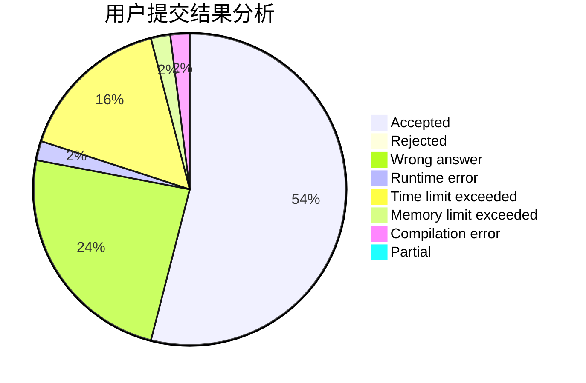
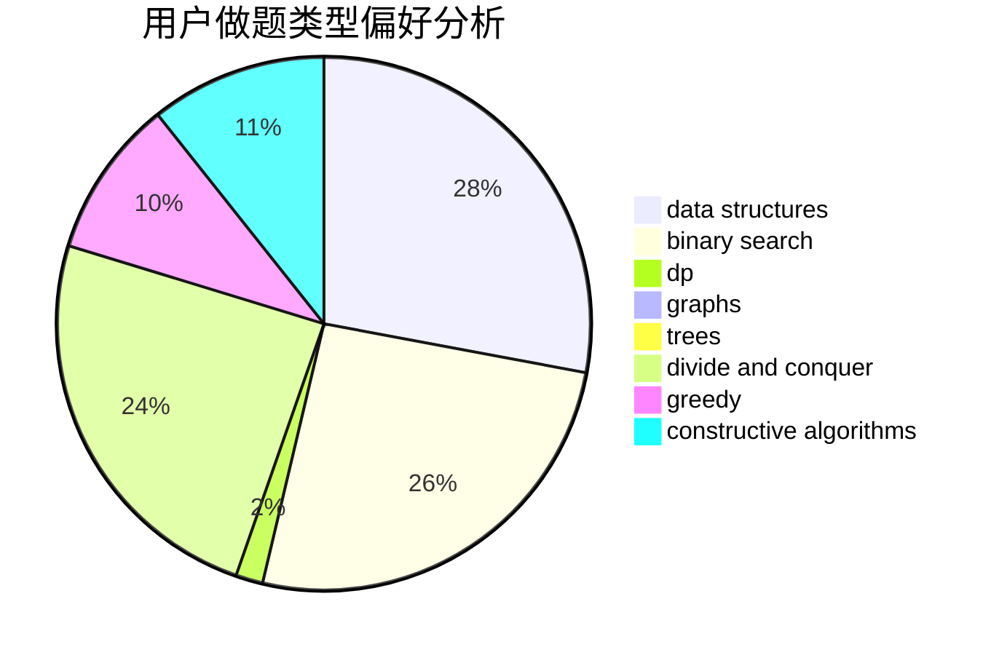
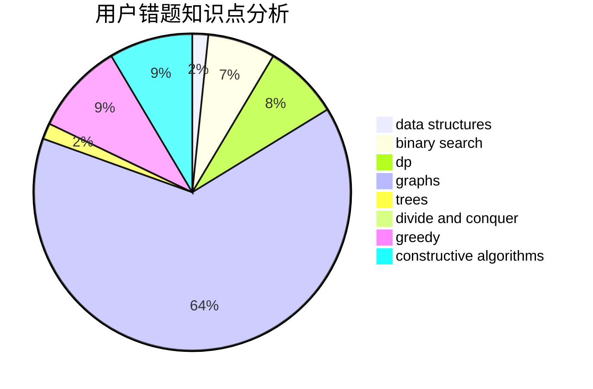

# thedesalizes

<!-- tabs:start -->

#### **用户提交结果分析**

#### **用户做题类型偏好分析**

#### **用户错题知识点分析**

<!-- tabs:end -->
# 推荐题目
[809E](https://codeforces.com/contest/809/problem/E)		divide and conquer,
                        math,
                        number theory,
                        trees		  
[195C](https://codeforces.com/contest/195/problem/C)		expression parsing,
                        implementation		  
[1506B](https://codeforces.com/contest/1506/problem/B)		greedy,
                        implementation		  
[331C1](https://codeforces.com/contest/331C/problem/1)		dp		  
[723C](https://codeforces.com/contest/723/problem/C)		greedy		  
[1488A](https://codeforces.com/contest/1488/problem/A)		*special problem,
                        math		  
[1247D](https://codeforces.com/contest/1247/problem/D)		dsu,graphs,sortings,trees		  
[494B](https://codeforces.com/contest/494/problem/B)		dp,
                        strings		  
[1415D](https://codeforces.com/contest/1415/problem/D)		bitmasks,
                        brute force,
                        constructive algorithms		  
[218D](https://codeforces.com/contest/218/problem/D)		dsu,graphs,sortings,trees		  
