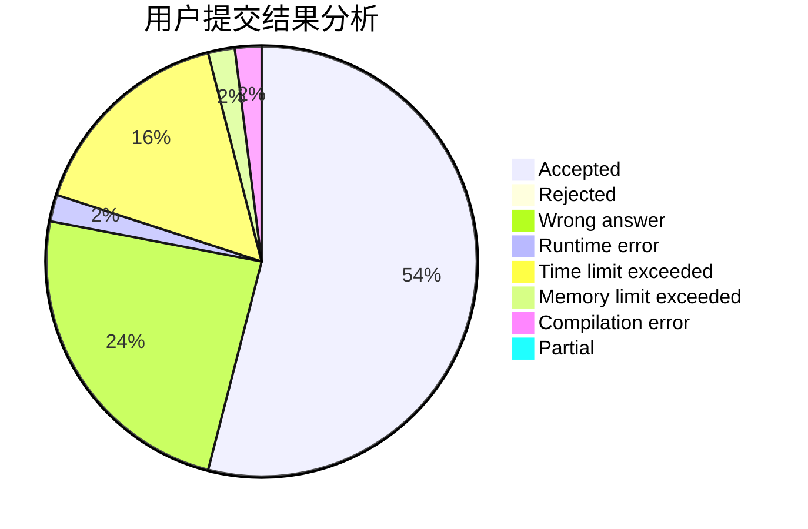
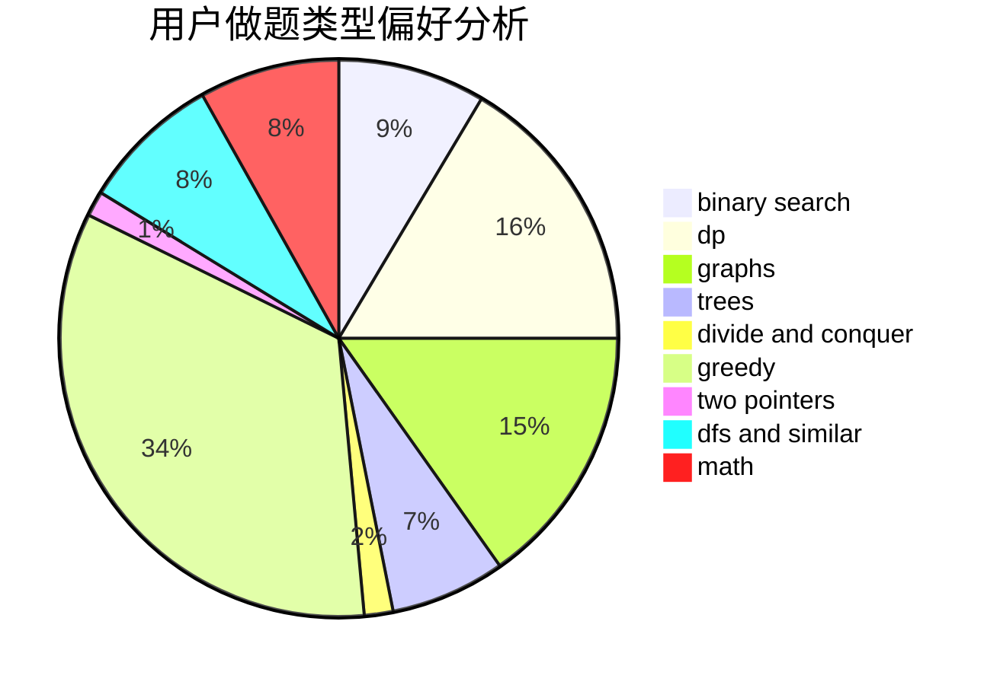

# thedesalizes

<!-- tabs:start -->

#### **用户提交结果分析**

#### **用户做题类型偏好分析**

<!-- tabs:end -->
# 推荐题目
[827D](https://codeforces.com/contest/827/problem/D)
[218C](https://codeforces.com/contest/218/problem/C)
[157C](https://codeforces.com/contest/157/problem/C)
[359B](https://codeforces.com/contest/359/problem/B)
[740D](https://codeforces.com/contest/740/problem/D)
[1495E](https://codeforces.com/contest/1495/problem/E)
[1251C](https://codeforces.com/contest/1251/problem/C)
[514C](https://codeforces.com/contest/514/problem/C)
[1423H](https://codeforces.com/contest/1423/problem/H)
[238A](https://codeforces.com/contest/238/problem/A)
