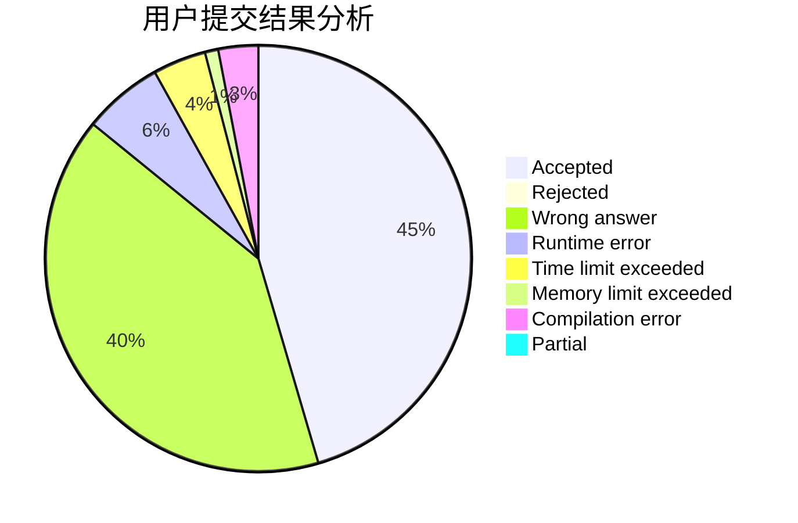
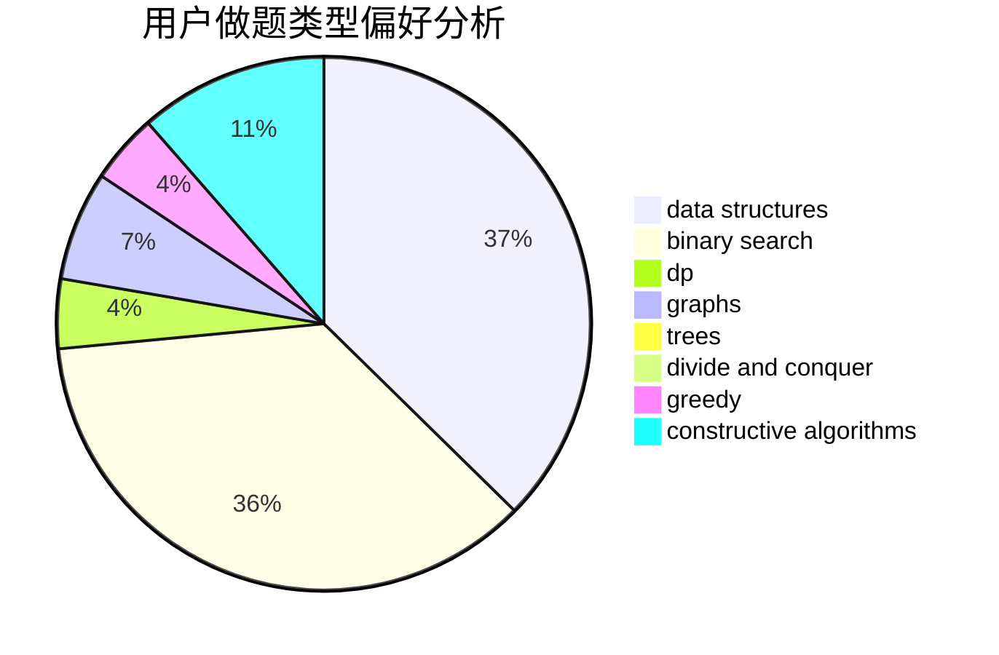
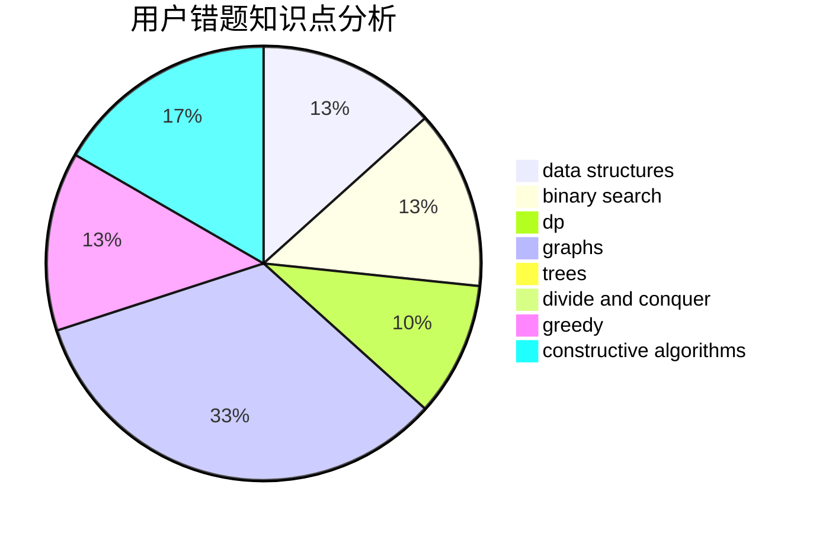

# thelittleboy

<!-- tabs:start -->

#### **用户提交结果分析**

#### **用户做题类型偏好分析**

#### **用户错题知识点分析**

<!-- tabs:end -->
# 推荐题目
[1028H](https://codeforces.com/contest/1028/problem/H)		math		  
[739D](https://codeforces.com/contest/739/problem/D)		graph matchings		  
[6E](https://codeforces.com/contest/6/problem/E)		binary search,
                        data structures,
                        dsu,
                        trees,
                        two pointers		  
[763E](https://codeforces.com/contest/763/problem/E)		data structures,
                        divide and conquer,
                        dsu		  
[1099A](https://codeforces.com/contest/1099/problem/A)		implementation		  
[600C](https://codeforces.com/contest/600/problem/C)		constructive algorithms,
                        greedy,
                        strings		  
[71A](https://codeforces.com/contest/71/problem/A)		strings		  
[1277C](https://codeforces.com/contest/1277/problem/C)		dsu,graphs,sortings,trees		  
[1028G](https://codeforces.com/contest/1028/problem/G)		dp,
                        interactive		  
[567F](https://codeforces.com/contest/567/problem/F)		dp		  
