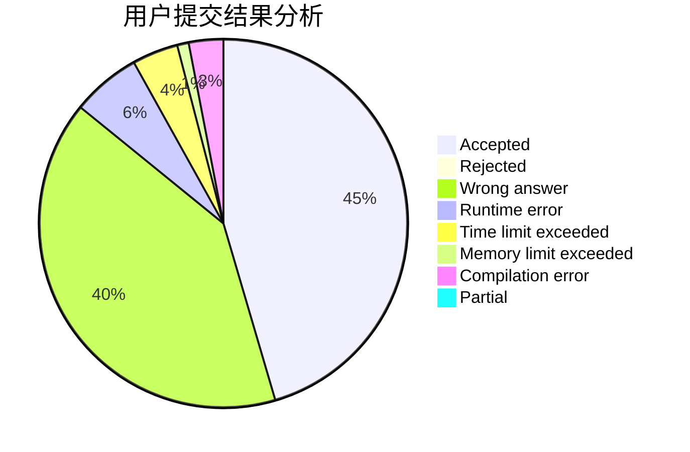
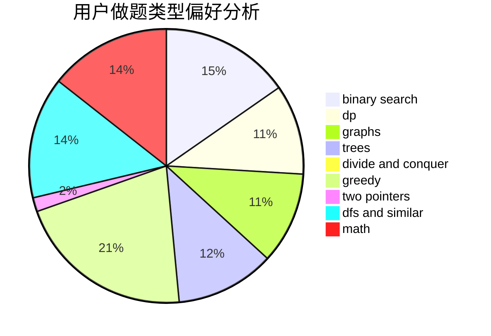

# thelittleboy

<!-- tabs:start -->

#### **用户提交结果分析**

#### **用户做题类型偏好分析**

<!-- tabs:end -->
# 推荐题目
[1029C](https://codeforces.com/contest/1029/problem/C)
[75D](https://codeforces.com/contest/75/problem/D)
[717I](https://codeforces.com/contest/717/problem/I)
[782C](https://codeforces.com/contest/782/problem/C)
[1099D](https://codeforces.com/contest/1099/problem/D)
[61B](https://codeforces.com/contest/61/problem/B)
[737A](https://codeforces.com/contest/737/problem/A)
[1283E](https://codeforces.com/contest/1283/problem/E)
[1029B](https://codeforces.com/contest/1029/problem/B)
[587E](https://codeforces.com/contest/587/problem/E)
