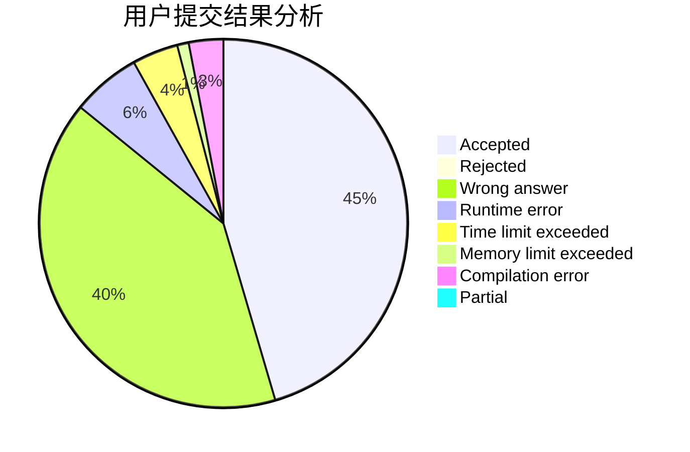
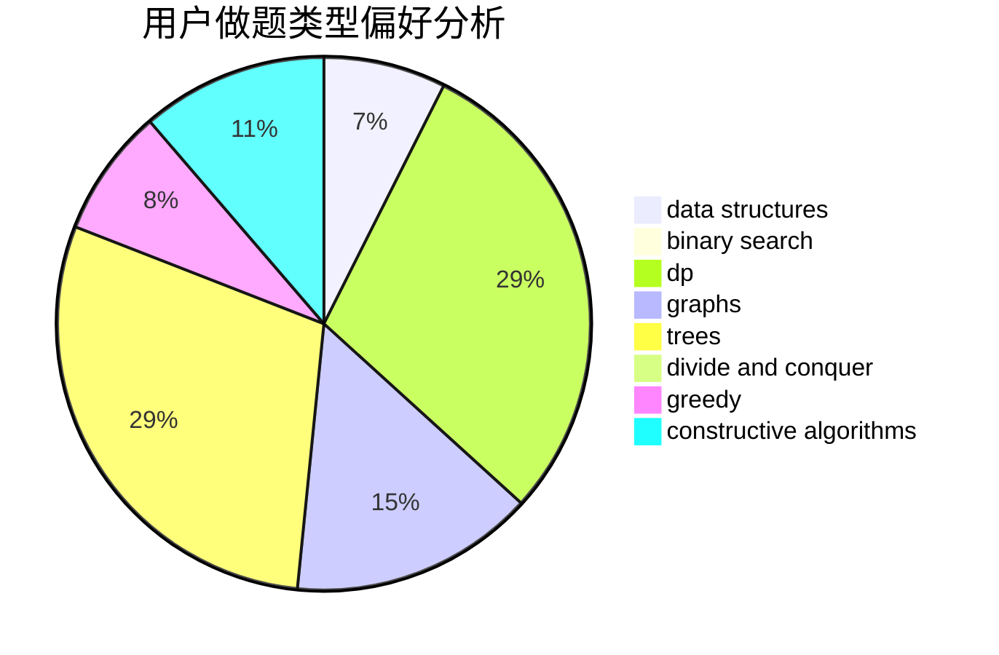
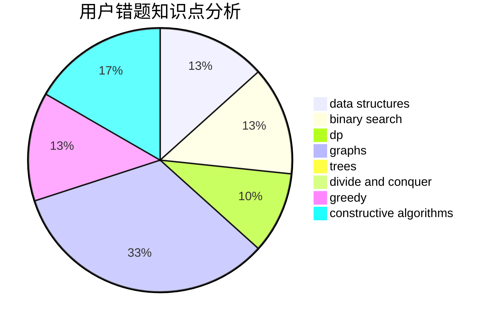

# thelittleboy

<!-- tabs:start -->

#### **用户提交结果分析**

#### **用户做题类型偏好分析**

#### **用户错题知识点分析**

<!-- tabs:end -->
# 推荐题目
[1029C](https://codeforces.com/contest/1029/problem/C)		greedy,
                        math,
                        sortings		  
[75D](https://codeforces.com/contest/75/problem/D)		data structures,
                        dp,
                        greedy,
                        implementation,
                        math,
                        trees		  
[717I](https://codeforces.com/contest/717/problem/I)		geometry		  
[782C](https://codeforces.com/contest/782/problem/C)		dsu,graphs,sortings,trees		  
[1099D](https://codeforces.com/contest/1099/problem/D)		dsu,graphs,sortings,trees		  
[61B](https://codeforces.com/contest/61/problem/B)		strings		  
[737A](https://codeforces.com/contest/737/problem/A)		dsu,graphs,sortings,trees		  
[1283E](https://codeforces.com/contest/1283/problem/E)		dp,
                        greedy		  
[1029B](https://codeforces.com/contest/1029/problem/B)		dp,
                        greedy,
                        math		  
[587E](https://codeforces.com/contest/587/problem/E)		data structures		  
