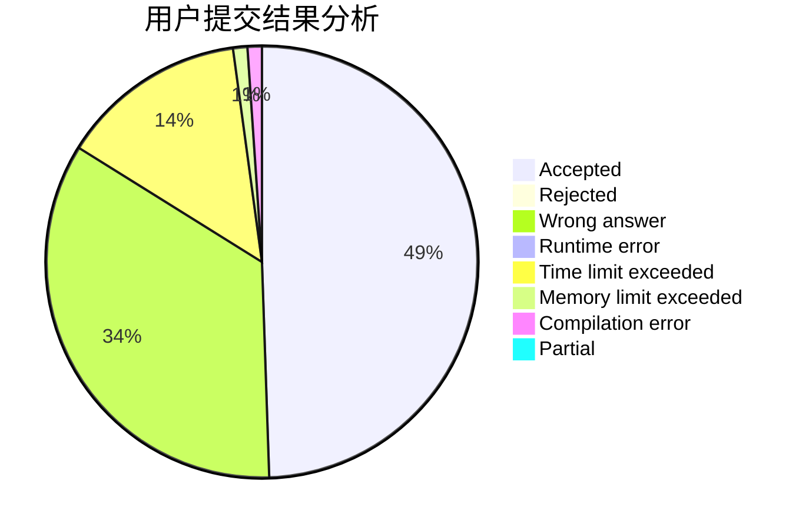
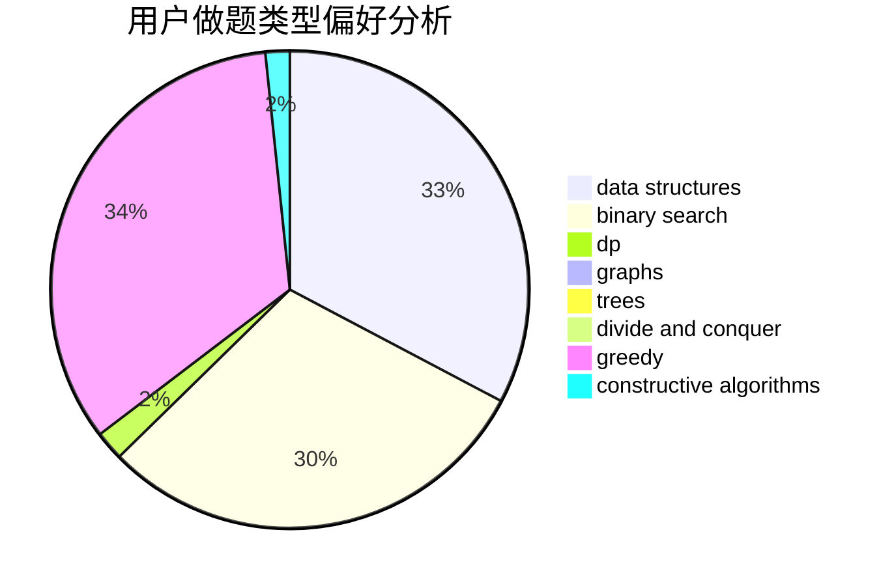

# thematrix233

<!-- tabs:start -->

#### **用户提交结果分析**

#### **用户做题类型偏好分析**

#### **用户错题知识点分析**

<!-- tabs:end -->
# 推荐题目
[990F](https://codeforces.com/contest/990/problem/F)		dfs and similar,
                        dp,
                        greedy,
                        trees		  
[1137A](https://codeforces.com/contest/1137/problem/A)		implementation,
                        sortings		  
[1250B](https://codeforces.com/contest/1250/problem/B)		brute force,
                        constructive algorithms,
                        greedy,
                        math		  
[1260F](https://codeforces.com/contest/1260/problem/F)		data structures,
                        trees		  
[1083B](https://codeforces.com/contest/1083/problem/B)		greedy,
                        strings		  
[1062A](https://codeforces.com/contest/1062/problem/A)		greedy,
                        implementation		  
[682A](https://codeforces.com/contest/682/problem/A)		constructive algorithms,
                        math,
                        number theory		  
[1163D](https://codeforces.com/contest/1163/problem/D)		dp,
                        strings		  
[707E](https://codeforces.com/contest/707/problem/E)		data structures		  
[1418G](https://codeforces.com/contest/1418/problem/G)		data structures,
                        divide and conquer,
                        hashing,
                        two pointers		  
