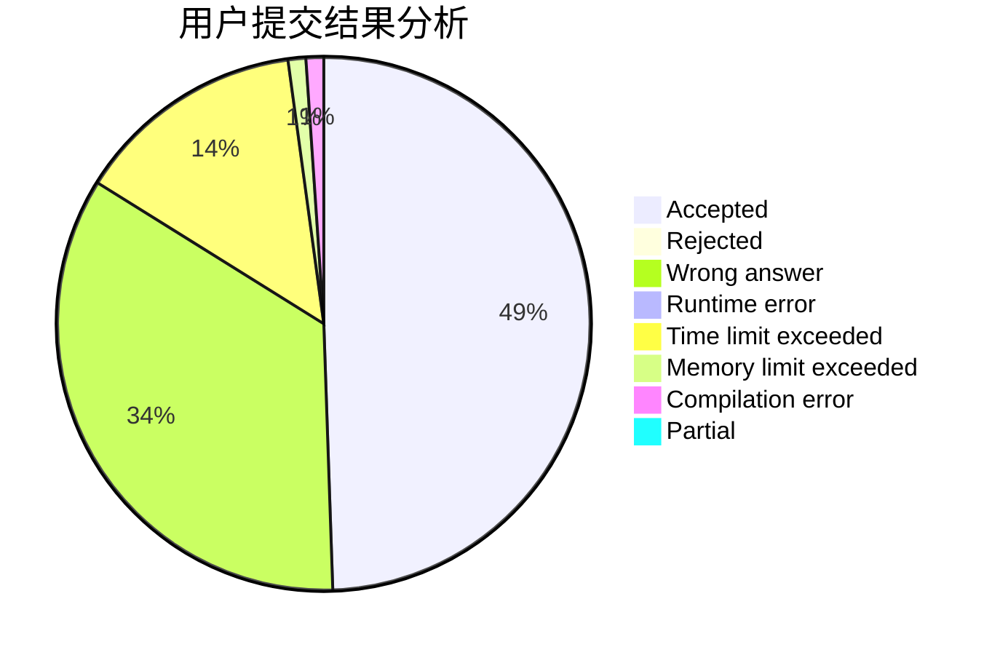
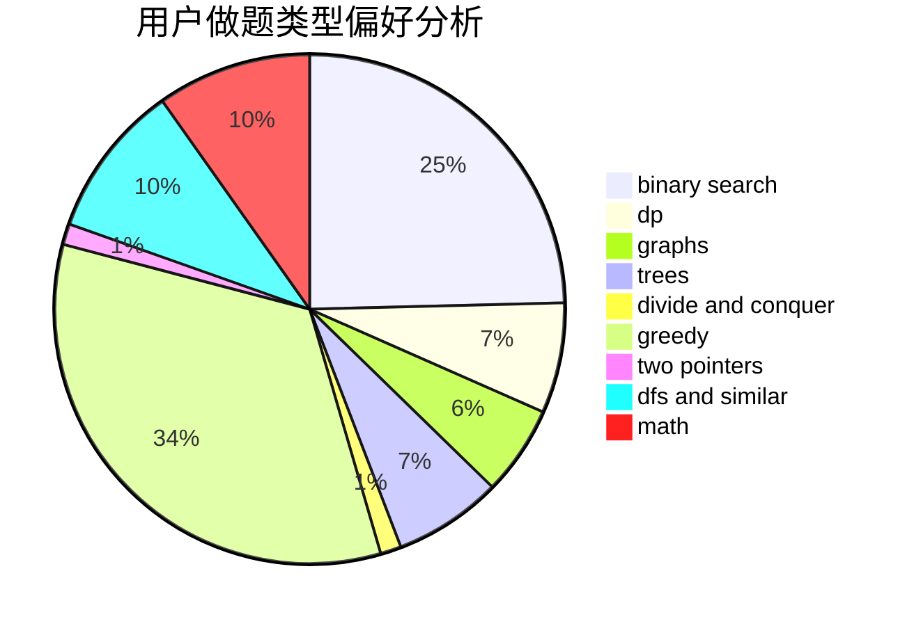

# thematrix233

<!-- tabs:start -->

#### **用户提交结果分析**

#### **用户做题类型偏好分析**

<!-- tabs:end -->
# 推荐题目
[990F](https://codeforces.com/contest/990/problem/F)
[1137A](https://codeforces.com/contest/1137/problem/A)
[1250B](https://codeforces.com/contest/1250/problem/B)
[1260F](https://codeforces.com/contest/1260/problem/F)
[1083B](https://codeforces.com/contest/1083/problem/B)
[1062A](https://codeforces.com/contest/1062/problem/A)
[682A](https://codeforces.com/contest/682/problem/A)
[1163D](https://codeforces.com/contest/1163/problem/D)
[707E](https://codeforces.com/contest/707/problem/E)
[1418G](https://codeforces.com/contest/1418/problem/G)
