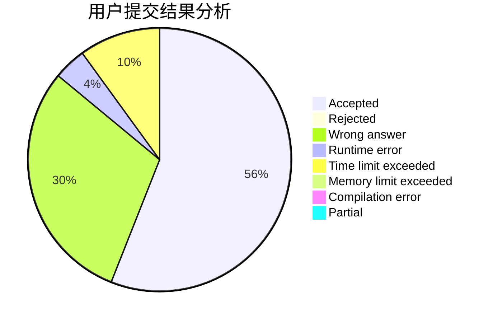
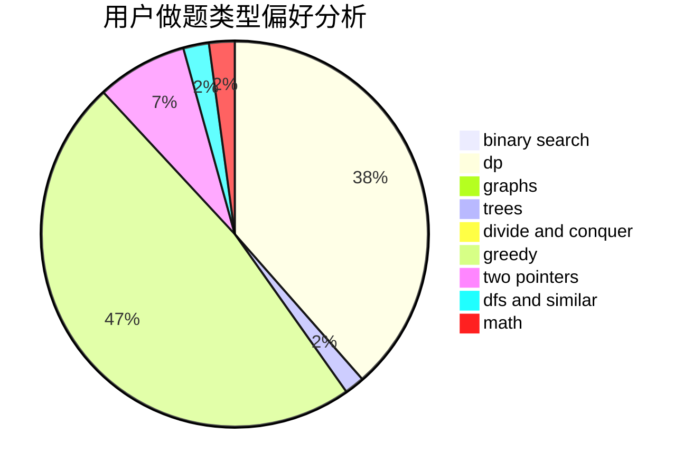

# thereuvlb

<!-- tabs:start -->

#### **用户提交结果分析**

#### **用户做题类型偏好分析**

<!-- tabs:end -->
# 推荐题目
[1419C](https://codeforces.com/contest/1419/problem/C)
[1166C](https://codeforces.com/contest/1166/problem/C)
[463C](https://codeforces.com/contest/463/problem/C)
[521B](https://codeforces.com/contest/521/problem/B)
[280E](https://codeforces.com/contest/280/problem/E)
[346A](https://codeforces.com/contest/346/problem/A)
[474A](https://codeforces.com/contest/474/problem/A)
[10921](https://codeforces.com/contest/1092/problem/1)
[1183D](https://codeforces.com/contest/1183/problem/D)
[200B](https://codeforces.com/contest/200/problem/B)
