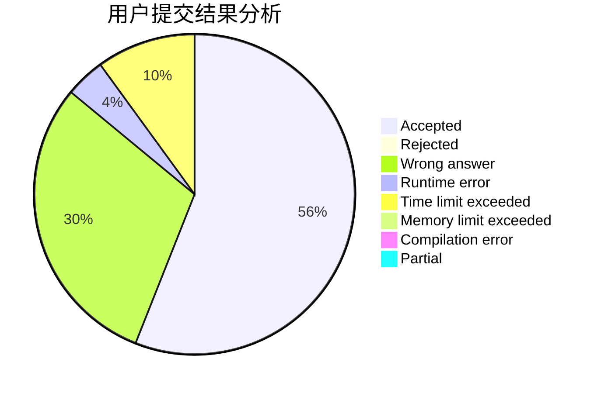
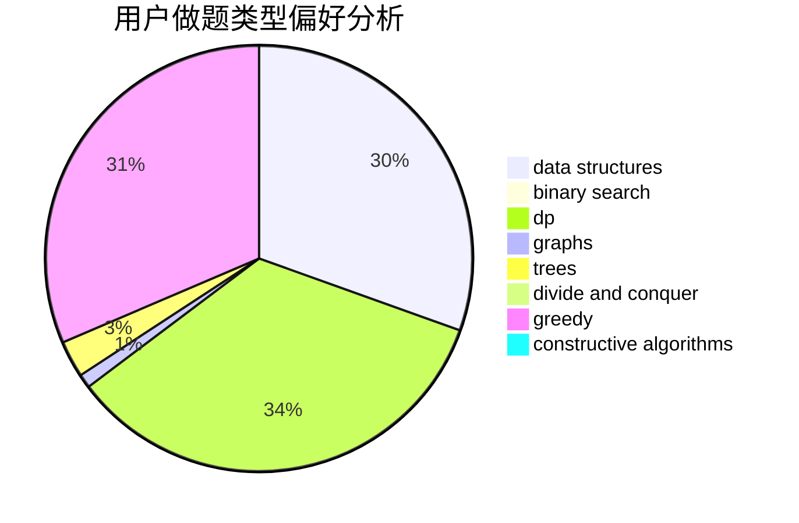
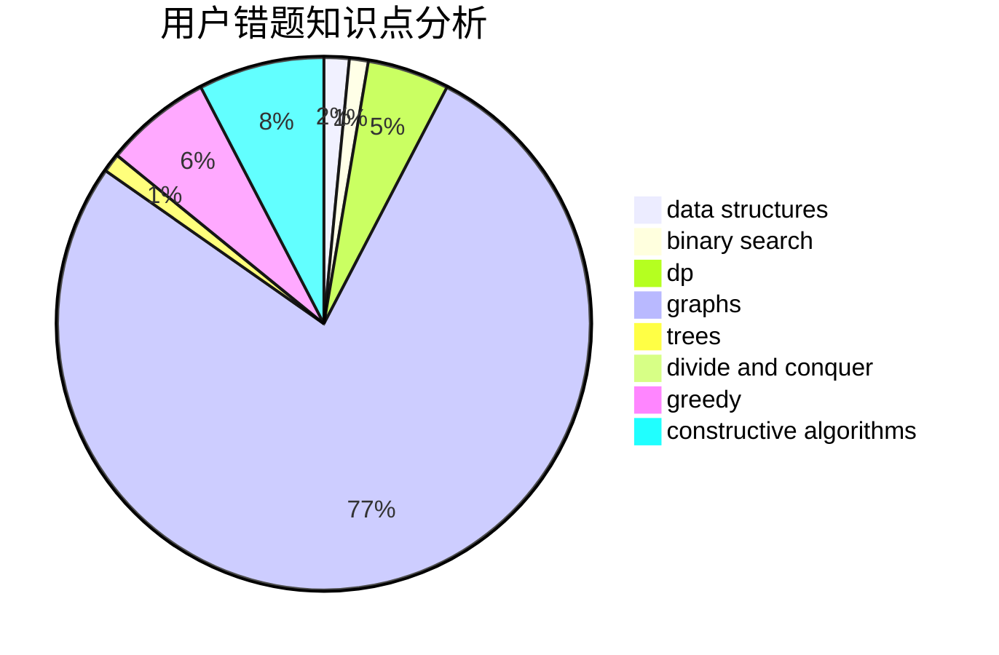

# thereuvlb

<!-- tabs:start -->

#### **用户提交结果分析**

#### **用户做题类型偏好分析**

#### **用户错题知识点分析**

<!-- tabs:end -->
# 推荐题目
[1419C](https://codeforces.com/contest/1419/problem/C)		greedy,
                        implementation,
                        math		  
[1166C](https://codeforces.com/contest/1166/problem/C)		binary search,
                        sortings,
                        two pointers		  
[463C](https://codeforces.com/contest/463/problem/C)		greedy,
                        hashing,
                        implementation		  
[521B](https://codeforces.com/contest/521/problem/B)		dsu,graphs,sortings,trees		  
[280E](https://codeforces.com/contest/280/problem/E)		data structures,
                        dp,
                        implementation,
                        math		  
[346A](https://codeforces.com/contest/346/problem/A)		games,
                        math,
                        number theory		  
[474A](https://codeforces.com/contest/474/problem/A)		implementation		  
[10921](https://codeforces.com/contest/1092/problem/1)		dsu,graphs,sortings,trees		  
[1183D](https://codeforces.com/contest/1183/problem/D)		greedy,
                        sortings		  
[200B](https://codeforces.com/contest/200/problem/B)		implementation,
                        math		  
