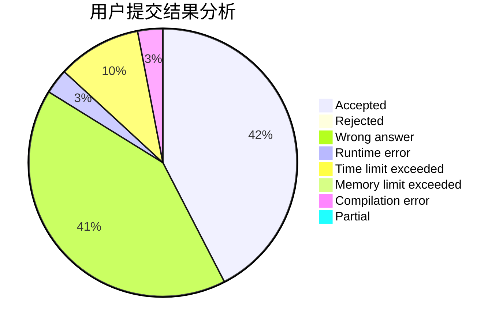
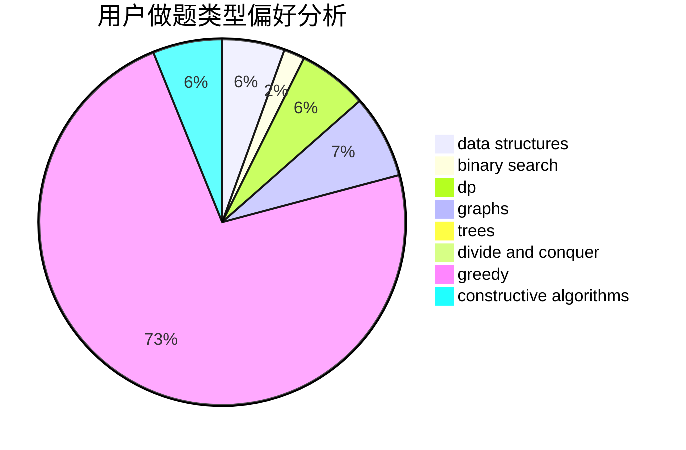
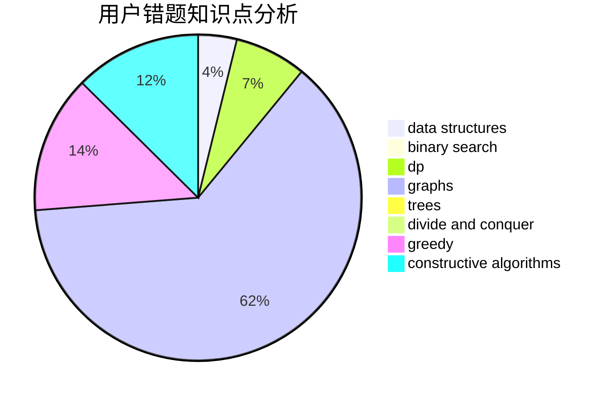

# thirtiseven

<!-- tabs:start -->

#### **用户提交结果分析**

#### **用户做题类型偏好分析**

#### **用户错题知识点分析**

<!-- tabs:end -->
# 推荐题目
[835E](https://codeforces.com/contest/835/problem/E)		binary search,
                        constructive algorithms,
                        interactive		  
[1028C](https://codeforces.com/contest/1028/problem/C)		geometry,
                        implementation,
                        sortings		  
[1008E](https://codeforces.com/contest/1008/problem/E)		dsu,graphs,sortings,trees		  
[1206D](https://codeforces.com/contest/1206/problem/D)		dsu,graphs,sortings,trees		  
[180C](https://codeforces.com/contest/180/problem/C)		dp		  
[682D](https://codeforces.com/contest/682/problem/D)		dp,
                        strings		  
[633G](https://codeforces.com/contest/633/problem/G)		bitmasks,
                        data structures,
                        dfs and similar,
                        math,
                        number theory		  
[871C](https://codeforces.com/contest/871/problem/C)		dsu,graphs,sortings,trees		  
[461D](https://codeforces.com/contest/461/problem/D)		dsu,
                        math		  
[786B](https://codeforces.com/contest/786/problem/B)		data structures,
                        graphs,
                        shortest paths		  
