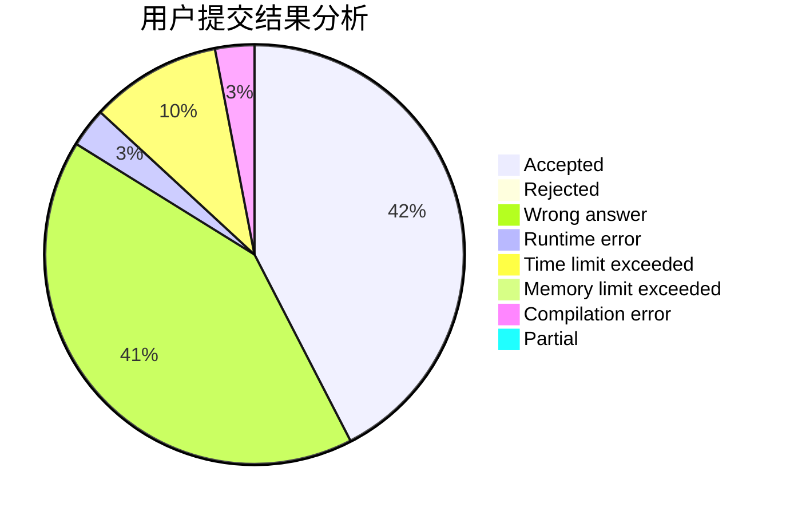
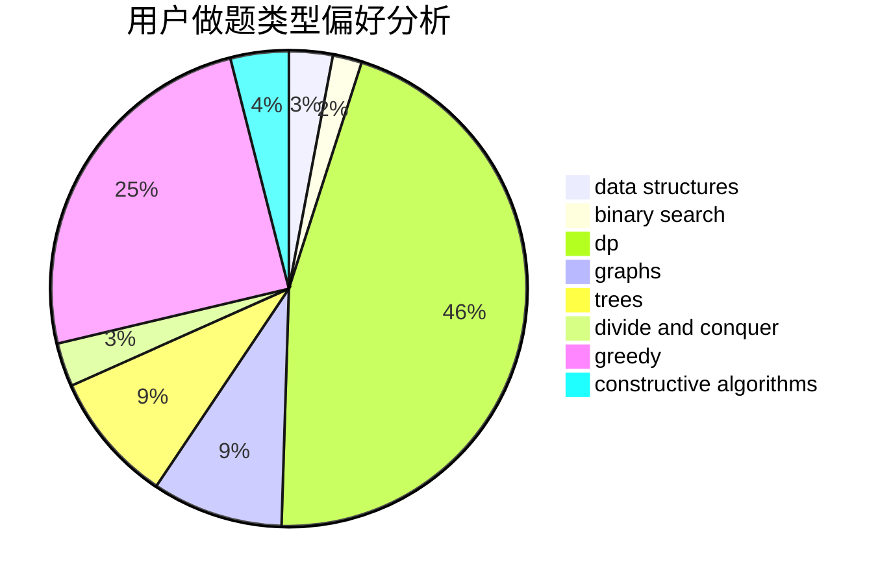
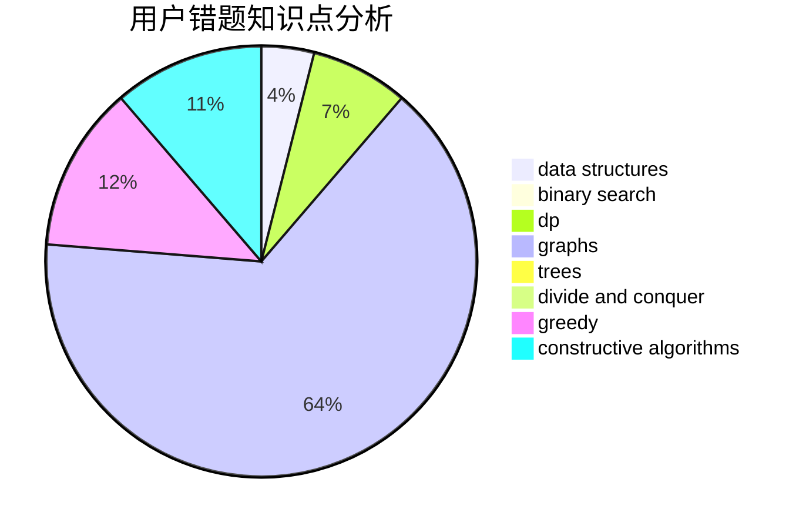

# thirtiseven

<!-- tabs:start -->

#### **用户提交结果分析**

#### **用户做题类型偏好分析**

#### **用户错题知识点分析**

<!-- tabs:end -->
# 推荐题目
[853C](https://codeforces.com/contest/853/problem/C)		data structures		  
[1028G](https://codeforces.com/contest/1028/problem/G)		dp,
                        interactive		  
[1009C](https://codeforces.com/contest/1009/problem/C)		greedy,
                        math		  
[1210E](https://codeforces.com/contest/1210/problem/E)		math		  
[205D](https://codeforces.com/contest/205/problem/D)		dsu,graphs,sortings,trees		  
[706E](https://codeforces.com/contest/706/problem/E)		data structures,
                        implementation		  
[666B](https://codeforces.com/contest/666/problem/B)		graphs,
                        shortest paths		  
[892A](https://codeforces.com/contest/892/problem/A)		greedy,
                        implementation		  
[480C](https://codeforces.com/contest/480/problem/C)		dsu,graphs,sortings,trees		  
[802L](https://codeforces.com/contest/802/problem/L)		dfs and similar,
                        dp,
                        math,
                        trees		  
