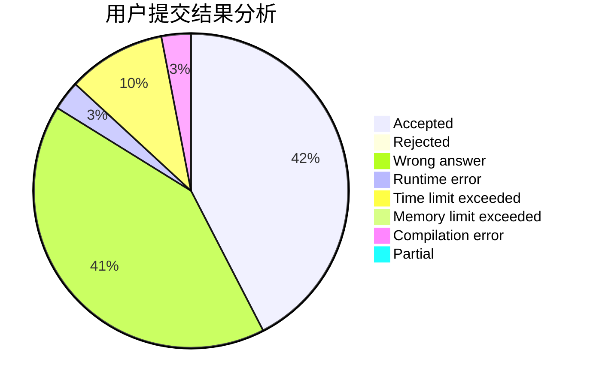
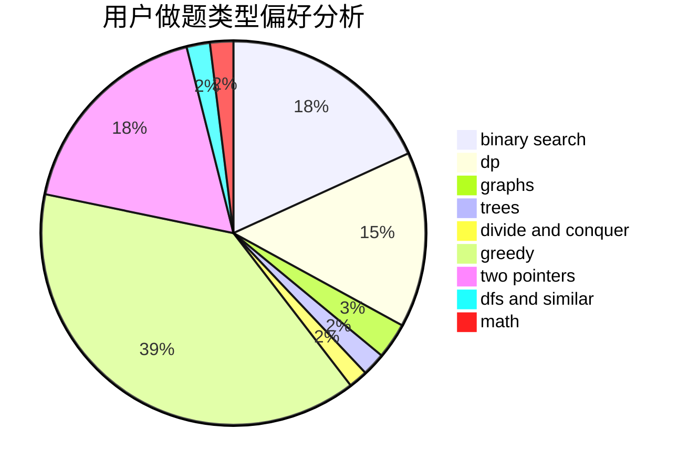

# thirtiseven

<!-- tabs:start -->

#### **用户提交结果分析**

#### **用户做题类型偏好分析**

<!-- tabs:end -->
# 推荐题目
[853C](https://codeforces.com/contest/853/problem/C)
[1028G](https://codeforces.com/contest/1028/problem/G)
[1009C](https://codeforces.com/contest/1009/problem/C)
[1210E](https://codeforces.com/contest/1210/problem/E)
[205D](https://codeforces.com/contest/205/problem/D)
[706E](https://codeforces.com/contest/706/problem/E)
[666B](https://codeforces.com/contest/666/problem/B)
[892A](https://codeforces.com/contest/892/problem/A)
[480C](https://codeforces.com/contest/480/problem/C)
[802L](https://codeforces.com/contest/802/problem/L)
