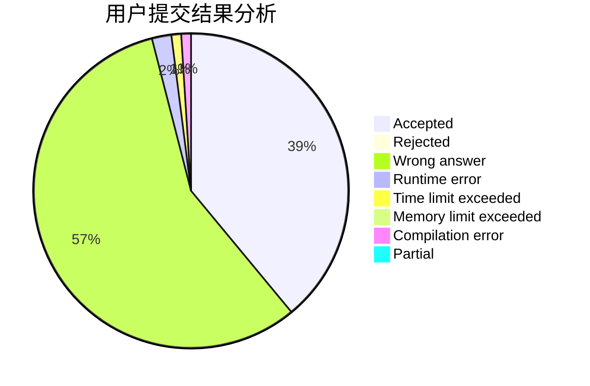
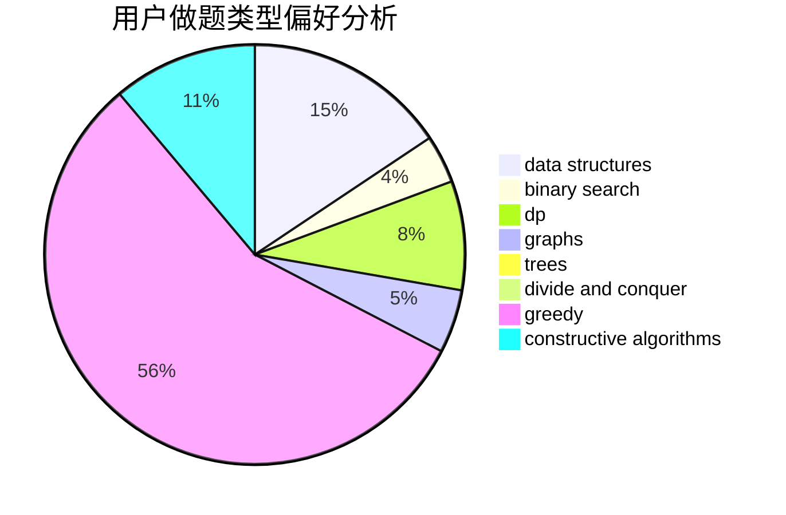
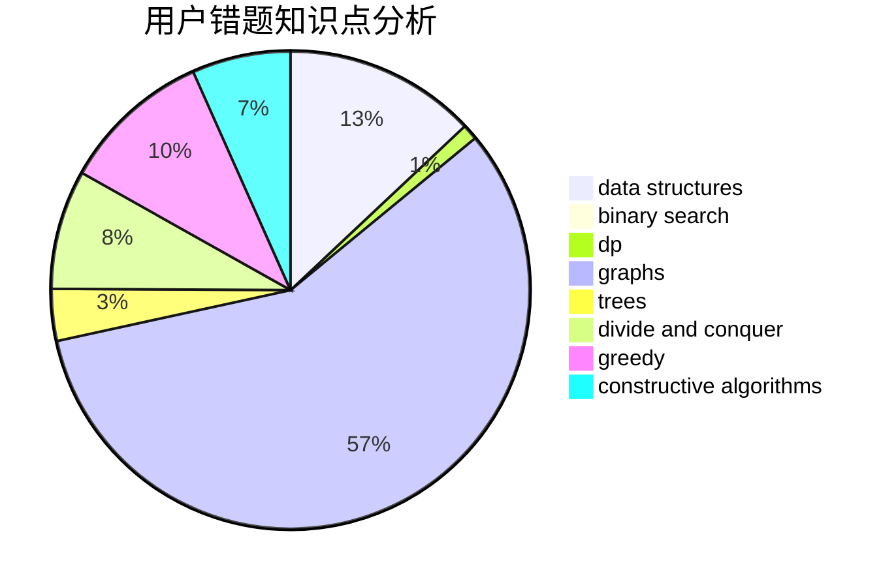

# thjkhdf12

<!-- tabs:start -->

#### **用户提交结果分析**

#### **用户做题类型偏好分析**

#### **用户错题知识点分析**

<!-- tabs:end -->
# 推荐题目
[1401C](https://codeforces.com/contest/1401/problem/C)		constructive algorithms,
                        math,
                        number theory,
                        sortings		  
[1413E](https://codeforces.com/contest/1413/problem/E)		greedy,
                        math,
                        ternary search		  
[1340B](https://codeforces.com/contest/1340/problem/B)		bitmasks,
                        dp,
                        graphs,
                        greedy		  
[1106E](https://codeforces.com/contest/1106/problem/E)		data structures,
                        dp		  
[61E](https://codeforces.com/contest/61/problem/E)		data structures,
                        trees		  
[1154D](https://codeforces.com/contest/1154/problem/D)		greedy		  
[488B](https://codeforces.com/contest/488/problem/B)		brute force,
                        constructive algorithms,
                        math		  
[861A](https://codeforces.com/contest/861/problem/A)		dsu,graphs,sortings,trees		  
[681A](https://codeforces.com/contest/681/problem/A)		implementation		  
[315A](https://codeforces.com/contest/315/problem/A)		brute force		  
