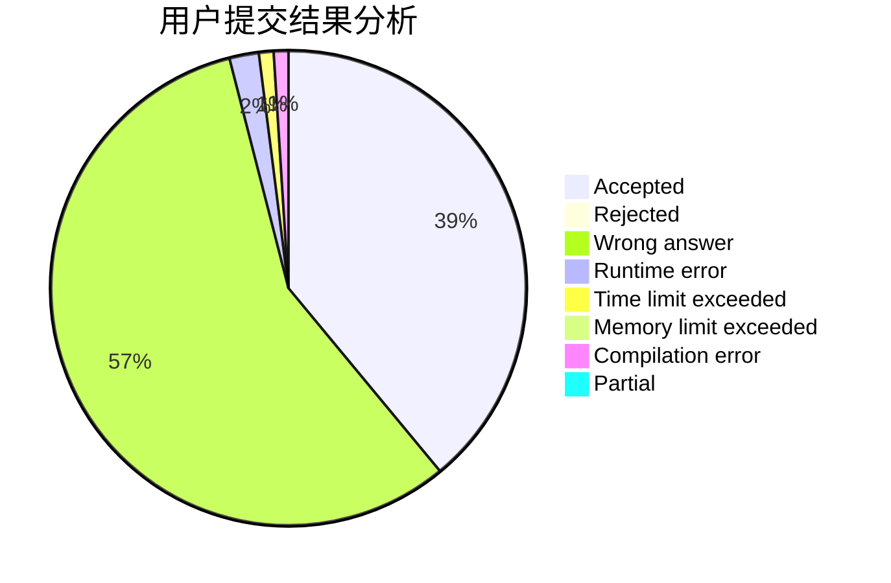
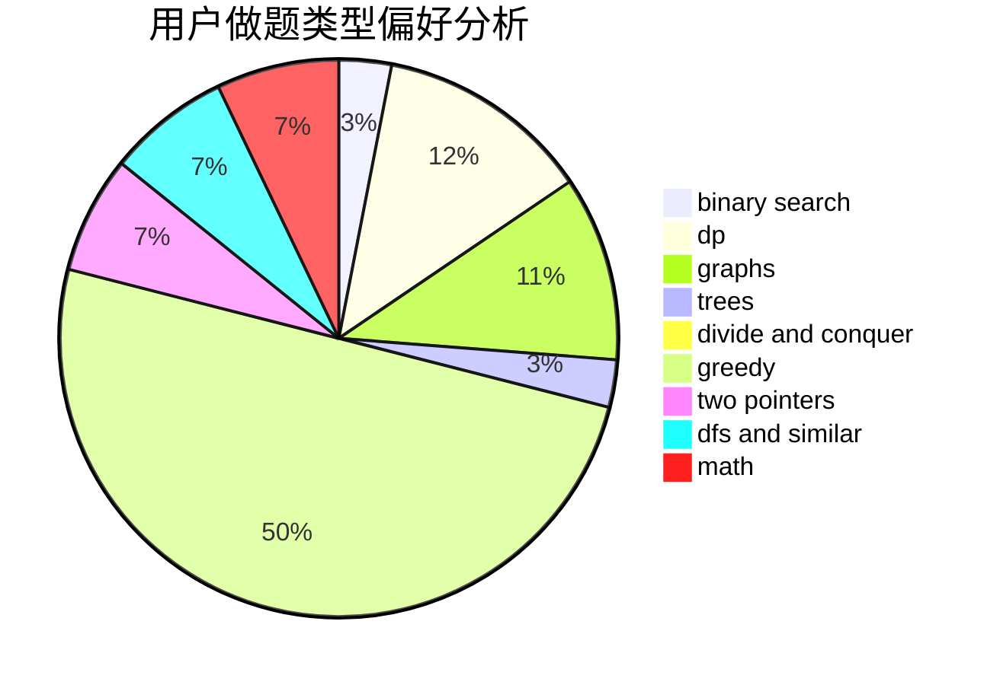

# thjkhdf12

<!-- tabs:start -->

#### **用户提交结果分析**

#### **用户做题类型偏好分析**

<!-- tabs:end -->
# 推荐题目
[1401C](https://codeforces.com/contest/1401/problem/C)
[1413E](https://codeforces.com/contest/1413/problem/E)
[1340B](https://codeforces.com/contest/1340/problem/B)
[1106E](https://codeforces.com/contest/1106/problem/E)
[61E](https://codeforces.com/contest/61/problem/E)
[1154D](https://codeforces.com/contest/1154/problem/D)
[488B](https://codeforces.com/contest/488/problem/B)
[861A](https://codeforces.com/contest/861/problem/A)
[681A](https://codeforces.com/contest/681/problem/A)
[315A](https://codeforces.com/contest/315/problem/A)
