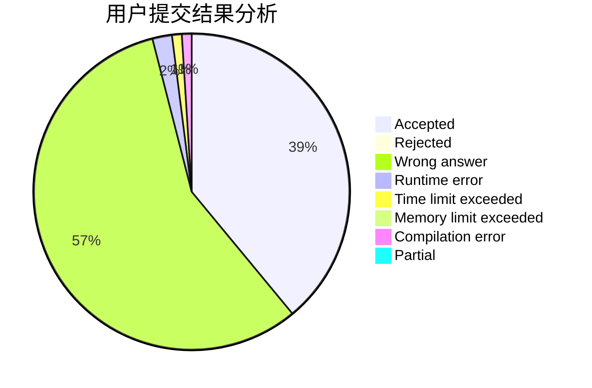
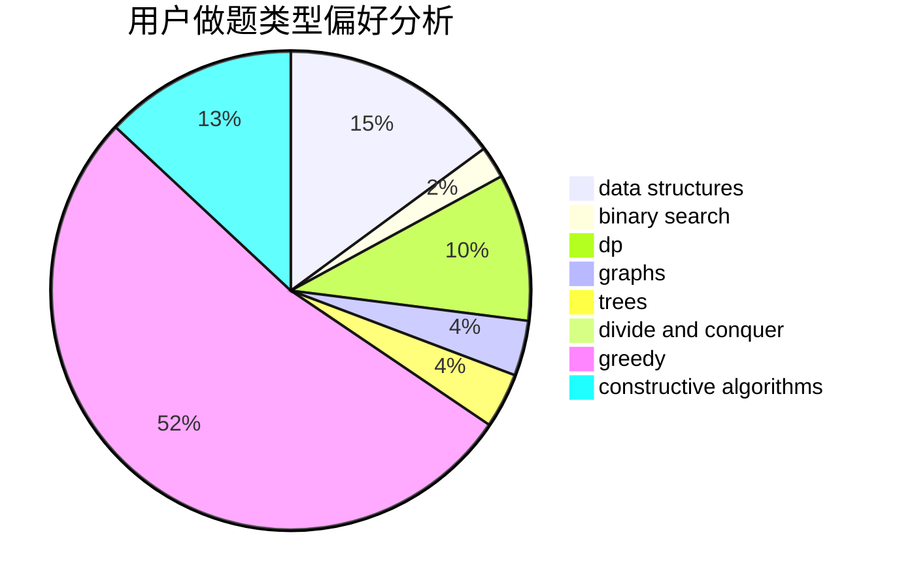
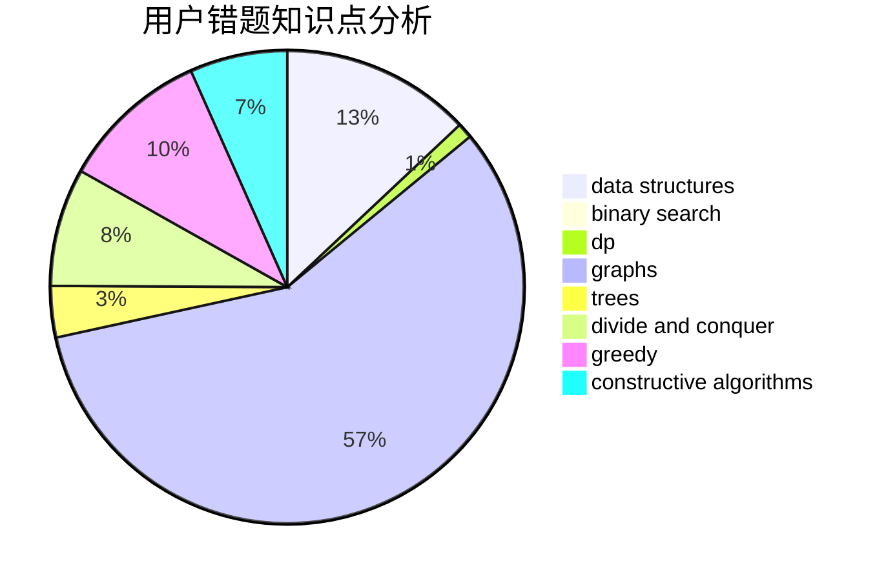

# thjkhdf12

<!-- tabs:start -->

#### **用户提交结果分析**

#### **用户做题类型偏好分析**

#### **用户错题知识点分析**

<!-- tabs:end -->
# 推荐题目
[1393D](https://codeforces.com/contest/1393/problem/D)		dfs and similar,
                        dp,
                        implementation,
                        shortest paths		  
[1402C](https://codeforces.com/contest/1402/problem/C)		*special problem,
                        combinatorics,
                        dfs and similar,
                        dp,
                        games,
                        graphs,
                        matrices,
                        trees		  
[1333C](https://codeforces.com/contest/1333/problem/C)		binary search,
                        data structures,
                        implementation,
                        two pointers		  
[1106B](https://codeforces.com/contest/1106/problem/B)		data structures,
                        implementation		  
[600D](https://codeforces.com/contest/600/problem/D)		geometry		  
[1152D](https://codeforces.com/contest/1152/problem/D)		dp,
                        greedy,
                        trees		  
[468D](https://codeforces.com/contest/468/problem/D)		graph matchings		  
[842B](https://codeforces.com/contest/842/problem/B)		geometry		  
[660C](https://codeforces.com/contest/660/problem/C)		binary search,
                        dp,
                        two pointers		  
[297E](https://codeforces.com/contest/297/problem/E)		data structures		  
