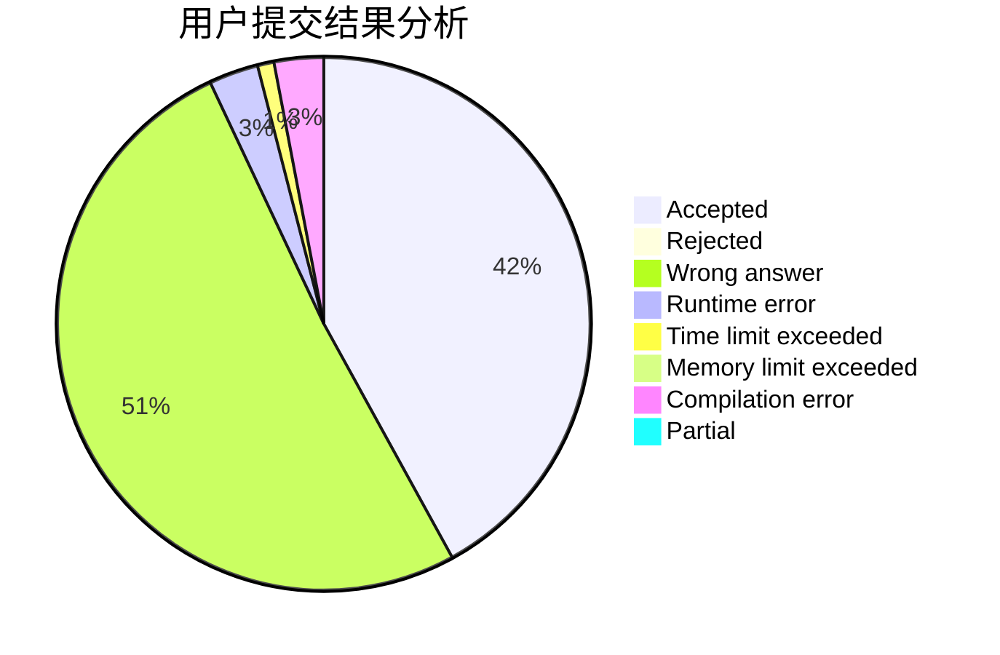
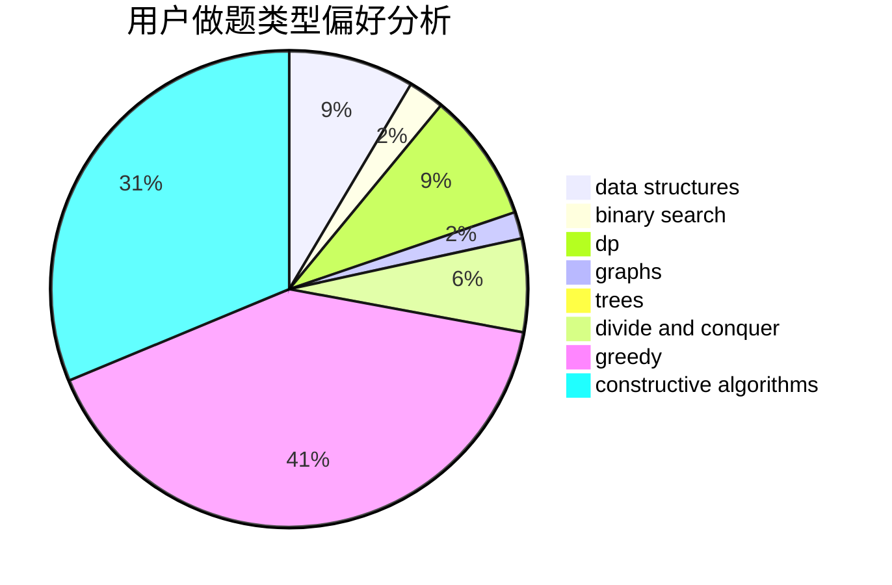
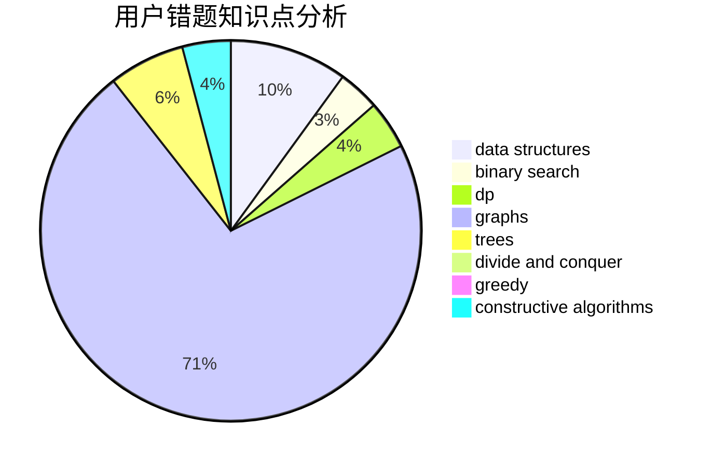

# thomasliu

<!-- tabs:start -->

#### **用户提交结果分析**

#### **用户做题类型偏好分析**

#### **用户错题知识点分析**

<!-- tabs:end -->
# 推荐题目
[652B](https://codeforces.com/contest/652/problem/B)		sortings		  
[860A](https://codeforces.com/contest/860/problem/A)		dsu,graphs,sortings,trees		  
[30A](https://codeforces.com/contest/30/problem/A)		brute force,
                        math		  
[621C](https://codeforces.com/contest/621/problem/C)		combinatorics,
                        math,
                        number theory,
                        probabilities		  
[650C](https://codeforces.com/contest/650/problem/C)		dfs and similar,
                        dp,
                        dsu,
                        graphs,
                        greedy		  
[434A](https://codeforces.com/contest/434/problem/A)		dsu,graphs,sortings,trees		  
[549B](https://codeforces.com/contest/549/problem/B)		constructive algorithms,
                        dfs and similar,
                        graphs,
                        greedy		  
[746E](https://codeforces.com/contest/746/problem/E)		greedy,
                        implementation,
                        math		  
[13492](https://codeforces.com/contest/1349/problem/2)		dsu,graphs,sortings,trees		  
[1294D](https://codeforces.com/contest/1294/problem/D)		data structures,
                        greedy,
                        implementation,
                        math		  
