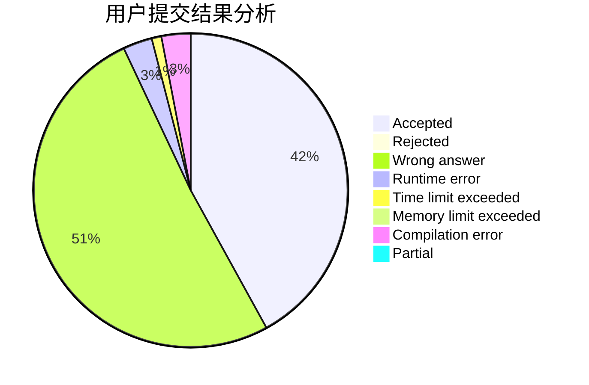
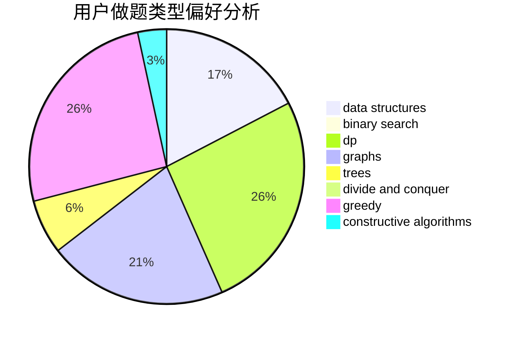
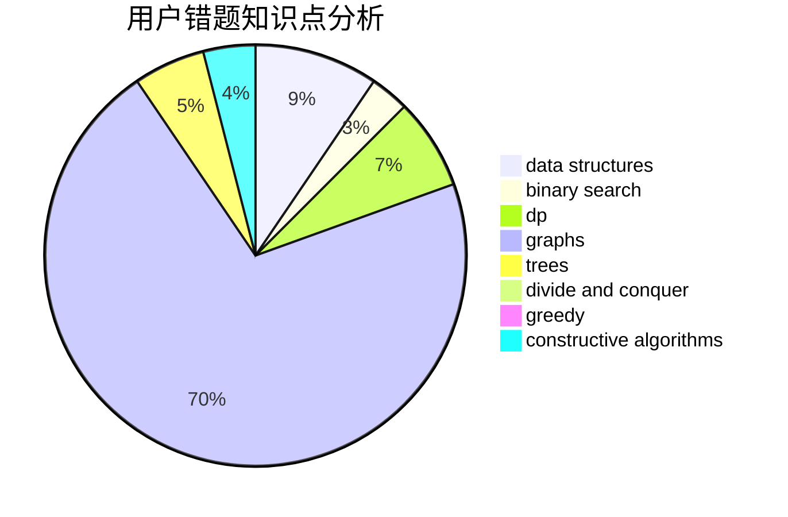

# thomasliu

<!-- tabs:start -->

#### **用户提交结果分析**

#### **用户做题类型偏好分析**

#### **用户错题知识点分析**

<!-- tabs:end -->
# 推荐题目
[624A](https://codeforces.com/contest/624/problem/A)		math		  
[841A](https://codeforces.com/contest/841/problem/A)		brute force,
                        implementation		  
[293C](https://codeforces.com/contest/293/problem/C)		brute force,
                        math,
                        number theory		  
[602C](https://codeforces.com/contest/602/problem/C)		dsu,graphs,sortings,trees		  
[622C](https://codeforces.com/contest/622/problem/C)		data structures,
                        implementation		  
[405A](https://codeforces.com/contest/405/problem/A)		greedy,
                        implementation,
                        sortings		  
[524E](https://codeforces.com/contest/524/problem/E)		data structures,
                        sortings		  
[729E](https://codeforces.com/contest/729/problem/E)		constructive algorithms,
                        data structures,
                        graphs,
                        greedy,
                        sortings		  
[1342B](https://codeforces.com/contest/1342/problem/B)		constructive algorithms,
                        strings		  
[1287A](https://codeforces.com/contest/1287/problem/A)		greedy,
                        implementation		  
