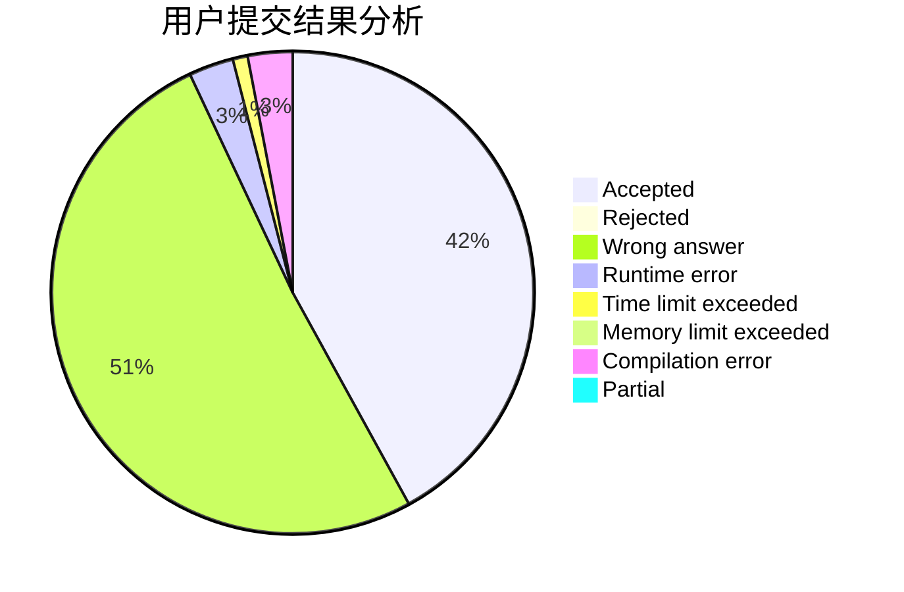
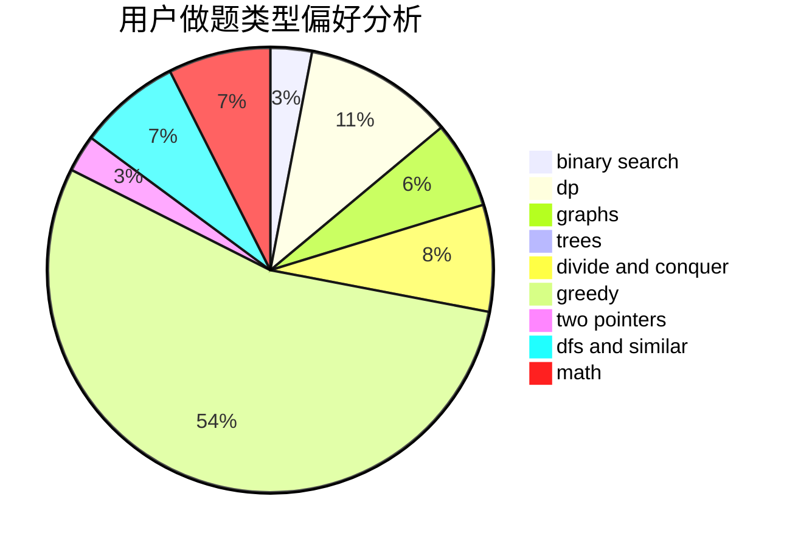

# thomasliu

<!-- tabs:start -->

#### **用户提交结果分析**

#### **用户做题类型偏好分析**

<!-- tabs:end -->
# 推荐题目
[652B](https://codeforces.com/contest/652/problem/B)
[860A](https://codeforces.com/contest/860/problem/A)
[30A](https://codeforces.com/contest/30/problem/A)
[621C](https://codeforces.com/contest/621/problem/C)
[650C](https://codeforces.com/contest/650/problem/C)
[434A](https://codeforces.com/contest/434/problem/A)
[549B](https://codeforces.com/contest/549/problem/B)
[746E](https://codeforces.com/contest/746/problem/E)
[13492](https://codeforces.com/contest/1349/problem/2)
[1294D](https://codeforces.com/contest/1294/problem/D)
