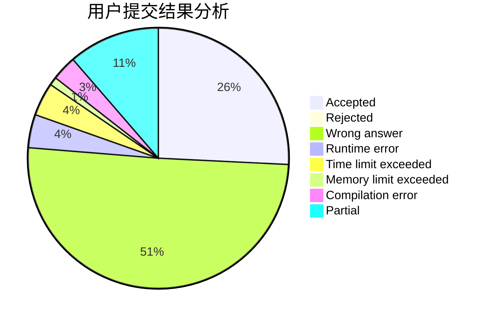
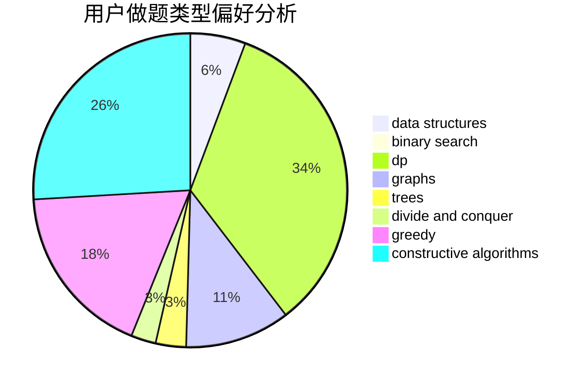

# thu2022yz

<!-- tabs:start -->

#### **用户提交结果分析**

#### **用户做题类型偏好分析**

#### **用户错题知识点分析**

<!-- tabs:end -->
# 推荐题目
[1106F](https://codeforces.com/contest/1106/problem/F)		math,
                        matrices,
                        number theory		  
[958D1](https://codeforces.com/contest/958D/problem/1)		expression parsing,
                        math		  
[610C](https://codeforces.com/contest/610/problem/C)		constructive algorithms		  
[1416A](https://codeforces.com/contest/1416/problem/A)		binary search,
                        data structures,
                        implementation,
                        two pointers		  
[1191F](https://codeforces.com/contest/1191/problem/F)		dsu,graphs,sortings,trees		  
[1031D](https://codeforces.com/contest/1031/problem/D)		greedy		  
[261C](https://codeforces.com/contest/261/problem/C)		constructive algorithms,
                        dp,
                        math		  
[1108E2](https://codeforces.com/contest/1108E/problem/2)		data structures,
                        implementation		  
[1154B](https://codeforces.com/contest/1154/problem/B)		math		  
[859C](https://codeforces.com/contest/859/problem/C)		dp,
                        games		  
