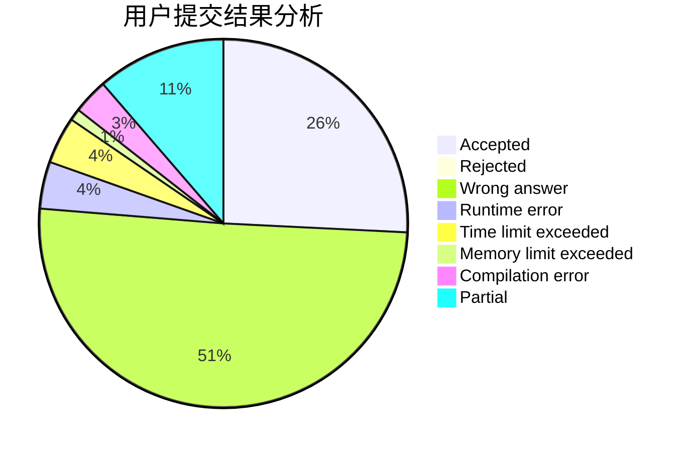
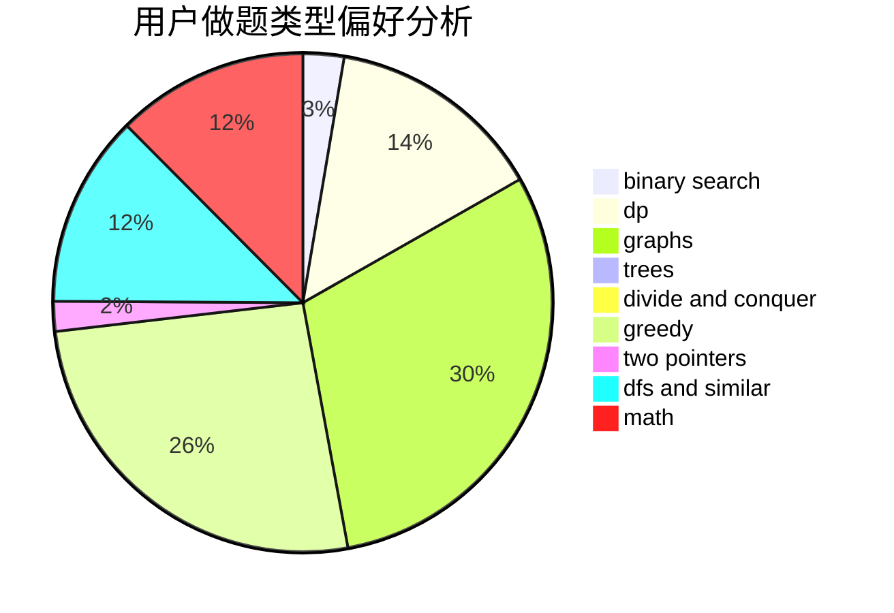

# thu2022yz

<!-- tabs:start -->

#### **用户提交结果分析**

#### **用户做题类型偏好分析**

<!-- tabs:end -->
# 推荐题目
[1107C](https://codeforces.com/contest/1107/problem/C)
[97D](https://codeforces.com/contest/97/problem/D)
[629E](https://codeforces.com/contest/629/problem/E)
[1423K](https://codeforces.com/contest/1423/problem/K)
[1197E](https://codeforces.com/contest/1197/problem/E)
[1032F](https://codeforces.com/contest/1032/problem/F)
[27A](https://codeforces.com/contest/27/problem/A)
[1109B](https://codeforces.com/contest/1109/problem/B)
[1156B](https://codeforces.com/contest/1156/problem/B)
[877A](https://codeforces.com/contest/877/problem/A)
