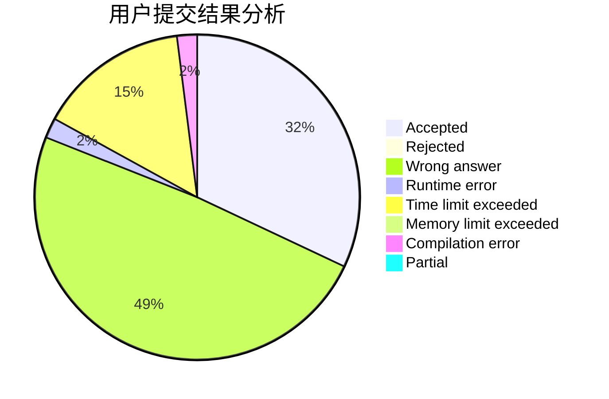
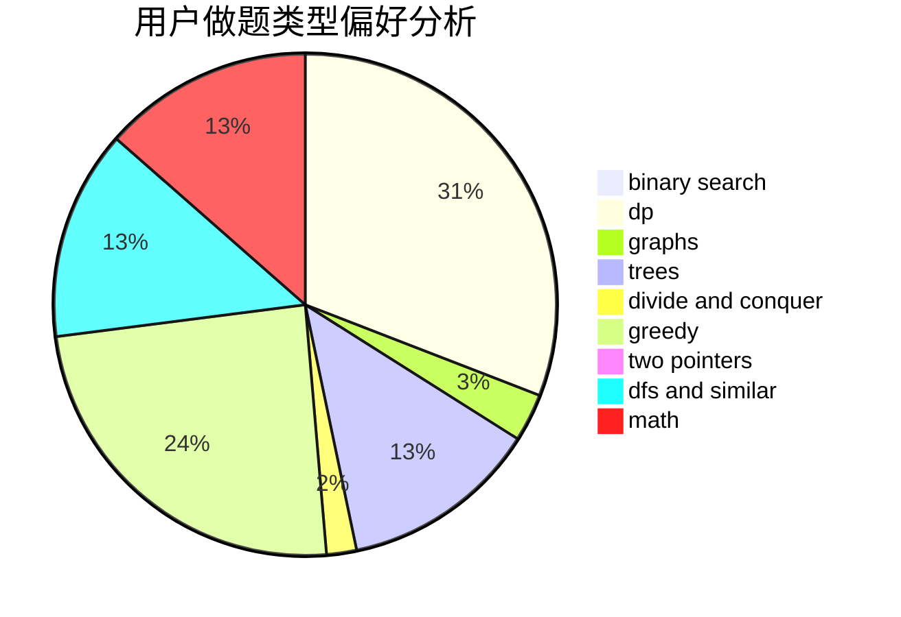

# 156250lcy

<!-- tabs:start -->

#### **用户提交结果分析**

#### **用户做题类型偏好分析**

<!-- tabs:end -->
# 推荐题目
[115B](https://codeforces.com/contest/115/problem/B)
[1132C](https://codeforces.com/contest/1132/problem/C)
[1161E](https://codeforces.com/contest/1161/problem/E)
[1159F](https://codeforces.com/contest/1159/problem/F)
[1036B](https://codeforces.com/contest/1036/problem/B)
[1161B](https://codeforces.com/contest/1161/problem/B)
[1159C](https://codeforces.com/contest/1159/problem/C)
[1161C](https://codeforces.com/contest/1161/problem/C)
[1162A](https://codeforces.com/contest/1162/problem/A)
[1161A](https://codeforces.com/contest/1161/problem/A)
