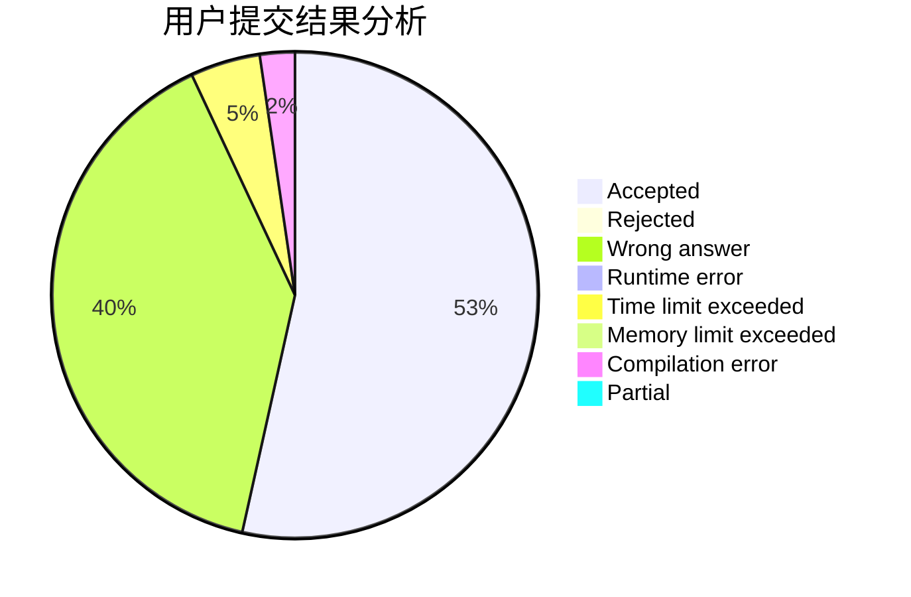
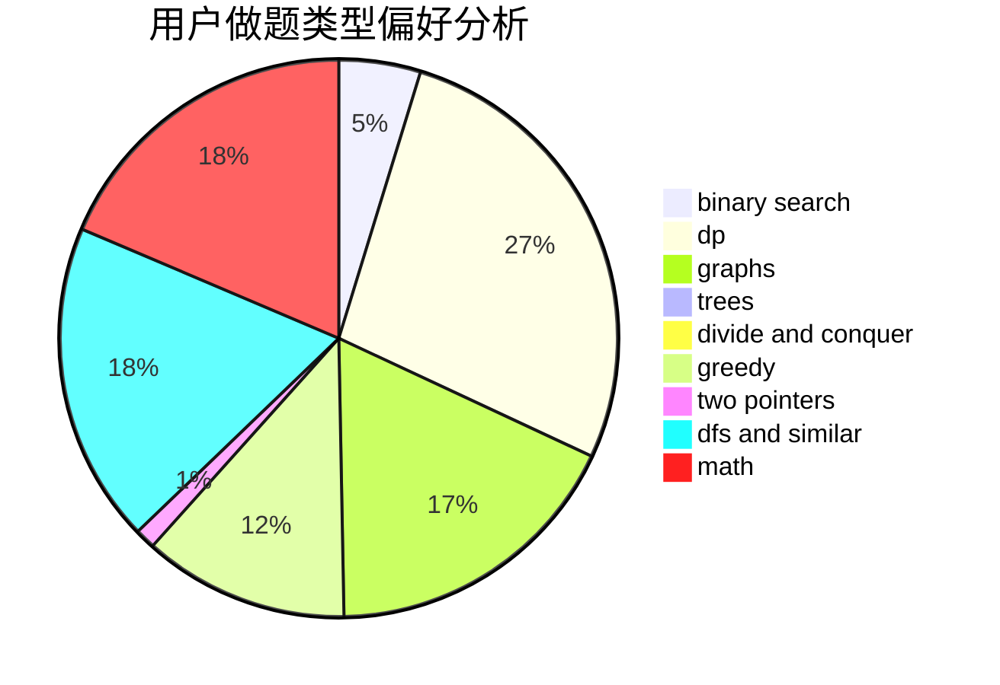

# CSP_Sept

<!-- tabs:start -->

#### **用户提交结果分析**

#### **用户做题类型偏好分析**

<!-- tabs:end -->
# 推荐题目
[286A](https://codeforces.com/contest/286/problem/A)
[225E](https://codeforces.com/contest/225/problem/E)
[1033G](https://codeforces.com/contest/1033/problem/G)
[1040A](https://codeforces.com/contest/1040/problem/A)
[1144B](https://codeforces.com/contest/1144/problem/B)
[634B](https://codeforces.com/contest/634/problem/B)
[325B](https://codeforces.com/contest/325/problem/B)
[633D](https://codeforces.com/contest/633/problem/D)
[1256C](https://codeforces.com/contest/1256/problem/C)
[1351A](https://codeforces.com/contest/1351/problem/A)
