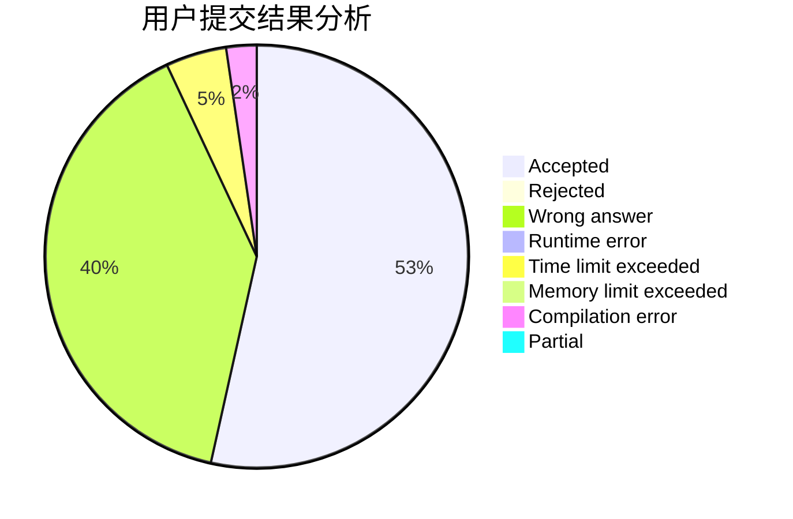
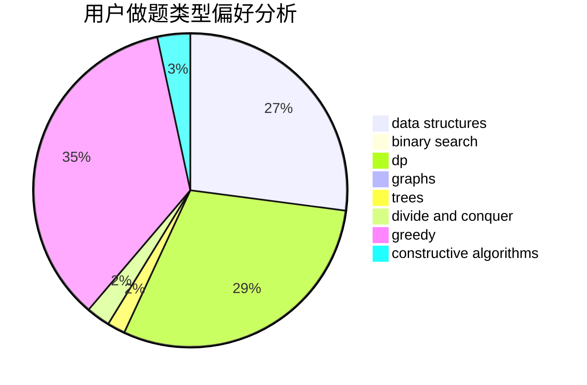

# CSP_Sept

<!-- tabs:start -->

#### **用户提交结果分析**

#### **用户做题类型偏好分析**

#### **用户错题知识点分析**

<!-- tabs:end -->
# 推荐题目
[286A](https://codeforces.com/contest/286/problem/A)		constructive algorithms,
                        math		  
[225E](https://codeforces.com/contest/225/problem/E)		math,
                        number theory		  
[1033G](https://codeforces.com/contest/1033/problem/G)		games		  
[1040A](https://codeforces.com/contest/1040/problem/A)		greedy		  
[1144B](https://codeforces.com/contest/1144/problem/B)		greedy,
                        implementation,
                        sortings		  
[634B](https://codeforces.com/contest/634/problem/B)		dsu,graphs,sortings,trees		  
[325B](https://codeforces.com/contest/325/problem/B)		binary search,
                        math		  
[633D](https://codeforces.com/contest/633/problem/D)		brute force,
                        dp,
                        hashing,
                        implementation,
                        math		  
[1256C](https://codeforces.com/contest/1256/problem/C)		greedy		  
[1351A](https://codeforces.com/contest/1351/problem/A)		implementation		  
