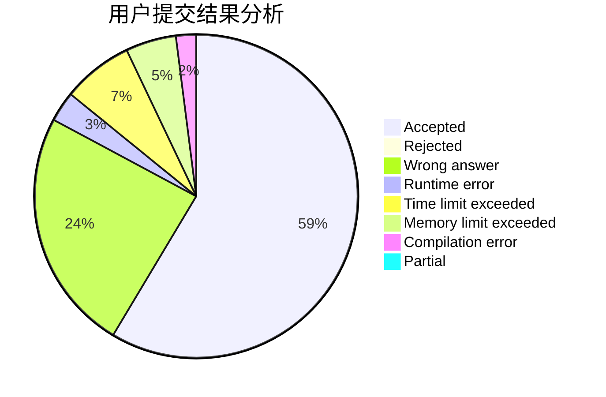
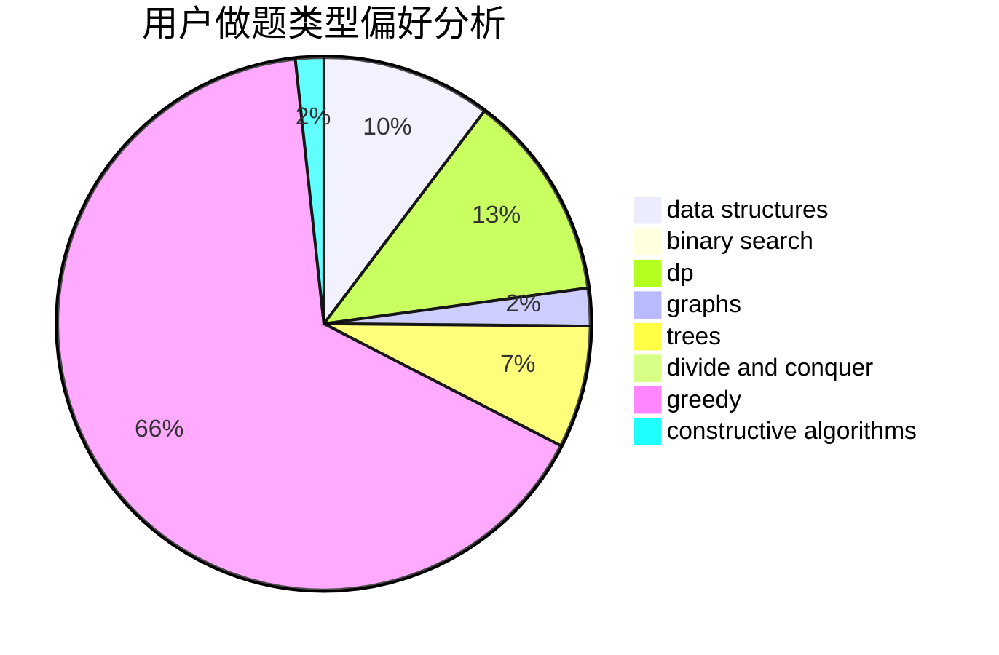
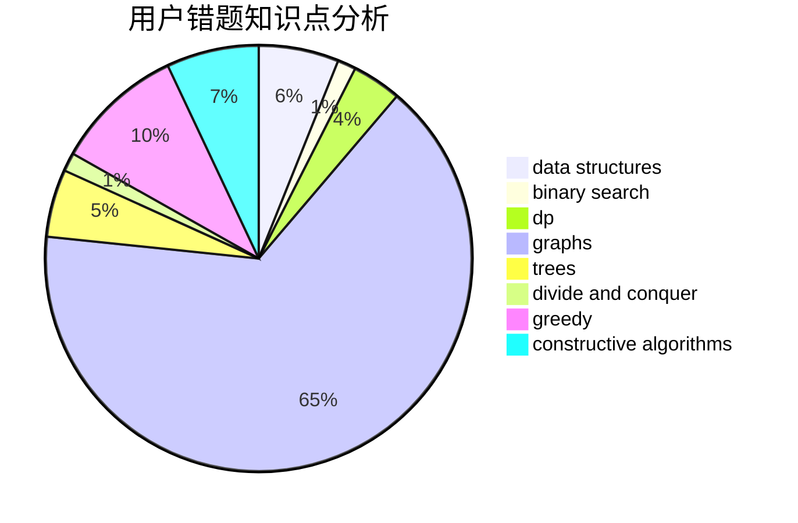

# tianbu

<!-- tabs:start -->

#### **用户提交结果分析**

#### **用户做题类型偏好分析**

#### **用户错题知识点分析**

<!-- tabs:end -->
# 推荐题目
[335D](https://codeforces.com/contest/335/problem/D)		brute force,
                        dp		  
[508C](https://codeforces.com/contest/508/problem/C)		constructive algorithms,
                        greedy		  
[604A](https://codeforces.com/contest/604/problem/A)		implementation		  
[388E](https://codeforces.com/contest/388/problem/E)		geometry		  
[543E](https://codeforces.com/contest/543/problem/E)		constructive algorithms,
                        data structures		  
[1230C](https://codeforces.com/contest/1230/problem/C)		dsu,graphs,sortings,trees		  
[917C](https://codeforces.com/contest/917/problem/C)		combinatorics,
                        dp,
                        matrices		  
[1191C](https://codeforces.com/contest/1191/problem/C)		dsu,graphs,sortings,trees		  
[789A](https://codeforces.com/contest/789/problem/A)		implementation,
                        math		  
[1243B2](https://codeforces.com/contest/1243B/problem/2)		strings		  
