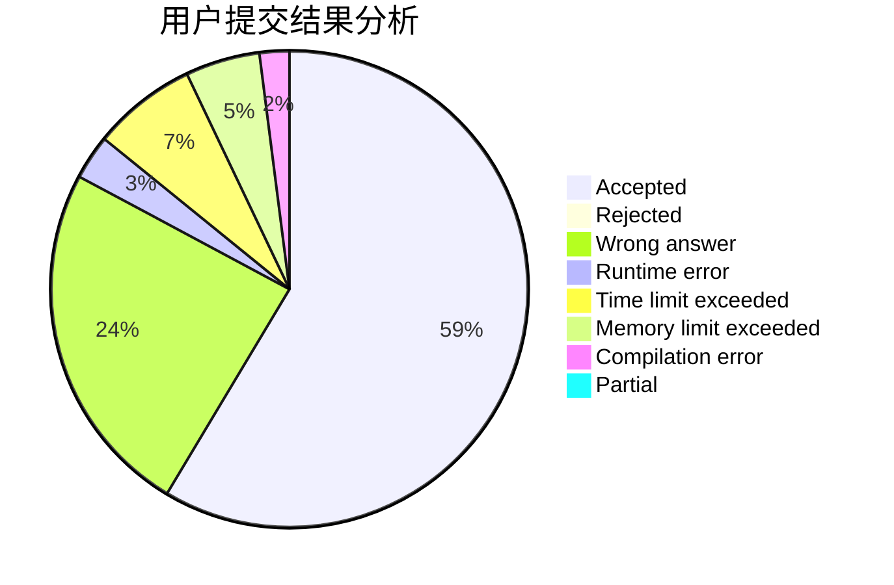
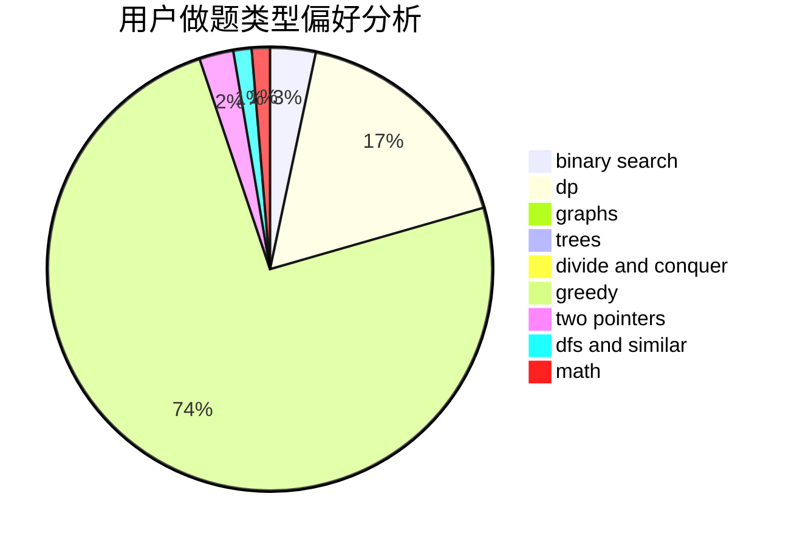

# tianbu

<!-- tabs:start -->

#### **用户提交结果分析**

#### **用户做题类型偏好分析**

<!-- tabs:end -->
# 推荐题目
[362C](https://codeforces.com/contest/362/problem/C)
[528C](https://codeforces.com/contest/528/problem/C)
[622C](https://codeforces.com/contest/622/problem/C)
[418B](https://codeforces.com/contest/418/problem/B)
[568A](https://codeforces.com/contest/568/problem/A)
[1238G](https://codeforces.com/contest/1238/problem/G)
[938A](https://codeforces.com/contest/938/problem/A)
[1197B](https://codeforces.com/contest/1197/problem/B)
[804C](https://codeforces.com/contest/804/problem/C)
[1248B](https://codeforces.com/contest/1248/problem/B)
