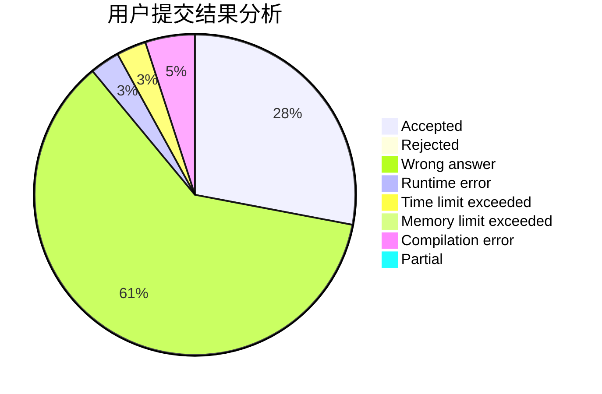
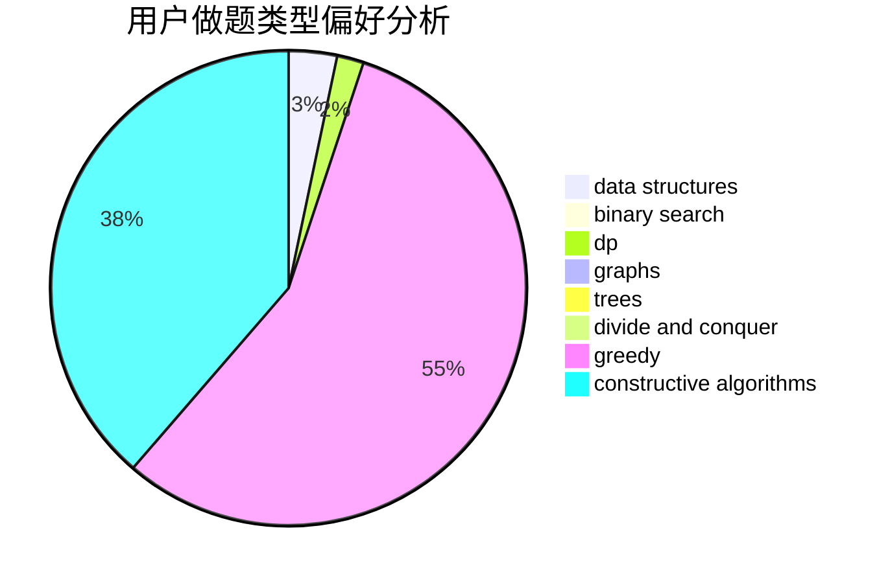
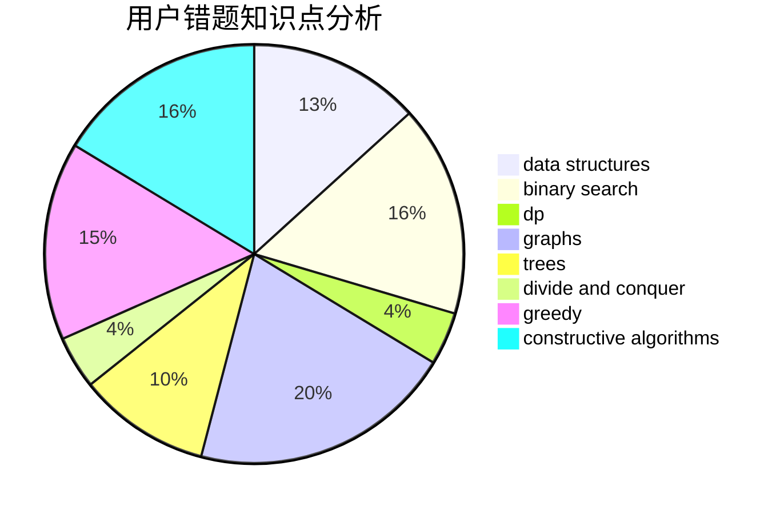

# tianfuzhen

<!-- tabs:start -->

#### **用户提交结果分析**

#### **用户做题类型偏好分析**

#### **用户错题知识点分析**

<!-- tabs:end -->
# 推荐题目
[3162](https://codeforces.com/contest/316/problem/2)		dsu,graphs,sortings,trees		  
[497D](https://codeforces.com/contest/497/problem/D)		brute force,
                        geometry,
                        math		  
[828C](https://codeforces.com/contest/828/problem/C)		dsu,graphs,sortings,trees		  
[996B](https://codeforces.com/contest/996/problem/B)		binary search,
                        math		  
[597B](https://codeforces.com/contest/597/problem/B)		dp,
                        greedy,
                        sortings		  
[431E](https://codeforces.com/contest/431/problem/E)		binary search,
                        data structures,
                        ternary search		  
[981H](https://codeforces.com/contest/981/problem/H)		combinatorics,
                        data structures,
                        dp,
                        fft,
                        math		  
[1119B](https://codeforces.com/contest/1119/problem/B)		binary search,
                        flows,
                        greedy,
                        sortings		  
[729D](https://codeforces.com/contest/729/problem/D)		constructive algorithms,
                        greedy,
                        math		  
[1093C](https://codeforces.com/contest/1093/problem/C)		greedy		  
