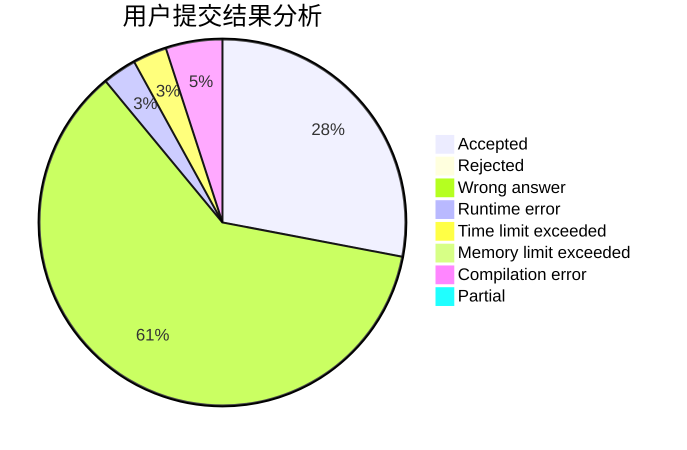
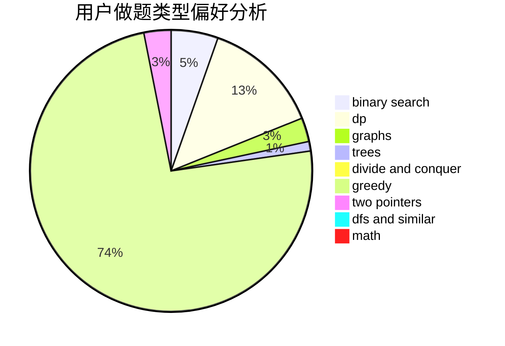

# tianfuzhen

<!-- tabs:start -->

#### **用户提交结果分析**

#### **用户做题类型偏好分析**

<!-- tabs:end -->
# 推荐题目
[3162](https://codeforces.com/contest/316/problem/2)
[497D](https://codeforces.com/contest/497/problem/D)
[828C](https://codeforces.com/contest/828/problem/C)
[996B](https://codeforces.com/contest/996/problem/B)
[597B](https://codeforces.com/contest/597/problem/B)
[431E](https://codeforces.com/contest/431/problem/E)
[981H](https://codeforces.com/contest/981/problem/H)
[1119B](https://codeforces.com/contest/1119/problem/B)
[729D](https://codeforces.com/contest/729/problem/D)
[1093C](https://codeforces.com/contest/1093/problem/C)
