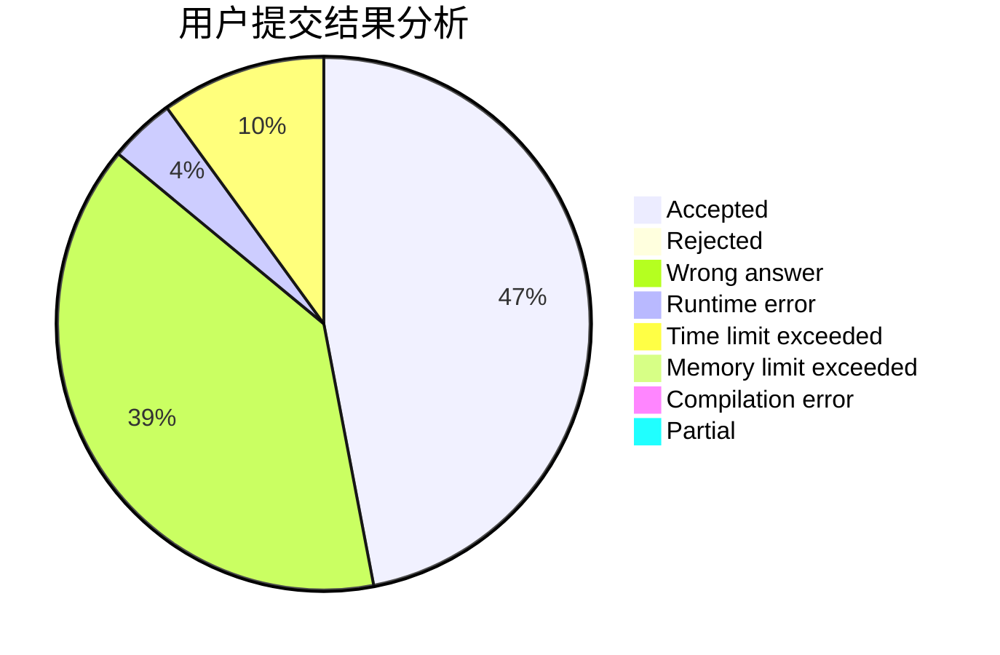
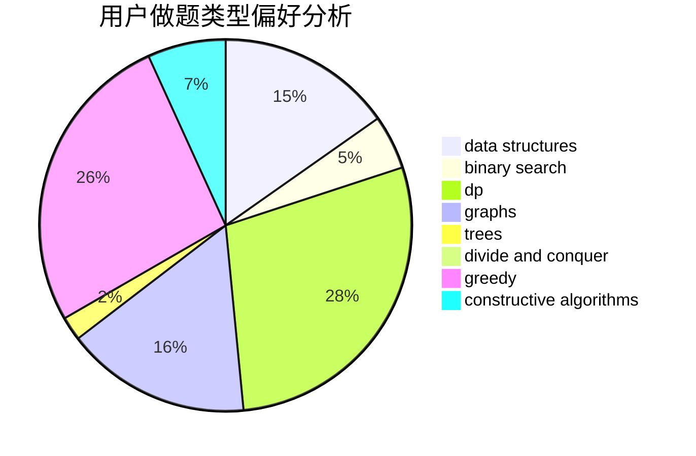
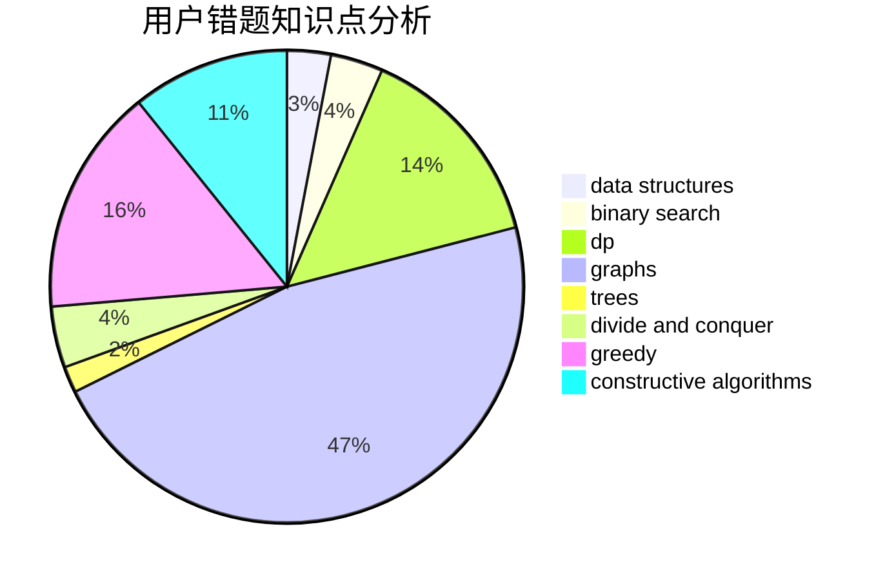

# tiantian666

<!-- tabs:start -->

#### **用户提交结果分析**

#### **用户做题类型偏好分析**

#### **用户错题知识点分析**

<!-- tabs:end -->
# 推荐题目
[acmsguru7](https://codeforces.com/contest/acmsguru/problem/7)		dsu,graphs,sortings,trees		  
[1480C](https://codeforces.com/contest/1480/problem/C)		dsu,graphs,sortings,trees		  
[963C](https://codeforces.com/contest/963/problem/C)		brute force,
                        math,
                        number theory		  
[965E](https://codeforces.com/contest/965/problem/E)		data structures,
                        dp,
                        greedy,
                        strings,
                        trees		  
[205A](https://codeforces.com/contest/205/problem/A)		brute force,
                        implementation		  
[777C](https://codeforces.com/contest/777/problem/C)		binary search,
                        data structures,
                        dp,
                        greedy,
                        implementation,
                        two pointers		  
[404A](https://codeforces.com/contest/404/problem/A)		implementation		  
[1083B](https://codeforces.com/contest/1083/problem/B)		greedy,
                        strings		  
[1431A](https://codeforces.com/contest/1431/problem/A)		*special problem		  
[509A](https://codeforces.com/contest/509/problem/A)		brute force,
                        implementation		  
