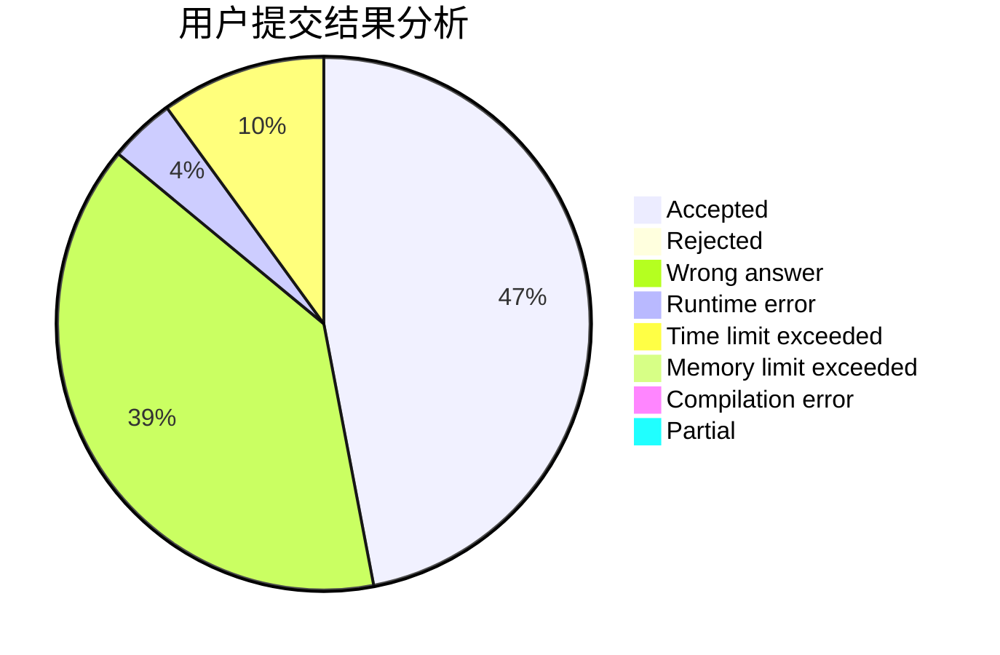
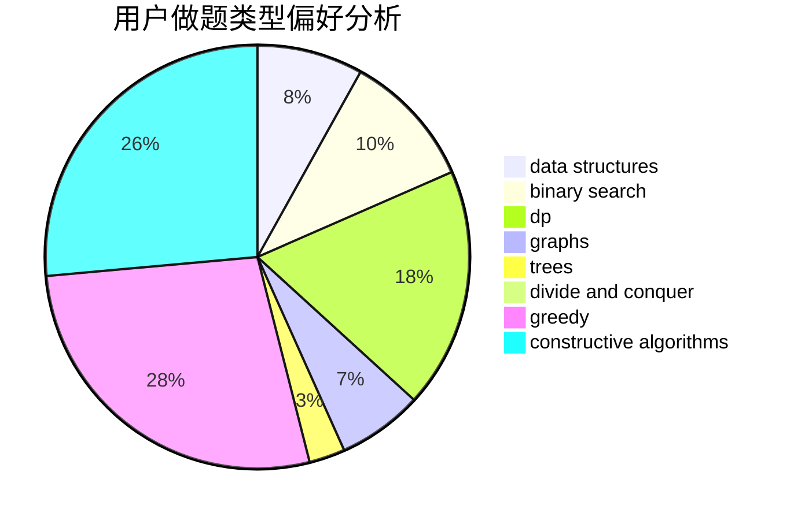
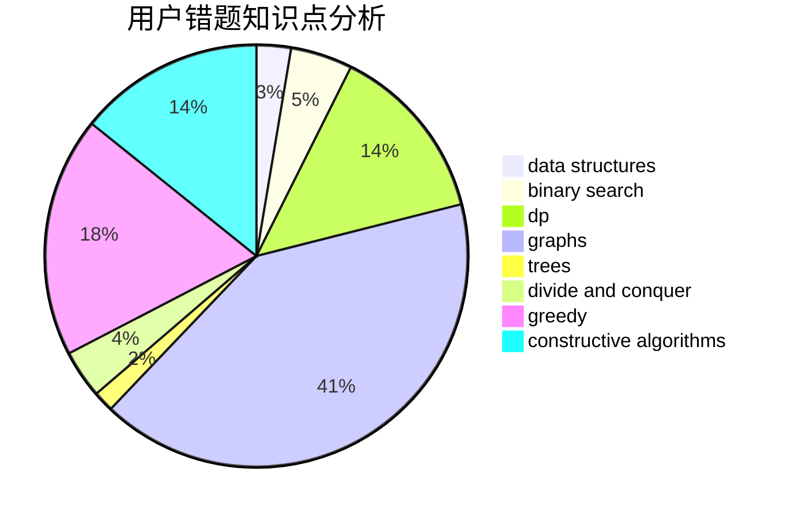

# tiantian666
<!-- tabs:start -->
#### **用户提交结果分析**

#### **用户做题类型偏好分析**

#### **用户错题知识点分析**

<!-- tabs:end -->
# 推荐题目
[Feeding Chicken](http://codeforces.com/problemset/problem/1254/A)		constructive algorithms,
                        greedy,
                        implementation		  
[Fibonacci String Subsequences](http://codeforces.com/problemset/problem/946/F)		combinatorics,
                        dp,
                        matrices		  
[Representative Sampling](http://codeforces.com/problemset/problem/178/F3)		nan		  
[Frog Jumping](http://codeforces.com/problemset/problem/1146/D)		dfs and similar,
                        math,
                        number theory		  
[Zebras](http://codeforces.com/problemset/problem/949/A)		greedy		  
[Mentors](http://codeforces.com/problemset/problem/978/F)		binary search,
                        data structures,
                        implementation		  
[Palindrome Pairs](http://codeforces.com/problemset/problem/1045/I)		hashing,
                        strings		  
[Self-exploration](http://codeforces.com/problemset/problem/1045/H)		math		  
[Coins](http://codeforces.com/problemset/problem/1061/A)		greedy,
                        implementation,
                        math		  
[Coins](http://codeforces.com/problemset/problem/1423/F)		math		  
<!-- tabs:start -->
#### **data structures**
[Feeding Chicken](http://codeforces.com/problemset/problem/978/F)		binary search,
                        data structures,
                        implementation		  
[Fibonacci String Subsequences](http://codeforces.com/problemset/problem/986/E)		brute force,
                        data structures,
                        math,
                        number theory,
                        trees		  
[Representative Sampling](https://codeforces.com/contest/1084/problem/D)		data structures,
                        dp,
                        trees		  
[Frog Jumping](http://codeforces.com/problemset/problem/1290/A)		brute force,
                        data structures,
                        implementation		  
[Zebras](http://codeforces.com/problemset/problem/1332/G)		data structures		  
[Mentors](http://codeforces.com/problemset/problem/1492/C)		binary search,
                        data structures,
                        dp,
                        greedy,
                        two pointers		  
[Palindrome Pairs](http://codeforces.com/problemset/problem/1490/G)		binary search,
                        data structures,
                        math		  
[Self-exploration](http://codeforces.com/problemset/problem/1479/D)		binary search,
                        bitmasks,
                        brute force,
                        data structures,
                        probabilities,
                        trees		  
[Coins](http://codeforces.com/problemset/problem/1497/A)		brute force,
                        data structures,
                        greedy,
                        sortings		  
[Coins](http://codeforces.com/problemset/problem/1491/C)		brute force,
                        data structures,
                        dp,
                        greedy,
                        implementation		  
#### **binary search**
[Feeding Chicken](http://codeforces.com/problemset/problem/978/F)		binary search,
                        data structures,
                        implementation		  
[Fibonacci String Subsequences](http://codeforces.com/problemset/problem/1305/H)		binary search,
                        greedy		  
[Representative Sampling](http://codeforces.com/problemset/problem/1436/C)		binary search,
                        combinatorics		  
[Frog Jumping](http://codeforces.com/problemset/problem/653/D)		binary search,
                        flows,
                        graphs		  
[Zebras](http://codeforces.com/problemset/problem/1442/E)		binary search,
                        constructive algorithms,
                        dfs and similar,
                        dp,
                        greedy,
                        trees		  
[Mentors](http://codeforces.com/problemset/problem/1492/C)		binary search,
                        data structures,
                        dp,
                        greedy,
                        two pointers		  
[Palindrome Pairs](http://codeforces.com/problemset/problem/1463/D)		binary search,
                        constructive algorithms,
                        greedy,
                        two pointers		  
[Self-exploration](http://codeforces.com/problemset/problem/1490/G)		binary search,
                        data structures,
                        math		  
[Coins](http://codeforces.com/problemset/problem/1479/D)		binary search,
                        bitmasks,
                        brute force,
                        data structures,
                        probabilities,
                        trees		  
[Coins](http://codeforces.com/problemset/problem/1436/E)		binary search,
                        data structures,
                        two pointers		  
#### **dp**
[Feeding Chicken](http://codeforces.com/problemset/problem/946/F)		combinatorics,
                        dp,
                        matrices		  
[Fibonacci String Subsequences](https://codeforces.com/contest/1084/problem/D)		data structures,
                        dp,
                        trees		  
[Representative Sampling](http://codeforces.com/problemset/problem/621/E)		dp,
                        matrices		  
[Frog Jumping](http://codeforces.com/problemset/problem/1082/F)		dp,
                        strings,
                        trees		  
[Zebras](http://codeforces.com/problemset/problem/1117/D)		dp,
                        math,
                        matrices		  
[Mentors](http://codeforces.com/problemset/problem/721/C)		dp,
                        graphs		  
[Palindrome Pairs](http://codeforces.com/problemset/problem/1472/C)		dp,
                        graphs		  
[Self-exploration](http://codeforces.com/problemset/problem/159/D)		*special problem,
                        brute force,
                        dp,
                        strings		  
[Coins](http://codeforces.com/problemset/problem/375/E)		dp,
                        implementation,
                        math		  
[Coins](http://codeforces.com/problemset/problem/1260/E)		brute force,
                        dp,
                        greedy		  
#### **graph**
[Feeding Chicken](https://codeforces.com/contest/1243/problem/D)		dfs and similar,
                        dsu,
                        graphs,
                        sortings		  
[Fibonacci String Subsequences](http://codeforces.com/problemset/problem/1045/C)		dfs and similar,
                        graphs,
                        trees		  
[Representative Sampling](http://codeforces.com/problemset/problem/721/C)		dp,
                        graphs		  
[Frog Jumping](http://codeforces.com/problemset/problem/1472/C)		dp,
                        graphs		  
[Zebras](http://codeforces.com/problemset/problem/986/A)		graphs,
                        greedy,
                        number theory,
                        shortest paths		  
[Mentors](http://codeforces.com/problemset/problem/653/D)		binary search,
                        flows,
                        graphs		  
[Palindrome Pairs](http://codeforces.com/problemset/problem/1461/E)		brute force,
                        graphs,
                        greedy,
                        implementation,
                        math		  
[Self-exploration](http://codeforces.com/problemset/problem/1487/C)		brute force,
                        constructive algorithms,
                        dfs and similar,
                        graphs,
                        greedy,
                        implementation,
                        math		  
[Coins](http://codeforces.com/problemset/problem/1437/C)		dp,
                        flows,
                        graph matchings,
                        greedy,
                        math,
                        sortings		  
[Coins](http://codeforces.com/problemset/problem/1470/D)		constructive algorithms,
                        dfs and similar,
                        graph matchings,
                        graphs,
                        greedy		  
#### **trees**
[Feeding Chicken](http://codeforces.com/problemset/problem/986/E)		brute force,
                        data structures,
                        math,
                        number theory,
                        trees		  
[Fibonacci String Subsequences](http://codeforces.com/problemset/problem/778/C)		brute force,
                        dfs and similar,
                        dsu,
                        hashing,
                        strings,
                        trees		  
[Representative Sampling](http://codeforces.com/problemset/problem/321/C)		constructive algorithms,
                        dfs and similar,
                        divide and conquer,
                        greedy,
                        trees		  
[Frog Jumping](https://codeforces.com/contest/1084/problem/D)		data structures,
                        dp,
                        trees		  
[Zebras](http://codeforces.com/problemset/problem/1045/C)		dfs and similar,
                        graphs,
                        trees		  
[Mentors](http://codeforces.com/problemset/problem/1082/F)		dp,
                        strings,
                        trees		  
[Palindrome Pairs](http://codeforces.com/problemset/problem/1442/E)		binary search,
                        constructive algorithms,
                        dfs and similar,
                        dp,
                        greedy,
                        trees		  
[Self-exploration](http://codeforces.com/problemset/problem/1479/D)		binary search,
                        bitmasks,
                        brute force,
                        data structures,
                        probabilities,
                        trees		  
[Coins](http://codeforces.com/problemset/problem/1511/C)		brute force,
                        data structures,
                        implementation,
                        trees		  
[Coins](http://codeforces.com/problemset/problem/1499/F)		combinatorics,
                        dfs and similar,
                        dp,
                        trees		  
#### **divide and conquer**
[Feeding Chicken](http://codeforces.com/problemset/problem/321/C)		constructive algorithms,
                        dfs and similar,
                        divide and conquer,
                        greedy,
                        trees		  
[Fibonacci String Subsequences](http://codeforces.com/problemset/problem/1364/E)		bitmasks,
                        constructive algorithms,
                        divide and conquer,
                        interactive,
                        probabilities		  
[Representative Sampling](http://codeforces.com/problemset/problem/1470/F)		divide and conquer		  
[Frog Jumping](http://codeforces.com/problemset/problem/1461/D)		binary search,
                        brute force,
                        data structures,
                        divide and conquer,
                        implementation,
                        sortings		  
[Zebras](http://codeforces.com/problemset/problem/1466/G)		combinatorics,
                        divide and conquer,
                        hashing,
                        math,
                        string suffix structures,
                        strings		  
[Mentors](http://codeforces.com/problemset/problem/1490/D)		dfs and similar,
                        divide and conquer,
                        implementation		  
[Palindrome Pairs](https://codeforces.com/contest/1483/problem/C)		data structures,
                        divide and conquer,
                        dp		  
[Self-exploration](http://codeforces.com/problemset/problem/1491/E)		brute force,
                        dfs and similar,
                        divide and conquer,
                        number theory,
                        trees		  
[Coins](http://codeforces.com/problemset/problem/1303/G)		data structures,
                        divide and conquer,
                        geometry,
                        trees		  
[Coins](http://codeforces.com/problemset/problem/1494/D)		constructive algorithms,
                        data structures,
                        dfs and similar,
                        divide and conquer,
                        dsu,
                        greedy,
                        sortings,
                        trees		  
#### **greedy**
[Feeding Chicken](http://codeforces.com/problemset/problem/1254/A)		constructive algorithms,
                        greedy,
                        implementation		  
[Fibonacci String Subsequences](http://codeforces.com/problemset/problem/949/A)		greedy		  
[Representative Sampling](http://codeforces.com/problemset/problem/1061/A)		greedy,
                        implementation,
                        math		  
[Frog Jumping](http://codeforces.com/problemset/problem/856/F)		greedy		  
[Zebras](http://codeforces.com/problemset/problem/489/A)		greedy,
                        implementation,
                        sortings		  
[Mentors](http://codeforces.com/problemset/problem/321/C)		constructive algorithms,
                        dfs and similar,
                        divide and conquer,
                        greedy,
                        trees		  
[Palindrome Pairs](https://codeforces.com/contest/860/problem/C)		greedy,
                        implementation		  
[Self-exploration](http://codeforces.com/problemset/problem/980/C)		games,
                        greedy		  
[Coins](http://codeforces.com/problemset/problem/1305/H)		binary search,
                        greedy		  
[Coins](http://codeforces.com/problemset/problem/1132/A)		greedy,
                        implementation		  
#### **constructive algorithms**
[Feeding Chicken](http://codeforces.com/problemset/problem/1254/A)		constructive algorithms,
                        greedy,
                        implementation		  
[Fibonacci String Subsequences](http://codeforces.com/problemset/problem/321/C)		constructive algorithms,
                        dfs and similar,
                        divide and conquer,
                        greedy,
                        trees		  
[Representative Sampling](http://codeforces.com/problemset/problem/430/A)		constructive algorithms,
                        sortings		  
[Frog Jumping](https://codeforces.com/contest/764/problem/D)		constructive algorithms,
                        geometry		  
[Zebras](http://codeforces.com/problemset/problem/1078/E)		constructive algorithms		  
[Mentors](http://codeforces.com/problemset/problem/1364/E)		bitmasks,
                        constructive algorithms,
                        divide and conquer,
                        interactive,
                        probabilities		  
[Palindrome Pairs](http://codeforces.com/problemset/problem/1343/B)		constructive algorithms,
                        math		  
[Self-exploration](http://codeforces.com/problemset/problem/1442/E)		binary search,
                        constructive algorithms,
                        dfs and similar,
                        dp,
                        greedy,
                        trees		  
[Coins](http://codeforces.com/problemset/problem/1493/A)		constructive algorithms,
                        greedy		  
[Coins](http://codeforces.com/problemset/problem/1463/D)		binary search,
                        constructive algorithms,
                        greedy,
                        two pointers		  
#### **sortings**
[Feeding Chicken](http://codeforces.com/problemset/problem/489/A)		greedy,
                        implementation,
                        sortings		  
[Fibonacci String Subsequences](https://codeforces.com/contest/1243/problem/D)		dfs and similar,
                        dsu,
                        graphs,
                        sortings		  
[Representative Sampling](http://codeforces.com/problemset/problem/430/A)		constructive algorithms,
                        sortings		  
[Frog Jumping](https://codeforces.com/contest/1496/problem/C)		geometry,
                        greedy,
                        math,
                        sortings		  
[Zebras](http://codeforces.com/problemset/problem/1495/A)		geometry,
                        greedy,
                        math,
                        sortings		  
[Mentors](http://codeforces.com/problemset/problem/1497/A)		brute force,
                        data structures,
                        greedy,
                        sortings		  
[Palindrome Pairs](http://codeforces.com/problemset/problem/1427/A)		math,
                        sortings		  
[Self-exploration](http://codeforces.com/problemset/problem/1461/D)		binary search,
                        brute force,
                        data structures,
                        divide and conquer,
                        implementation,
                        sortings		  
[Coins](http://codeforces.com/problemset/problem/1437/C)		dp,
                        flows,
                        graph matchings,
                        greedy,
                        math,
                        sortings		  
[Coins](http://codeforces.com/problemset/problem/1473/A)		greedy,
                        implementation,
                        math,
                        sortings		  
<!-- tabs:end -->
