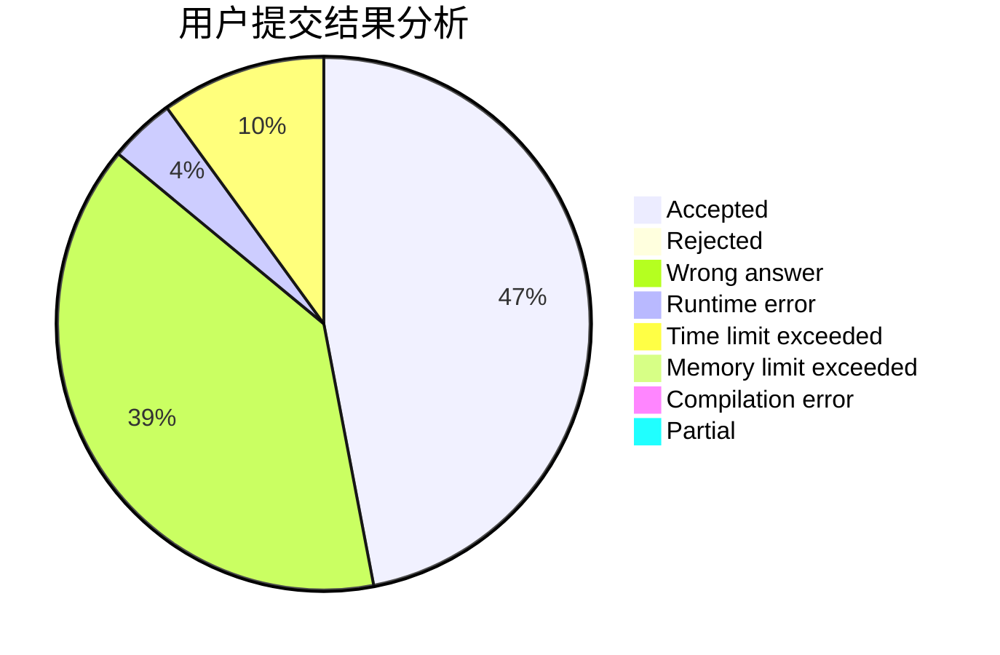
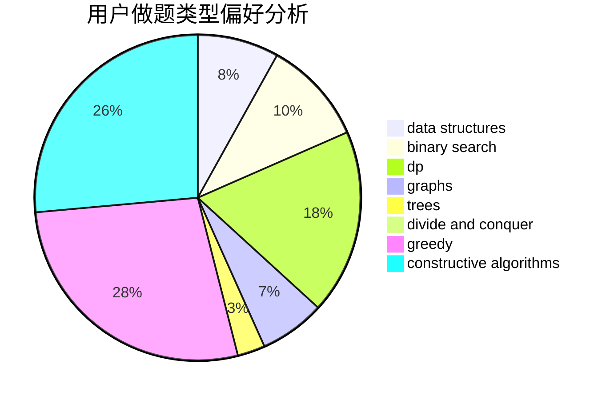
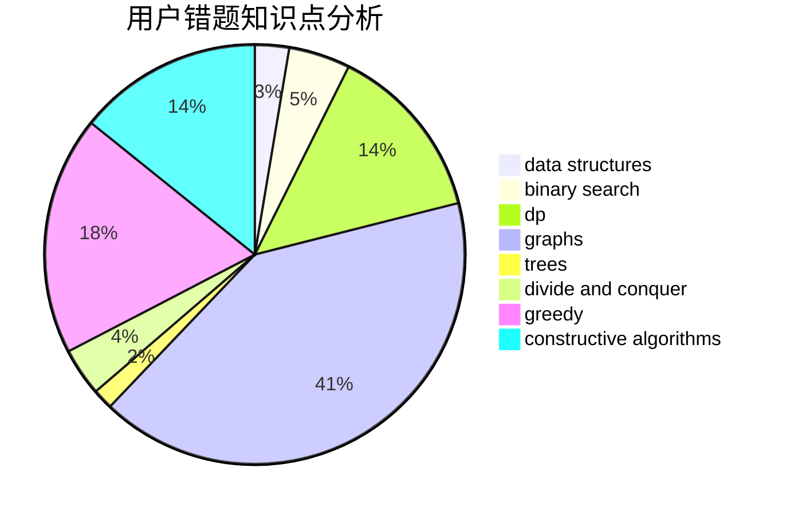

# tiantian666

<!-- tabs:start -->

#### **用户提交结果分析**

#### **用户做题类型偏好分析**

#### **用户错题知识点分析**

<!-- tabs:end -->
# 推荐题目
[986E](https://codeforces.com/contest/986/problem/E)		brute force,
                        data structures,
                        math,
                        number theory,
                        trees		  
[1472C](https://codeforces.com/contest/1472/problem/C)		dp,
                        graphs		  
[946F](https://codeforces.com/contest/946/problem/F)		combinatorics,
                        dp,
                        matrices		  
[949A](https://codeforces.com/contest/949/problem/A)		greedy		  
[178F3](https://codeforces.com/contest/178F/problem/3)		nan		  
[758B](https://codeforces.com/contest/758/problem/B)		brute force,
                        implementation,
                        number theory		  
[375E](https://codeforces.com/contest/375/problem/E)		dp,
                        implementation,
                        math		  
[1082F](https://codeforces.com/contest/1082/problem/F)		dp,
                        strings,
                        trees		  
[1423F](https://codeforces.com/contest/1423/problem/F)		math		  
[489A](https://codeforces.com/contest/489/problem/A)		greedy,
                        implementation,
                        sortings		  
