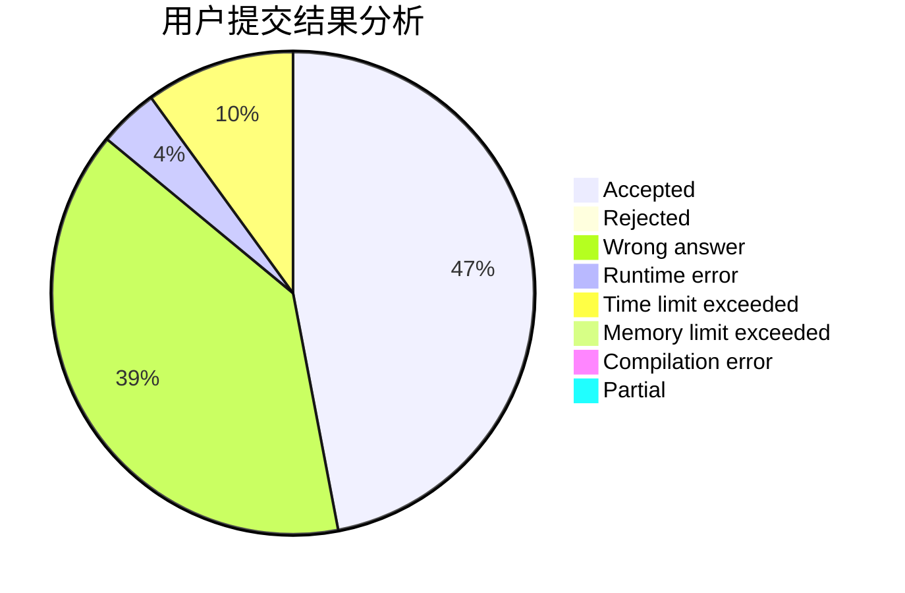
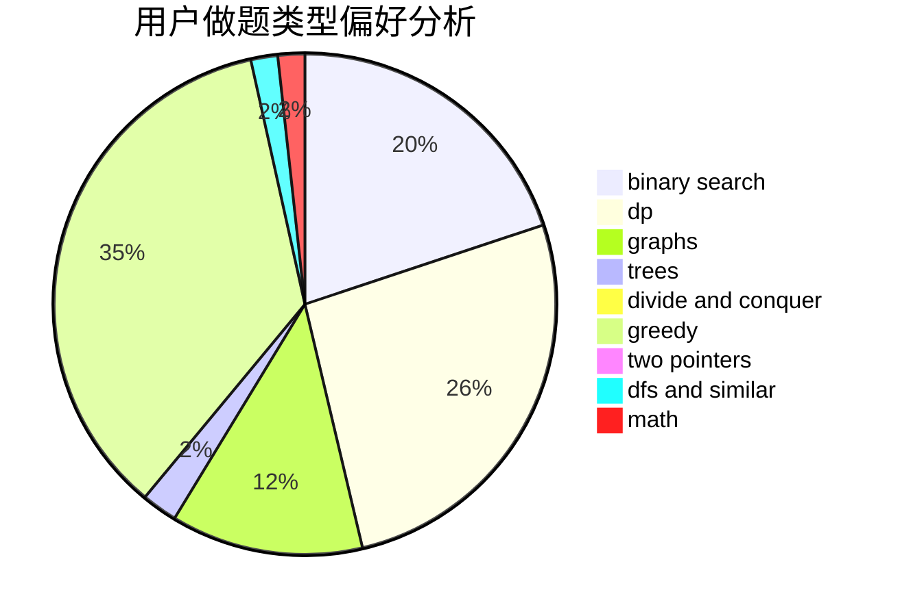

# tiantian666

<!-- tabs:start -->

#### **用户提交结果分析**

#### **用户做题类型偏好分析**

<!-- tabs:end -->
# 推荐题目
[acmsguru7](https://codeforces.com/contest/acmsguru/problem/7)
[1480C](https://codeforces.com/contest/1480/problem/C)
[963C](https://codeforces.com/contest/963/problem/C)
[965E](https://codeforces.com/contest/965/problem/E)
[205A](https://codeforces.com/contest/205/problem/A)
[777C](https://codeforces.com/contest/777/problem/C)
[404A](https://codeforces.com/contest/404/problem/A)
[1083B](https://codeforces.com/contest/1083/problem/B)
[1431A](https://codeforces.com/contest/1431/problem/A)
[509A](https://codeforces.com/contest/509/problem/A)
